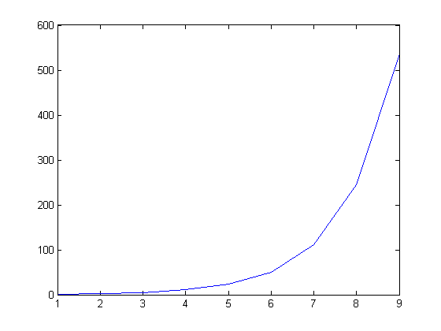
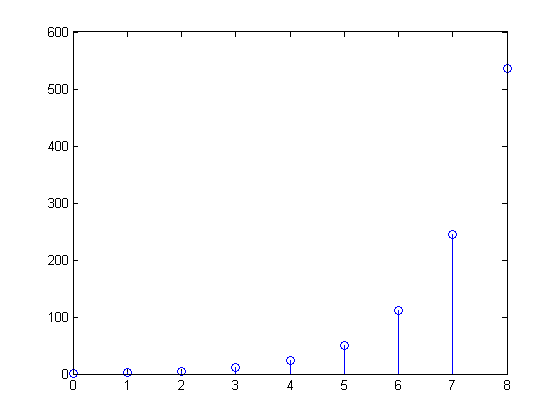
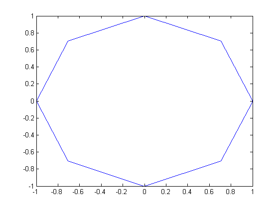
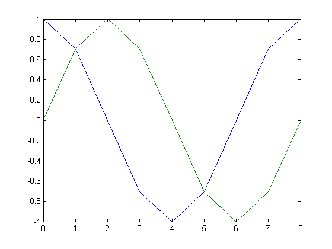
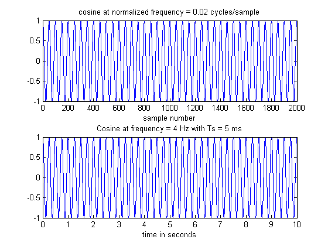
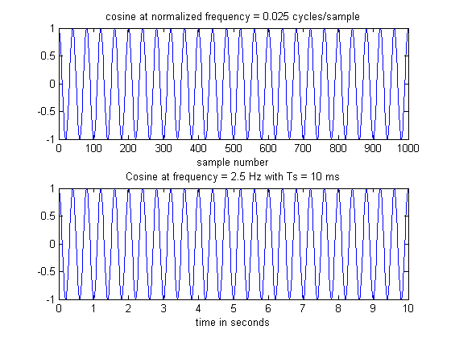
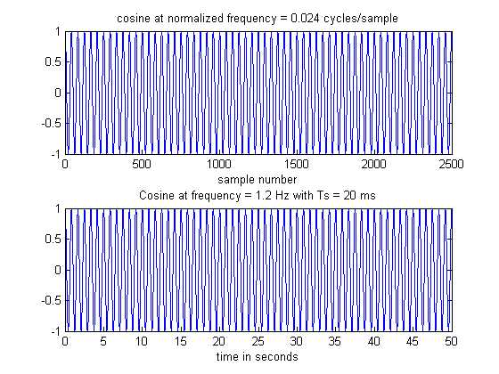
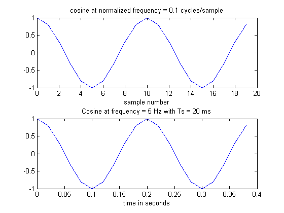

# lab01sub
Discrete Time Signals with MATLAB

## OBJECTIVES:
- Learn and/or review the basic usage of MATLAB as a tool for computation and visualization.
- Use MATLAB to create sampled signals.
- Learn the units for and relationships between sampling intervals, sampling frequency, number of samples observed, total time observed, signal frequency and normalized frequency.


## INITIALIZE:
```matlab
clear; clc; clf; cla; close all;
```


## LABORATORY:
### PART1: Interactive creation of vectors and plots
#### QUESTION#1:
__(a)__ How long is the vector `test1`? (Look in the workspace window or type "whos" in response to the >> prompt.

__(b)__ Is element 4 of vector test1 equal to 4? Why or why not?

```matlab
test1=0:8
test1(4)
```

__output__:
```
test1 =

     0     1     2     3     4     5     6     7     8

ans =

     3
```
#### ANSWER#1:
__(a)__ The `test1` vector has total of 9 elements, thus the length of the `test1` vector is 9. We can easily verify it by typing `length(test1)` on the `>>` prompt

__(b)__ No, the element 4 of the vector, `test1` is equal to 3. 0 is the first element, 1, the second element, 2, the third element, and 3, the fourth element.

----

#### QUESTION#2:
__(a)__ Explain each of the vectors created with these four statements.

__(b)__ How is 'expv1' different from 'expv2'?

```matlab
powv = 2.^test1
cosv = cos(2*pi*(1/8)*test1)
expv1 = exp(2*pi*(1/8)*test1)
expv2 = exp(2*pi*j*(1/8)*test1)
```

__output__:
```
powv =

     1     2     4     8    16    32    64   128   256


cosv =

  Columns 1 through 7

    1.0000    0.7071    0.0000   -0.7071   -1.0000   -0.7071   -0.0000

  Columns 8 through 9

    0.7071    1.0000


expv1 =

  Columns 1 through 7

    1.0000    2.1933    4.8105   10.5507   23.1407   50.7540  111.3178

  Columns 8 through 9

  244.1511  535.4917


expv2 =

  Columns 1 through 4

   1.0000 + 0.0000i   0.7071 + 0.7071i   0.0000 + 1.0000i  -0.7071 + 0.7071i

  Columns 5 through 8

  -1.0000 + 0.0000i  -0.7071 - 0.7071i  -0.0000 - 1.0000i   0.7071 - 0.7071i

  Column 9

   1.0000 - 0.0000i

```

#### ANSWER#2:
__(a)__ Where $$0\leq{n}\leq8$$
- the vector `powv` represents the values of $$2^n$$.
- the vector `cosv` represents the values of $$\cos{\left(2\pi\left(\tfrac{1}{8}\right)n\right)}$$.
- The vector `expv1` represents the values of $$\exp{\left(2\pi\left(\tfrac{1}{8}\right)n\right)}$$.
- The vector 'expv2' represents the values of $$\exp{\left(j2\pi\left(\tfrac{1}{8}\right)n\right)}$$

__(b)__ the vector `expv2` resides in the unit circle where values are are represented with complex numbers (with real and imaginary component) whereas, `expv1` is simply the exponential numbers

----

#### QUESTION#3
__(a)__ What does this plot show?

__(b)__ What is the horizontal axis?

```matlab
figure();
plot(expv1)
```



#### ANSWER#3:
__(a)__ The function `plot()` plots the values of the vector, `expv1` from 1 to 9

__(b)__ Horizontal axis in this plot represents the index of each element in the vector `expv1`

----

#### QUESTION#4
How is this plot different from the previous plot?
```matlab
figure();
plot(test1, expv1)
```


#### ANSWER#4
The plot will look different this time, since the elements of the vector, `expv1` will align with the values of each element in the vector `test1`, (*i.e.* the first sample point starts at $$0$$ and the last sample point ends at $$8$$).
> __NOTE__: It is important to keep length of vectors the same to plot it.

----

#### QUESTION#5
Describe this plot and differences from the previous ones.
```matlab
figure();
stem(test1, expv1);
```


#### ANSWER#5
The function `stem()` is a helpful graphical tool to represent the vector in the form of __discrete sequence__. Instead of showing a line graph , It will show a sequence of `stems` for each sample point (values of vector `expv1`) Also, this will align the same as the previous plot does

----

#### QUESTION#6
__(a)__ What does this plot show?

__(b)__ Explain it in terms of the values displayed when it was created.

```matlab
figure();
plot(expv2);
```


#### ANSWER#6
__(a)__ The function `plot()` plots the values of the vector, `expv2` from 1 to the last index of `expv2`

__(b)__ Referring to the analysis of [ANSWER#2][1], This plot draws the unit circle of this vector, since it was represented in Euler's form. Again, the horizontal axis represents real axis and the vertical axis, imaginary axis.

----

#### QUESTION#7
How is this plot different from the previous one?
```matlab
figure()
plot( test1, real(expv2), test1, imag(expv2) )
```



#### ANSWER#7
Euler's form is consisted of real and imaginary parts
$$
\begin{align*}
e^{j2\pi{f}t}&=\cos{\left(2\pi{f}t\right)}+j\sin{\left(2\pi{f}t\right)}\\
e^{j\omega{t}}&=\cos{\left(\omega{t}\right)}+j\sin{\left(\omega{t}\right)}
\end{align*}
$$
Thus, the plot displays the real and imaginary component of the following signal, $$x[n]=\exp{\left(j2\pi\left(\tfrac{1}{8}\right)n\right)}$$, that is,
$$
\begin{align*}
x_\Re[n]&=\cos{\left(2\pi\left(\tfrac{1}{8}\right)n\right)}\\
x_\Im[n]&=\sin{\left(2\pi\left(\tfrac{1}{8}\right)n\right)}
\end{align*}
$$
For this plot, the blue line represents $$x_\Re[n]$$ and the green line, $$x_\Im[n]$$

### PART2: Interactive creation of vectors and plot

```matlab
N1=2000;
freq1=0.02;   % in units of cycles per sample
phase=0.0;    % no phase
%
svec1=0:N1;
sig1=cos(  2 * pi * freq1 * svec1+phase );
whos
%
subplot(2,1,1)
plot(svec1,sig1)
xlabel('sample number')
title([ 'cosine at normalized frequency = ' num2str(freq1)...
    ' cycles/sample'])
%
% The ... allows a statement to be continued on the next line
%
subplot(2,1,2)
Ts=.005;          % sample interval (5 ms)
plot(svec1*Ts, sig1)
xlabel('time in seconds')
title([ 'Cosine at frequency = ' num2str(freq1/Ts) ...
    ' Hz with Ts = ' num2str(1000*Ts) ' ms'])
%
```

__output__:
```
Name       Size              Bytes  Class     Attributes

  N1         1x1                   8  double
  ans        1x1                   8  double
  cosv       1x9                  72  double
  expv1      1x9                  72  double
  expv2      1x9                 144  double    complex
  freq1      1x1                   8  double
  phase      1x1                   8  double
  powv       1x9                  72  double
  sig1       1x2001            16008  double
  svec1      1x2001            16008  double
  test1      1x9                  72  double
```



#### QUESTION#1
Reproduce the plots from part 2, step 1 above with two `m`-files, `getCosSig.m` and `plotCogsig.m`. How many statements do you need to type in the interactive mode?

#### ANSWER#1
1. Type 'getCosSig' on the '>>' prompt, and enter
```
>> getCosSig
```
2. When the 1st prompt appears, like the following
```
>> Enter number of samples:
```
type the correct number, which is $$N_\text{tot}=2000$$
```
>> Enter number of samples: 2000
```
3. When the 2nd prompt appears, like the following
```
>> Enter normalized frequency in cycles/sample:
```
type the correct number, which is $$\nu=0.02\:\left[\tfrac{\text{cycles}}{\text{sample}}\right]$$
```
>> Enter normalized frequency in cycles/sample: 0.02
```
4. Type 'plotCosSig' on the '>>' prompt, and enter
```
>> plotCosSig
```
5. When the 3rd prompt appears, like the following
```
>> Enter sample time interval in seconds:
```
type the correct number, which is $$T_s=0.005\:\left[\tfrac{\text{sec}}{\text{sample}}\right]$$
```
>> Enter sample time interval in seconds: 0.005
```


Total 5 steps are needed to reproduce the plot above.

> __NOTE__: See the appendix section for the details of two m-files.

#### QUESTION & ANSWER#2
__(a)__ What is the sampling interval?
- given
$$
\begin{align*}
N_\text{tot}&=2000\:\text{sample}\\
\nu&=0.02\:\tfrac{\text{cycle}}{\text{sample}}\\
T&=0.005\:\tfrac{\text{sec}}{\text{sample}}\\
\end{align*}
$$
Sample interval is
$$
T=0.005\:\tfrac{\text{sec}}{\text{sample}}
$$

__(b)__ What is the sampling frequency
- given quantities above, __the sampling frequency__ is
$$
\begin{align*}
f_T&=\frac{1}{T}\\
&=\frac{1}{0.005\:\left[\tfrac{\text{sec}}{\text{sample}}\right]}=200\:\tfrac{\text{sample}}{\text{sec}}
\end{align*}
$$

__(c)__ How many samples are there per cycle of the input signal?
- given quantities above, the __sample rate per cycle__ is
$$
\frac{1}{\nu}=\frac{1}{0.02\:\left[\tfrac{\text{cycle}}{\text{sample}}\right]}=50\:\tfrac{\text{sample}}{\text{cycle}}
$$

__(d)__ What is the time duration of one cycle on your plot?
- given quantities above, the __time duration per cycle__ is
$$
\require{cancel}
\begin{align*}
f_0&=(\nu)(f_T)\\
\frac{1}{f_0}&=\frac{1}{(\nu)(f_T)}\\
&=\frac{1}{(0.02)\left(\frac{1}{0.005}\right)\:\left[\tfrac{\text{cycle}}{\cancel{\text{sample}}}\right]\left[\tfrac{\cancel{\text{sample}}}{\text{sec}}\right]}\\
&=4\:\tfrac{\text{sec}}{\text{cycle}};
\end{align*}
$$

__(e)__ What parameters values should be used for `getCosSig` and `plotCosSig`?
- For $$N_\text{tot}=1000$$, find the correct parameters to plot $$10\:\text{sec}$$ of a $$2.5\:\text{Hz}$$ signal.
	- given
	$$
	\begin{align*}
	f_0&=2.5\:\text{Hz}\\
	t_\text{tot}&=10\:\text{sec}\\
	N_\text{tot}&=1000\:\text{samples}
	\end{align*}
	$$
	we can use this set of relation
	$$
	\begin{align*}
	\nu&=\frac{f_0}{f_T}\\
	T&=\frac{t_\text{tot}}{N_\text{tot}}\\
	\end{align*}
	$$
	to determine our desired quantities.
	$$
	\require{cancel}
	\begin{align*}
	T&=\frac{t_\text{tot}}{N_\text{tot}}\\
	&=\frac{(10)\:\left[\text{sec}\right]}{(1000)\:\left[\text{samples}\right]}=0.01\:\tfrac{\text{sec}}{\text{sample}};\\
	\nu&=\frac{f_0}{f_T}\\
	&=\frac{(2.5)\:\left[\tfrac{\text{cycle}}{\cancel{\text{sec}}}\right]}{\left(\frac{1}{0.01}\right)\:\left[\tfrac{\text{sample}}{\cancel{\text{sec}}}\right]}=0.025\:\tfrac{\text{cycle}}{\text{sample}};\\
	\end{align*}
	$$
	Therefore,
	$$
	\therefore\:
	\begin{align*}
	N_\text{tot}&=1000;\\
	\nu&=0.025;\\
	T&=0.01;
	\end{align*}
	$$
	- To generate the correct plot, do a similar execution like above
		1. Type 'getCosSig' on the '>>' prompt, and enter
		```
		>> getCosSig
		```
		2. When the 1st prompt appears, type the correct number, which is $$N_\text{tot}=1000$$
		```
		>> Enter number of samples: 1000
		```
		3. When the 2nd prompt appears, type the correct number, which is $$\nu=0.025\:\left[\tfrac{\text{cycles}}{\text{sample}}\right]$$
		```
		>> Enter normalized frequency in cycles/sample: 0.025
		```
		4. Type 'getCosSig' on the '>>' prompt, and enter
		```
		>> plotCosSig
		```
		5. When the 3rd prompt appears, type the correct number, which is $$T=0.01\:\left[\tfrac{\text{sec}}{\text{sample}}\right]$$
		```
		>> Enter sample time interval in seconds: 0.01
		```
	
- For $$T_S=0.002$$, find the correct parameters to plot $$5\:\text{sec}$$ of a $$1.2\:\text{Hz}$$ signal.
	- given
	$$
	\begin{align*}
	f_0&=1.2\:\text{Hz}\\
	t_\text{tot}&=5\:\text{sec}\\
	T&=0.002\:\tfrac{\text{sec}}{\text{sample}}
	\end{align*}
	$$
	- we can use the set of relation (mentioned above) to determine our desired quantities.
	$$
	\require{cancel}
	\begin{align*}
	N_\text{tot}&=\frac{t_\text{tot}}{T}\\
	&=\frac{(5)\:\left[\cancel{\text{sec}}\right]}{\left(0.002\right)\:\left[\tfrac{\cancel{\text{sec}}}{\text{sample}}\right]}=20\:\text{samples};\\
	\nu&=\frac{f_0}{f_T}\\
	&=\frac{(1.2)\:\left[\tfrac{\text{cycle}}{\cancel{\text{sec}}}\right]}{\left(\tfrac{1}{0.002}\right)\:\left[\tfrac{\text{sample}}{\cancel{\text{sec}}}\right]}=0.024:\tfrac{\text{cycle}}{\text{sample}};\\
	\end{align*}
	$$
	Therefore,
	$$
	\therefore\:
	\begin{align*}
	N_\text{tot}&=20;\\
	\nu&=0.024;\\
	T&=0.02;
	\end{align*}
	$$
	- To generate the correct plot, do a similar execution like above
		1. Type 'getCosSig' on the '>>' prompt, and enter
		```
		>> getCosSig
		```
		2. When the 1st prompt appears, type the correct number, which is $$N_\text{tot}=20$$
		```
		>> Enter number of samples: 20
		```
		3. When the 2nd prompt appears, type the correct number, which is $$\nu=0.024\:\left[\tfrac{\text{cycles}}{\text{sample}}\right]$$
		```
		>> Enter normalized frequency in cycles/sample: 0.024
		```
		4. Type 'getCosSig' on the '>>' prompt, and enter
		```
		>> plotCosSig
		```
		5. When the 3rd prompt appears, type the correct number, which is $$T=0.02\:\left[\tfrac{\text{sec}}{\text{sample}}\right]$$
		```
		>> Enter sample time interval in seconds: 0.02
		```

- For $$\nu=0.1$$, find the correct parameters to plot $$0.4\:\text{sec}$$ of a $$5\:\text{Hz}$$ signal.
	- given
	$$
	\begin{align*}
	f_0&=5\:\text{Hz}\\
	t_\text{tot}&=0.4\:\text{sec}\\
	\nu&=0.1\:\tfrac{\text{cycle}}{\text{sample}}
	\end{align*}
	$$
	we can use the set of relation (mentioned above) to determine our desired quantities.
	$$
	\require{cancel}
	\begin{align*}
	f_T&=\frac{f_0}{\nu}\\
	&=\frac{(5)\:\left[\tfrac{\cancel{\text{cycle}}}{\text{sec}}\right]}{(0.1)\:\left[\tfrac{\cancel{\text{cycle}}}{\text{sample}}\right]}=50\:\tfrac{\text{sample}}{\text{sec}};\\
	N_\text{tot}&=\frac{t_\text{tot}}{T}\\
	&=\frac{(0.4)\:\left[\cancel{\text{sec}}\right]}{\left(\tfrac{1}{50}\right)\:\left[\tfrac{\cancel{\text{sec}}}{\text{sample}}\right]}=20\:\text{samples};
	\end{align*}
	$$
	Therefore,
	$$
	\therefore
	\begin{align*}
	N_\text{tot}&=20;\\
	\nu&=0.1;\\
	T&=0.02;
	\end{align*}
	$$
	- To generate the correct plot, do a similar execution like above
		1. Type 'getCosSig' on the '>>' prompt, and enter
		```
		>> getCosSig
		```
		2. When the 1st prompt appears, type the correct number, which is $$N_\text{tot}=20$$
		```
		>> Enter number of samples: 20
		```
		3. When the 2nd prompt appears, type the correct number, which is $$\nu=0.1\:\left[\tfrac{\text{cycles}}{\text{sample}}\right]$$
		```
		>> Enter normalized frequency in cycles/sample: 0.1
		```
		4. Type 'getCosSig' on the '>>' prompt, and enter
		```
		>> plotCosSig
		```
		5. When the 3rd prompt appears, type the correct number, which is $$T_s=0.02\:\left[\tfrac{\text{sec}}{\text{sample}}\right]$$
		```
		>> Enter sample time interval in seconds: 0.02
		```
	
- For $$N_\text{tot}=20$$, find the correct parameters to plot $$0.4\:\text{sec}$$ of a $$55\:\text{Hz}$$ signal. Does this plot match its labels? Why or why not?
	- given
	$$
	\begin{align*}
	f_0&=55\:\text{Hz}\\
	t_\text{tot}&=0.4\:\text{sec}\\
	N_\text{tot}&=20\:\text{sample}
	\end{align*}
	$$
	we can use the set of relation (mentioned above) to determine our desired quantities.
	$$
	\require{cancel}
	\begin{align*}
	T&=\frac{t_\text{tot}}{N_\text{tot}}\\
	&=\frac{(0.4)\:\left[\text{sec}\right]}{\left(20\right)\:\left[\text{sample}\right]}=0.02\:\tfrac{\text{sec}}{\text{samples}};\\
	\nu&=\frac{f_0}{f_T}\\
	&=\frac{(55)\:\left[\tfrac{\text{cycle}}{\cancel{\text{sec}}}\right]}{\left(\tfrac{1}{0.02}\right)\:\left[\tfrac{\text{sample}}{\cancel{\text{sec}}}\right]}=1.1\:\tfrac{\text{cycle}}{\text{sample}};
	\end{align*}
	$$
	Therefore,
	$$
	\therefore
	\begin{align*}
	N_\text{tot}&=20;\\
	\nu&=1.1;\\
	T&=0.02;
	\end{align*}
	$$
	- To generate the correct plot, do a similar execution like above
		1. Type 'getCosSig' on the '>>' prompt, and enter
		```
		>> getCosSig
		```
		2. When the 1st prompt appears, type the correct number, which is $$N_\text{tot}=20$$
		```
		>> Enter number of samples: 20
		```
		3. When the 2nd prompt appears, type the correct number, which is $$\nu=1.1\:\left[\tfrac{\text{cycles}}{\text{sample}}\right]$$
		```
		>> Enter normalized frequency in cycles/sample: 1.1
		```
		4. Type 'getCosSig' on the '>>' prompt, and enter
		```
		>> plotCosSig
		```
		5. When the 3rd prompt appears, type the correct number, which is $$T_s=0.02\:\left[\tfrac{\text{sec}}{\text{sample}}\right]$$
		```
		>> Enter sample time interval in seconds: 0.02
		```
	
	To review how __aliasing__ works, let's suppose we have a DT signal like the following
	$$
	\begin{align*}
	x[n]&=\cos{\left(2\pi{f}_0nT\right)}\\
	&=\cos{\left(2\pi{n}T\left(f_0+kf_T\right)\right)}
	\end{align*}
	$$
	This implies that an original continuous time domain signal with frequency $$f_0+kf_T$$ is indistinguishable from one with a frequnect $$f_0$$ after it has been sampled at sampling rate $$f_T$$. For our case, we have
	$$
	\begin{align*}
	f_0&=5\:\text{Hz}\\
	f_T&=\tfrac{1}{0.02\:\left[\tfrac{\text{sec}}{\text{sample}}\right]}=50\:\tfrac{\text{sample}}{\text{sec}}\\
	f^\prime&=f_0+kf_T\\
	&=5+k\left.\left(50\right)\right|_{k=1}\\
	&=55\:\text{Hz}\\
	\end{align*}
	$$
	This relation shows that our new frequency $$55\:\text{Hz}$$ was, in fact, the aliasing frequency. *i.e.* it will yield the same looking plot. when we sample at the same rate.


### PART3: Sound Output
#### QUESTION#1:
Using `getCosSig`, create `sig1` with $$N_\text{tot}=8000$$ and $$\nu=0.075\:\left[\tfrac{\text{cycle}}{\text{sample}}\right]$$.

#### ANSWER#1:
1. Type 'getCosSig' on the '>>' prompt, and enter
```
>> getCosSig
```
2. When the 1st prompt appears, type the correct number, which is $$N_\text{tot}=8000$$
```
>> Enter number of samples: 8000
```
3. When the 2nd prompt appears, type the correct number, which is $$\nu=0.075\:\left[\tfrac{\text{cycles}}{\text{sample}}\right]$$
```
>> Enter normalized frequency in cycles/sample: 0.075
```
4.
> Type `help sound` to learn how to make sound output.

----

#### QUESTION#2:
Listen to the output sound using `sound(sig1, 8000)`. Estimate the duration of the tone and a relative frequency. Is this consistent with $$F_T=8000\:\text{Hz}$$?

```matlab
% getCosSig
% % 1st input: 8000,
% % 2nd input: 0.075
%
% uncomment the codes above if necessary
FT1=8000;
filename1='sound01.wav';
audiowrite(filename1, sig1, FT1);
sound(sig1, FT1);
```

#### ANSWER#2
I think the sound it generated is consistent with our sample frequency $$F_T=8000\:\text{Hz}$$, since we know the second parameter `FT1` we insert into the function `sound()` represents the sampling frequnecy.

----

#### QUESTION#3:
Listen to the output sound using `sound(sig1, 4000)`. Compare the duration and frequency to the previous sound output. Is this consistent with $$F_T=4000\:\text{Hz}$$? Explain.

```matlab
% getCosSig
% % 1st input: 8000,
% % 2nd input: 0.075
% FT1=8000;
%
% uncomment the codes above if necessary
FT2=4000;
filename2='sound02.wav';
audiowrite(filename2, sig1, FT2)
sound(sig1, FT2);
pause(3)

% sound compare
sound(sig1, FT1); pause(2.5);
sound(sig1, FT2); pause(2.5);
```

#### ANSWER#3
Now we have a relativistic point of view to compare two differnet sound output with different sampling frequency.  The second sound output generates the sound that reside in the lower frequency. As a result, this new output
- generates __lower tone__ of sound (it sounds like it plays 'octave down' of the original sound), and
- plays __twice__ longer, in duration, than the original one, .

----

#### QUESTION#4:
Listen to the output sound using `sound(sig1, 12000)`. Compare the duration and frequency to the previous sound output. Is this consistent with $$F_T=12,000\:\text{Hz}$$? Explain.

```matlab
% getCosSig
% % 1st input: 8000,
% % 2nd input: 0.075
% FT2=4000;
%
% uncomment the codes above if necessary
FT3=12000;
filename3='sound03.wav';
audiowrite(filename3, sig1, FT3)
sound(sig1, FT3);
pause(2.5)

% sound compare
sound(sig1, FT2); pause(2.5);
sound(sig1, FT3); pause(2.5);
```
#### ANSWER#4
It seems the third sound output represents the signal with 3 times higher frequency, relative to the previous one.  To describe the difference, this new output
- generates __higher tone__ of sound (in this one, I did not hear the octave relationship)
- plays __three times__ shorter, in duration, than the original one.

----

#### QUESTION#5:
What is the relationship of $$\nu$$ to the actual frequency of the tone you hear?  How can the same sequence of data points make different frequency sounds?


#### ANSWER#5:
To simply put, $$\nu$$ represents the normalized frequency, and it has this general relation
$$
\begin{align*}
\nu&=\frac{f_0}{f_T}=(f_0)T\\
f_0&=\frac{\nu}{T}=\nu(f_T)
\end{align*}
$$
Since we know the quantity of $$\nu=0.075\:\left[\tfrac{\text{cycle}}{\text{sample}}\right]$$ the sound output of frequnecy $$f_0$$ will vary with the sampling frequency $$f_T$$. Therefore, it's expected that, with different sample frequency, each output will make different sound with different duration.

----

#### QUESTION#6:
Listen to the output sound using `sound(0.5*sig1, 8000)`. Compare it to the first sound output you created. What is different? Why?

```matlab
% getCosSig
% % 1st input: 8000,
% % 2nd input: 0.075
% FT1=8000;
%
% uncomment the codes above if necessary
filename4='sound04.wav';
audiowrite(filename4, 0.5*sig1, FT1)
sound(0.5*sig1, FT1);
pause(2.5);

% sound compare
sound(sig1, FT1); pause(2.5);
sound(0.5*sig1, FT1); pause(2.5);
```
#### ANSWER#6
From inspection with our hearing and even how the code looks, the frequency of the sound output stays the same but the difference can be detected in the __amplitude__ of sound. It's fair to say that the amplitude of sound is reduced by *half*.

----

#### QUESTION#7:
Listen to the output sound using `sound(5.0*sig1, 8000)`. Compare it to the first sound output you created. What is different? Why? (You may want to reread the information about the sound function by typing `help sound`.)

```matlab
% getCosSig
% % 1st input: 8000,
% % 2nd input: 0.075
% FT1=8000;
%
% uncomment the codes above if necessary
filename5='sound05.wav';
audiowrite(filename5, 5.0*sig1, FT1) % FT1=8000
sound(5.0*sig1, FT1);
pause(2.5);

% sound compare
sound(sig1, FT1); pause(2.5);
sound(5.0*sig1, FT1); pause(2.5);
```
#### ANSWER#7
Likewise, but contrary to the previous example, our new sound output has __five times__ higher, in amplitude, than the original sound. 

----

## DISCUSSION / FINAL REMARKS
This lab is to teach you basic techniques of MATLAB to get familiar with computing what we desire in digital signal processing. It also teaches you to understand new concepts (sampling intervals, sampling frequency, number of samples observed, signal frequency, normalized frequency, and property of aliasing) that will play a big role in the next lab and how the each relates to one another both mathematically and physically.


## APPENDIX
#### getCosSig.m
```matlab
N1=input('Enter number of samples: ');
freq1=input('Enter normalized frequency in cycles/sample: ');
phase=0.0;
svec1=0:(N1-1);
sig1=cos(2 * pi * freq1 * svec1+phase);
```

#### plotCosSig.m
```matlab
subplot(2,1,1)
plot(svec1,sig1)
xlabel('sample number')
title([ 'cosine at normalized frequency = ' num2str(freq1) ' cycles/sample'])
%
subplot(2,1,2)
Ts=input('Enter sample time interval in seconds: ')
plot(svec1*Ts, sig1)
xlabel('time in seconds')
title([ 'Cosine at frequency = ' num2str(freq1/Ts) ...
    ' Hz with Ts = ' num2str(1000*Ts) ' ms'])
```

#### SOUND FILES:
- [sound01.wav][1]
- [sound02.wav][2]
- [sound03.wav][3]
- [sound04.wav][4]
- [sound05.wav][5]

[1]: https://raw.githubusercontent.com/chanhi2000/ELEN133/master/lab/lab01sub/sound01.wav
[2]: https://raw.githubusercontent.com/chanhi2000/ELEN133/master/lab/lab01sub/sound02.wav
[3]: https://raw.githubusercontent.com/chanhi2000/ELEN133/master/lab/lab01sub/sound03.wav
[4]: https://raw.githubusercontent.com/chanhi2000/ELEN133/master/lab/lab01sub/sound04.wav
[5]: https://raw.githubusercontent.com/chanhi2000/ELEN133/master/lab/lab01sub/sound05.wav

