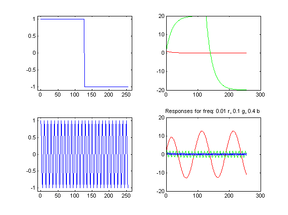

# lab02
Impulse, Step, and Frequency Response (PreLab is due at the beginning of lab)

## OBJECTIVES:
In this laboratory you will use MATLAB to determine the response of first and second order Finite Impulse Response (FIR) and Infinite Impulse Response (IIR) systems defined by difference equations. Inputs will include an impulse, a step function, and a signal with constant frequencies.

You will also learn to use functions in MATLAB.


## BACKGROUND NOTES:
A linear shift invariant digital filter can be implemented with a __linear constant coefficient difference equation__ which expresses the filter output in terms of a sum current and delayed inputs and delayed outputs. Typically “$$b$$” coefficients multiply delayed inputs and “$$a$$” coefficients multiply delayed outputs.
$$
\sum_{m=0}^{N_a}{a_my[n-m]}=\sum_{k=0}^{N_b}{b_ky[n-k]}\\
$$

$$
\begin{align*}
y[n]&=\sum_{k=0}^{N_b}{b_ky[n-k]}-\sum_{m=0}^{N_a}{a_my[n-m]}&&\left<\text{for }a_0=1\right>
\end{align*}
$$

The MATLAB function *filter* will compute the difference equation output, $$y[n]$$, with
```matlab
y= filter(b, a, x)
```

where `x` is a vector of input values, `a` is a vector of $$N_a+1$$ “`a`” coefficients and `b` is a vector of $$N_b+1$$ “`b`” coefficients. Note that MATLAB indices start at $$1$$, not $$0$$, and that $$a_0$$ cannot be zero. Type “`help filter`” at the MATLAB `>>` prompt to read more about this function.


## PRELAB:
For the prelab assignment, you will write two simple MATLAB functions that will make it much easier and faster to plot results in the laboratory.

A function is similar to the `m`-file scripts used in the previous laboratory. Using `m`-file scripts you were able to create and debug a sequence of MATLAB instructions in an editor. Typing the name of the `m`-file in the command window caused all the instructions in the `m`-file to be executed as if each instruction had been typed in the command window. The instructions in the script could use data already in the workspace and the results of the instructions remained in the workspace.

A function is also a sequence of MATLAB instructions in an `m`-file. However, it only has access to its specified input parameters, and after it is completed only the specified output is available in the workspace. For example, `y = cos(  2 * pi * freq * tv)` uses the cosine function `cos`. A function `m`-file begins with a function declaration of the inputs and outputs, followed by comments describing it, followed by MATLAB instructions. For example:
```matlab
function myplot1(x, t, n_data)
% comment to describe function
% this function has three inputs and no outputs other than the plot it creates
```

The instructions in this function, `myplot1`, only have access to the values in `x`, `t`, and `n_data`. If additional variables are created by the function instructions, these are not available after the function is complete. Type "`help function`" at the MATLAB `>>` prompt to read more about functions.

In this laboratory, we will explore the response of some basic filters when the inputs are an impulse, a square wave or step function, and sinusoidal functions. We will view multiple plots on the same axis so that we can easily compare the results. The plots will be created by two functions `lab1plot1` and `lab1plot2`. An example of an instruction sequence in the command window using the functions and the plots it would create are shown below. (The instructions that created the five input x vectors and made the two subplots on the left side are not included here.)
```matlab
a1 = [1. -.95];
b1 = 1;
v2 = filter(b1,a1,x2);
v1 = filter(b1,a1,x1);
lab1plot1(v1, v2, 2) % 2 means upper right in the 2x2 subplots v3 = filter(b1,a1,x3);
v4 = filter(b1,a1,x4);
v5 = filter(b1,a1,x5);
lab1plot2(v3, v4, v5, freq1, freq2, freq3, 4) %4 is lower right
```




### `function lab1plot1(t, h, s, ix)`
```matlab
% inputs: a time vector (t), two input vectors (h and s); subplot index (ix)
% The two input vectors are plotted in different colors on the same axes against the time vector, t,
% in subplot ix of a 2x2 subplot array.
```

In this laboratory the function `lab1plot1` will be used to plot a filter impulse response, `h`, and a filter step response, `s`. The example above uses `lab1plot1(v1, v2, 2)`.

### `function lab1plot2(t, y1, y2, y3, f1, f2, f3, ix)`
```matlab
% inputs: a time vector (t), three vectors (y1,y2,y3); three associated frequency values (f1,f2,f3);
% and subplot index (ix)
% The three input vectors are plotted in different colors on the same axes against the time
% vector, t,in subplot ix of a 2x2 subplot array. The frequency values are printed in the plot title.
```

The function `lab1plot2` will be used to plot three filter outputs for inputs at different frequencies. The example above uses `lab1plot2(v3, v4, v5, freq1, freq2, freq3, 4)`.

Write these two functions and test them using data vectors such as you used in [Laboratory 1](lab01.md). The test vectors do not have to be impulse or step responses. As you use the functions in the lab, you may want to make improvements in your functions.

### Submit your two `m`-file listings and a test plot at the beginning of the lab period.


## LABORATORY:
Implement the filters described in the laboratory procedure below and compare the filter behavior using plots of the outputs. __Always use parameters in MATLAB statements rather than specific constant values__. Use `m`-file scripts so that you can easily make corrections.

### Part 1 — Create input vectors
Define the length of input vector, `n_in=256`.

Define three normalized test frequencies in units of cycles/sample:
- freq1 = 0.01
- freq2 = 0.1
- freq3 = 0.4

Create the following input vectors which all have length `n_in`:
- `tv = 0:(n_in -1)`
- `x1` = impulse
- `x2` = a step function – use the "`zeros`" and "`ones`" functions to create a function that has zeros for the first half (that is for `n_in/2` samples) and ones for the rest. "`help zeros`" and "`help ones`" can help you.
- `x3` = cosine at normalized frequency 1
- `x4` = cosine at normalized frequency 2
- `x5` = cosine at normalized frequency 3

Plot the test signals vs `tv` to verify that they are correct, but __do not print__ the plots. They should look like the following plots of `x2`, `x3`, `x4`, and `x5`. The horizontal axis is `tv`.


Count the number of cycles in `x3` and `x4`. Compute the product of (the normalized frequency in cycles per sample) and (256 samples). Is it the same? Based on this, how many cycles appear for `x5`?

### Part 2 — Compare two first order systems
Create `a` and `b` vectors for each of the two first order systems defined here. Use the MATLAB function `filter` to compute outputs for these systems. Type `figure(1)` in the MATLAB command window to specify the window for the requested plots.

| System | a | b |
| :----- | - | - |
| System 1 | `a1=[1, -0.9]` | `b1=1` |
| System 2 | `a2=[1, 0.9]` | `b2=1` |

#### STEP 1
__For System 1__, plot the impulse response and step response on the same plot in different colors using your function `lab1plot1`. Put this plot in the upper left corner of a 2x2 subplot array.
- From the plot, estimate the time constant of the impulse response in samples in the same way you would estimate the time constant for an analog signal. Recall that, in an RC circuit, the time constant is the time it takes for the voltage to reach 63% of it’s final voltage or, when it is discharging, to reach 37% of it’s original value. (Note: The plot magnify option and/or printing selected output values may be helpful.)
- If the sampling interval were $$20\:\text{ms}$$, what would the time constant be in seconds?
- What is the steady state value for the step response? Analytically verify that your
observation is consistent with the difference equation output for a constant valued input.
- Does the impulse response ever go to zero? Type “`y(n_in)`” in the workspace to see the
value.

#### STEP 2
__For System 1__, plot the responses to inputs `x3`, `x4`, and `x5` in three different colors on the same plot using your function lab1plot2. Use the __upper right corner of the 2x2 subplot__ array for this plot.
- Estimatea the steady state amplitude of the response to each test signal.
- Using the steady state amplitudes and the response to a constant in Step 1, hand sketch a plot of the amplitude of the response as a function of frequency.
- How would you characterize the frequency selective behavior of the system? *i.e.* What is the effect of this filter on different normalized frequencies between $$0$$ and $$0.5$$ cycles per sample?

#### STEP 3
Repeat step 1 for __System 2__ and put the plot in __the lower left corner of the subplot array__. Repeat step 2 for __System 2__ and put the plot in __the lower right corner of the subplot array__.

#### STEP 4
__Print this plot__ of responses for System 1 and System 2 for your lab report.


### Additional Questions:
- What is the effect of changing the sign of `a(2)` on the impulse and step response for these two systems?
- What do you think will happen if the absolute value of `a(2)` is decreased? Why?
- What do you think will happen if the absolute value of `a(2)` is increased? Why?
- If System 1 is used as an “exponential average”, what value should `b(1)` have to insure that for a constant input value, the output will be that same value?


### Part 3 - Compare four second order systems
Create `a` and `b` vectors for four second order systems using parameters:
- `alpha=0.95`
- `alpha2=0.99`
-  `w`=$$2\pi(0.1)\:\tfrac{\text{radians}}{\text{sample}}$$

| System | a | b |
| :----- | - | - |
| System 3 | `a3=[1, -2*alpha*cos(w), alpha^2]` | `b3=[1, -alpha*cos(w)]` |
| System 4 | `a4=[1, -2*alpha*cos(2*w), alpha^2]` | `b4=[1, -alpha*cos(2*w)]` |
| System 5 | `a5=[1, -2*alpha2*cos(w), alpha2^2]` | `b5=[1, -alpha2*cos(w)]` |
| System 6 | `a6=[1, -2*alpha*cos(w), alpha^2]` | `b6=[0, alpha*sin(w)]` |

Type `figure(2)` in the MATLAB command window to specify the window for the requested plots. Repeat the four steps of Part 2 using Systems 3 and 4 instead of systems 1 and 2. __Print the plot__. Type `figure(3)` in the MATLAB command window and then repeat the four steps of Part 2 using Systems 5 and 6 instead of systems 1 and 2. __Print the plot__.
- Comparing System 3 and System 4:
	- How are System 3 and System 4 different?
	- Describe the impulse response of each system.
	- How does using $$2w$$ instead of $$w$$ affect the impulse and step responses?
	- How does using $$2w$$ instead of $$w$$ affect the response to the cosines at the three different input frequencies?
- Comparing System 3 and System 5, how does increasing alpha affect:
	- the duration of the impulse responses?
	- the relative response to the three different input frequencies?
- Comparing System 3 and System 6:
	- How are System 3 and System 6 different?
	- Compare the impulse and frequency responses over the full time interval. Zoom in on the first $$20$$ samples and compare again.
	- Compare the steady state amplitudes of the responses to cosines at the three different input frequencies.


### Part 4 - Cascade connection of two first order systems
Create another first order system, System 7, to be connected in series with System 1.

| System | a | b |
| :----- | - | - |
| System 7 | `a7=1` | `b7=[1, -0.9]` |

- Compute the impulse response for System 7. What is the duration of the impulse response? Why? (Zoom in to look at the first $$20$$ samples of the output.) Does the impulse response ever go to $$0$$?
- Compare the impulses responses of System 7 and System 1.
- Compute `y1` as the impulse response of System 1, and then use `y1` as the input for System 7.
The output of System 7 will be `z1`. Plot `y1` and `z1` on the same axes. Explain the form of `z1`.
(Zoom in to look at the first 20 samples of the output.)
- Compute `y7` as the impulse response of System 7, and then use y7 as the input for System 1.
The output of System 1 will be `z7`. Plot `y7` and `z7` on the same axes. Explain the form of `z7`.
(Zoom in to look at the first 20 samples of the output.)
- Draw block diagrams for the two previous steps and label `y1`, `z1`, `y7`, and `z7`.
- Analytically compute the first 5 values of `y1`, `z1`, `y7`, and `z7`.
- How would `y7` and `z7` change if the input to the cascaded system were $$x[n]=\delta[n]+\delta[n-1]$$ instead of just the impulse $$x[n]=\delta[n]$$?

## LABORATORY REPORT:
Submit:
- Listings of MATLAB functions and scripts
- All plots requested
- Answers to all question in the lab procedure
