# lab02sub
Impulse, Step, and Frequency Response

## OBJECTIVES:
- Learn to use MATLAB to determine the response of first and second order Finite Impulse Response (FIR) and Infinite Impulse Response (IIR) systems defined by difference equations.
- Learn about inputs in this lab, including an impulse, a step function, and a signal with constant frequencies.


## INITIALIZE:
```matlab
clear; clc; clf; cla; close all;
```

## PRELAB
Write two simple MATLAB functions `lab1plot1(t, h, s, ix)` and `lab1plot2(t, y1, y2, y3, f1, f2, f3, ix)`

### lab1plot1.m
```matlab
function lab1plot1(t, h, s, ix)
% inputs: a time vector (t), two input vectors (h and s); subplot index (ix)
% The two input vectors are plotted in different colors on the same axes
% against the time vector, (t), in subplot (ix) of a 2x2 subplot array.

% subplot on 2x2 subplots
subplot(2,2,ix);
plot(t, h, t, s, 'g');
```

### lab1plot2.m
```matlab
function lab1plot2(t, y1, y2, y3, f1, f2, f3, ix)
% inputs: a time vector (t), three vectors (y1,y2,y3);
% three associated frequency values (f1,f2,f3); and subplot index (ix)
% The three input vectors are plotted in different colors on the same axes
% against the time vector, (t) ,in subplot (ix) of a 2x2 subplot array.
% The frequency values are printed in the plot title.

% subplot on the same existing 2x2 subplots.
subplot(2,2,ix);
plot(t, y1, 'r', t, y2, 'b', t, y3, 'g')

titleFinal = horzcat('Responses for freq ', num2str(f1), ' r ', ' ', ...
    num2str(f2), ' g ',  num2str(f3), ' b');
title(titleFinal);

```

## LAB01
Create input vectors
```matlab
% define input
n_in=256;
tv = 0:(n_in -1);
freq1=0.01;  freq2=0.1;  freq3=0.4; % normalized freq [cycle/samples]
x1 = zeros(1,n_in);
x1(1)=1;
x2 = zeros(1,n_in);
x2(n_in/2+1:n_in) = 1;        % step function
x3 = cos(2* pi * freq1 * tv);
x4 = cos(2* pi * freq2 * tv);
x5 = cos(2* pi * freq3 * tv);

% plot test signals vs tv
figure();
subplot(2,2,1);
plot(tv, x2, 'LineWidth', 2);
title('x2(t) vs. t');  xlabel('t');  ylabel('x2(t)');
subplot(2,2,2);
plot(tv, x3);
title('x3(t) vs. t');  xlabel('t');  ylabel('x3(t)');
subplot(2,2,3);
plot(tv, x4);
title('x4(t) vs. t');  xlabel('t');  ylabel('x4(t)');
subplot(2,2,4);
plot(tv, x5);
title('x5(t) vs. t');  xlabel('t');  ylabel('x5(t)')
```

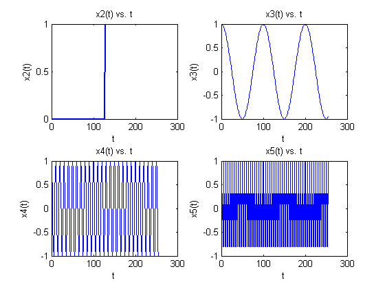

### 1(a)
Count the number of cycles in `x3` and `x4` (*i.e.* compute the product of the normalized frequency and number of samples). Is it the same?
```matlab
numCycle3=freq1*n_in
numCycle4=freq2*n_in
```

*output*:
```
	numCycle3 =
				2.5600
	numCycle4 =
				25.6000
```

### 1(b)
Based on this, how many cycles appear for `x5`?
```matlab
numCycle5=freq3*n_in
```

*output*:
```
	numCycle5 =
				102.4000
```

## LAB02
Compare two first-order systems
```matlab
% system 1
a1 = [1, -0.9];
b1 = 1;
% system 2
a2 = [1, 0.9];
b2 = 1;
```

### (a)
__For SYSTEM 1__, plot the impulse response and step response on the same plot in different colors using your function `lab1plot1`.
```matlab
v11 = filter(b1, a1, x1);
v12 = filter(b1, a1, x2);
figure();
plot(tv, v11, tv, v12, 'g');
```

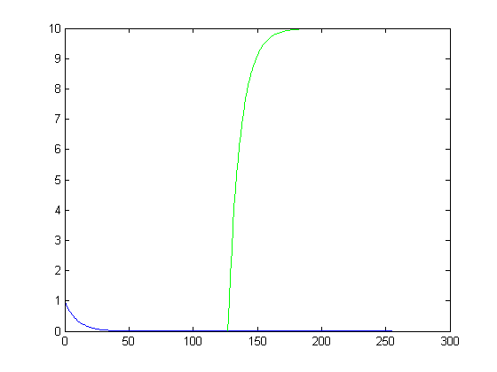

#### a(i)
From the plot, estimate the time constant of the impulse response in samples in the same way you would estimate the time constant for an analog signal. Recall that, in an RC circuit, the time constant is the time it takes for the voltage to reach 63% of it’s final voltage or, when it is discharging, to reach 37% of it’s original value. (Note: The plot magnify option and/or printing selected output values may be helpful.)
```matlab
v11max = max(v11);
v12max = max(v12);
for i=1:n_in
    if v11(i) < (v11max * 0.37)
		tc11 = i;
		break;
	end
end
tc11
v11(tc11)

for i=1:n_in
    if v12(i) > (v12max * 0.63)
		tc12 = i;
		break; end
	end
tc12
v12(tc12)

% zoom in
figure();
ax1=subplot(2,1,1);
plot(tv, v11);
axis([8 14 0.2 0.5])
ax2=subplot(2,1,2);
plot(tv, v12);
axis([134 142 0 10]);
```

__output__:
```
tc11 =
	11
ans =
	0.3487
tc12 =
	138
ans =
	6.5132
```

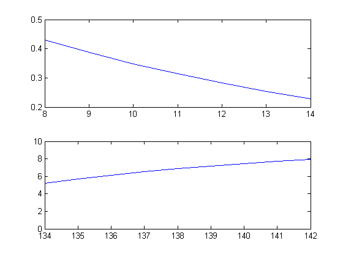

#### a(ii)
If the sampling interval were 20 msec, what would the time constant be in seconds?
```matlab
T = 0.02; % sampling interval [sec/sample]
tc11sec = tc11 * T
tc12sec = tc12 * T
```

__output__:
```
tc11sec =
	0.2200
tc12sec =
	2.7600
```

#### a(iii)
What is the steady state value for the step response? Analytically verify that your observation is consistent with the difference equation output for a constant valued input.
$$
\begin{align*}
y[n]&=\sum_{k=0}^{N_b}{b_kx[n-k]}-\sum_{m=0}^{N_a}{a_my[n-m]}\\
&=x[n]-(-0.9y[n-1])\\
&=x[n]+0.9y[n-1];
\end{align*}
$$

| $$n$$ | 0 | $$\cdots$$ | 128 | 129 | 130 | 131 | $$\cdots$$ |
| :---: | - | :--------: | :-: | :-: | :-: | :-: | :--------: |
| x[n] | 0 | $$\cdots$$ | 0 | 1 | 1 | 1 | $$\cdots$$ |
| y[n] | 0 | $$\cdots$$ | 1 | 1.9 | 2.71 | 3.439 | $$\cdots$$ |

In summation form,
$$
y[n]=\sum_{k=0}^{n}{(0.9)^k};
$$

To find the steady state value,
$$
\begin{align*}
\lim_{n\to\infty}{y[n]}&=\lim_{n\to\infty}{\sum_{k=0}^{n}{(0.9)^k}}\\
&=\lim_{n\to\infty}{\frac{1-(0.9)^{n+1}}{1-(0.9)}}\\
&=\frac{1}{0.1}=10;
\end{align*}
$$

As shown on the plot, it does converge to 10.

#### a(iv)
Does the impulse response ever go to zero? Type “y(n_in)” in the workspace to see the value.
```matlab
v11(n_in)
```

__output__:
```
ans =
   2.1470e-12
```

it does get extremely close to 0 and approximately, we can assert that the impulse response converges to 0

### (b)
__For SYSTEM 1__, plot the responses to inputs `x3`, `x4`, and `x5` in three different colors on the same plot using your function `lab1plot2`. Use the upper right corner of the 2x2 subplot array for this plot.
```matlab
% evaluate filtered results
v13 = filter (b1, a1, x3);
v14 = filter (b1, a1, x4);
v15 = filter (b1, a1, x5);

% plot those results together
figure();
plot(tv, v13, 'r', tv, v14, 'b', tv, v15, 'g')
titleFinal = horzcat('Responses for freq ', num2str(freq1), ' r ', ' ', ...
    num2str(freq2), ' g ',  num2str(freq3), ' b');
title(titleFinal);
```

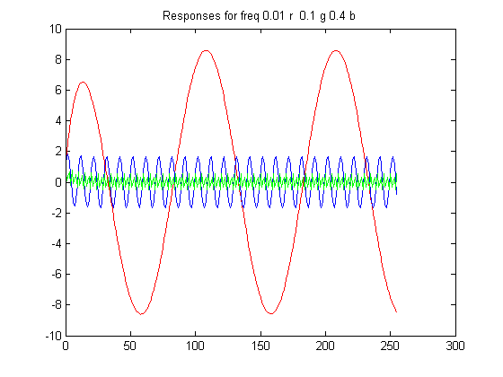

#### b(i)
Estimate the steady state amplitude of the response to each test signal.
```matlab
% evaluate steady-state amplitudes and make vectors.
ss13 = rms(v13)
ss14 = rms(v14)
ss15 = rms(v15)
ss13v = ones(1,n_in) * ss13;
ss14v = ones(1,n_in) * ss14;
ss15v = ones(1,n_in) * ss15;

% plot it along the previous outputs
figure();
plot(tv, v13, 'r', tv, v14, 'b', tv, v15, 'g');
hold on
plot(tv, ss13v, '-.r', tv, ss14v, '-.b', tv, ss15v, '-.g', 'LineWidth', 2);
titleFinal = horzcat('Responses for freq ', num2str(freq1), ' r ', ' ', ...
    num2str(freq2), ' g ',  num2str(freq3), ' b');
title(titleFinal);
```

__output__:
```
ss13 =
	5.8873
ss14 =
	1.1901
ss15 =
	0.3991
```

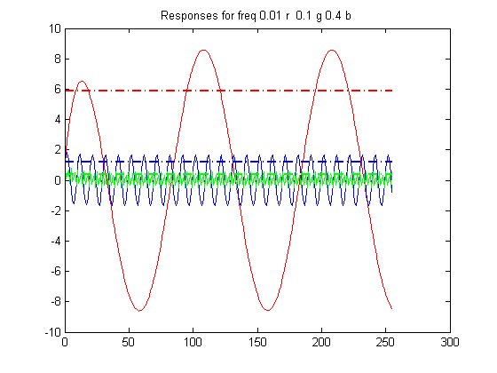


#### b(ii)
Using the steady state amplitudes and the response to a constant in Step 1, hand sketch a plot of the amplitude of the response as a function of frequency.
$$
\begin{align*}
ss_{13}&=5.8873&&@f=0.01\\
ss_{14}&=1.1901&&@f=0.1\\
ss_{15}&=0.3991&&@f=0.4
\end{align*}
$$

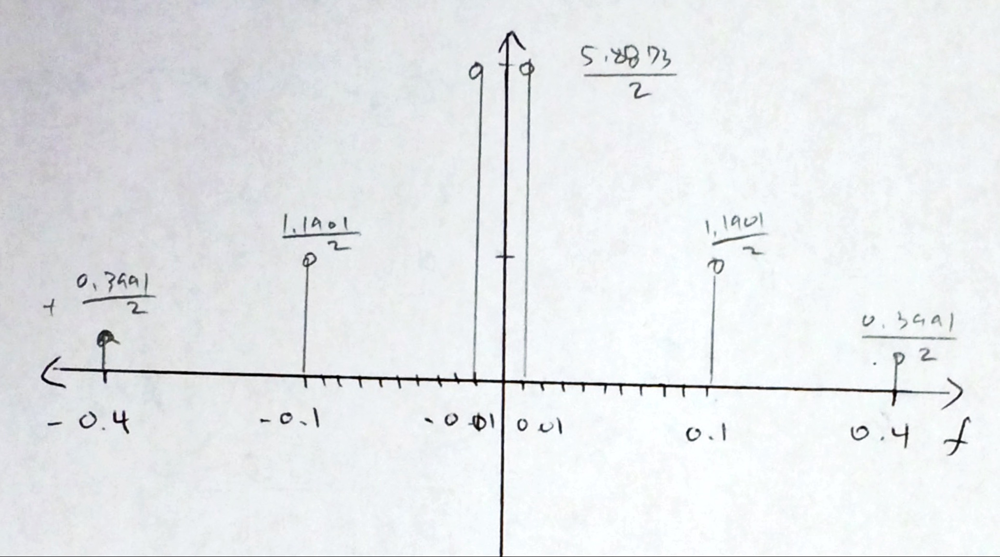

#### b(iii)
How would you characterize the frequency selective behavior of the system? *i.e.* What is the effect of this filter on different normalized frequencies between 0 and 0.5 cycles per sample?

__ANSWER__: The higher the frequency, the lower the amplitude. It looks like a LPF.


### (c)
__For SYSTEM 2__, plot the impulse response and step response on the same plot in different colors using your function lab1plot1.
```matlab
v21 = filter (b2, a2, x1);
v22 = filter (b2, a2, x2);

figure();
plot(tv, v21, tv, v22, 'g');
```
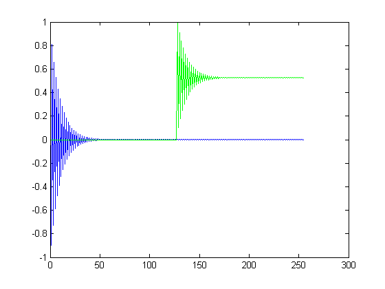

#### c(i)
From the plot, estimate the time constant of the impulse response in samples in the same way you would estimate the time constant for an analog signal. Recall that, in an RC circuit, the time constant is the time it takes for the voltage to reach 63% of it’s final voltage or, when it is discharging, to reach 37% of it’s original value. (Note: The plot magnify option and/or printing selected output values may be helpful.)

```matlab
% find the max values
v21max = max(v21);
v22max = max(v22);

% traverse the top of the oscillation only
for i=1:2:n_in
    if v21(i) < (v21max * 0.37)
    	tc21 = i;
		break;
	end
end
tc21
v21(tc21)

% only traverse the top of the oscillation
for i=n_in/2:2:n_in
    if abs(v22(i)-0.5) < ((v22max-0.5) * 0.37) % remove DC bias
    	tc22 = i;
		break;
	end
end
tc22
v22(tc22)

% zoom in
figure();
ax1=subplot(2,1,1);
plot(tv, v21);
axis([8 13 0.1 0.5])
ax2=subplot(2,1,2);
plot(tv, v22);
axis([135 140 0.1 0.9]);
```
__output__:
```
tc21 =
	11
ans =
	0.3487
tc22 =
	138
ans =
	0.3428
```

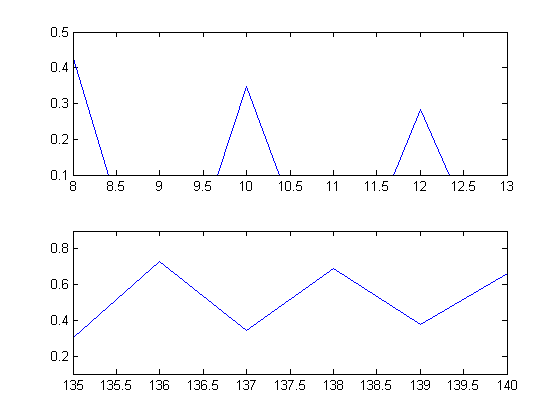

#### c(ii)
If the sampling interval were 20 msec, what would the time constant be in seconds?
```matlab
T = 0.02; % sampling interval [sec/sample]

tc21sec = tc21 * T
tc22sec = tc22 * T
```
__output__:
```
tc21sec =
	0.2200
tc22sec =
	2.7600
```

#### c(iii)
What is the steady state value for the step response? Analytically verify that your observation is consistent with the difference equation output for a constant valued input.
$$
\begin{align*}
y[n]&=\sum_{k=0}^{N_b}{b_kx[n-k]}-\sum_{m=0}^{N_a}{a_my[n-m]}\\
&=x[n]-(0.9y[n-1])\\
&=x[n]-0.9y[n-1];
\end{align*}
$$

| $$n$$ | 0 | $$\cdots$$ | 128 | 129 | 130 | 131 | $$\cdots$$ |
| :---: | - | :--------: | :-: | :-: | :-: | :-: | :--------: |
| x[n] | 0 | $$\cdots$$ | 0 | 1 | 1 | 1 | $$\cdots$$ |
| y[n] | 0 | $$\cdots$$ | 1 | 0.1 | 0.91 | 0.181 | $$\cdots$$ |

In summation form,
$$
y[n]=\sum_{k=0}^{n}{(-0.9)^k};
$$

To find the steady state value,
$$
\begin{align*}
\lim_{n\to\infty}{y[n]}&=\lim_{n\to\infty}{\sum_{k=0}^{n}{(-0.9)^k}}\\
&=\lim_{n\to\infty}{\frac{1-(-0.9)^{n+1}}{1-(-0.9)}}\\
&=\frac{1}{1.9}\approx0.5263;
\end{align*}
$$

#### c(iv)
Does the impulse response ever go to zero? Type “`y(n_in)`” in the workspace to see the value.
```matlab
v21(n_in)
```

__output__:
```
ans =
	-2.1470e-12
```

### (d)
__For SYSTEM 2__, plot the responses to inputs `x3`, `x4`, and `x5` in three different colors on the same plot using your function lab1plot2. Use the upper right corner of the 2x2 subplot array for this plot.
```matlab
v23 = filter (b2, a2, x3);
v24 = filter (b2, a2, x4);
v25 = filter (b2, a2, x5);

figure();
plot(tv, v23, 'r', tv, v24, 'b', tv, v25, 'g')
titleFinal = horzcat('Responses for freq ', num2str(freq1), ' r ', ' ', ...
    num2str(freq2), ' g ',  num2str(freq3), ' b');
title(titleFinal);
```

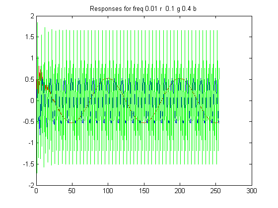


#### d(i)
Estimate the steady state amplitude of the response to each test signal.
```matlab
% evaluate the steady state amplitudes and make vectors
ss23 = rms(v23)     % sqrt( 1/n_in * sum(v13.^2) )
ss24 = rms(v24)
ss25 = rms(v25)
ss23v = ones(1,n_in) * ss23;
ss24v = ones(1,n_in) * ss24;
ss25v = ones(1,n_in) * ss25;

% plot it with previous results
figure();
plot(tv, v23, 'r', tv, v24, 'b', tv, v25, 'g');
hold on
plot(tv, ss23v, '-.r', tv, ss24v, '-.b', tv, ss25v, '-.g', 'LineWidth', 2);
titleFinal = horzcat('Responses for freq ', num2str(freq1), ' r ', ' ', ...
    num2str(freq2), ' g ',  num2str(freq3), ' b');
title(titleFinal);
```

__output__:
```
ss23 =
	0.3837
ss24 =
	0.3991
ss25 =
	1.1901
```

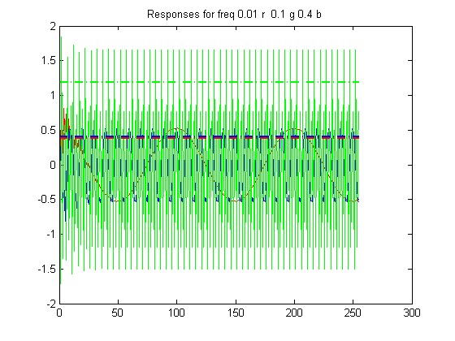

#### d(ii)
Using the steady state amplitudes and the response to a constant in Step 1, hand sketch a plot of the amplitude of the response as a function of frequency.
$$
\begin{align*}
ss_{23}&=0.3837&&@f=0.01\\
ss_{24}&=0.3991&&@f=0.1\\
ss_{25}&=1.1901&&@f=0.4
\end{align*}
$$

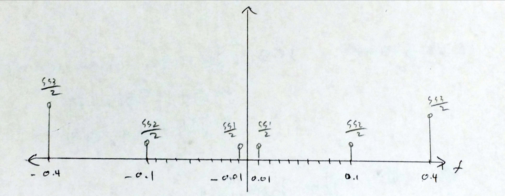

#### d(iii)
How would you characterize the frequency selective behavior of the system? *i.e.* What is the effect of this filter on different normalized frequencies between 0 and 0.5 cycles per sample?

__answer__: The higher the frequency, the higher the amplitude.  It looks like a HPF.

#### d(iv)
plot with `lab1plot1' and 'lab1plot2' file
```matlab
figure();
lab1plot1(tv, v11, v12, 1);
lab1plot2(tv, v13, v14, v15, freq1, freq2, freq3, 2);
lab1plot1(tv, v21, v22, 3);
lab1plot2(tv, v23, v24, v25, freq1, freq2, freq3, 4);
```

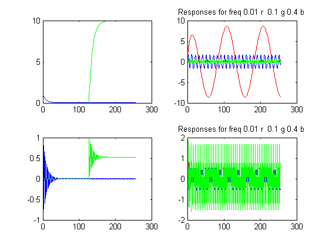

### (e)
Additional Questions:

#### e(i)
What is the effect of changing the sign of `a(2)` on the impulse and step response for these
two systems?

__answer__:
- For impulse function, as the sign of `a(2)` changes, the output changes from the decreasing exponential output to decreasing in oscillation amplitude output.
- For step response, the same applies on the latter half side.

#### e(ii)
What do you think will happen if the absolute value of `a(2)` is decreased? Why?

__answer__: The lower the 'a(2)' is, the speed of convergence for steady state output becomes quicker,
and convergence value also changes according to it.

#### e(iii)
What do you think will happen if the absolute value of `a(2)` is increased? Why?

__answer__: The opposite of above will happen, *i.e.* the speed of convergences for steady state output becomes much slower.


#### e(iv)
If System 1 is used as an “exponential average”, what value should `b(1)` have to insure that for a constant input value, the output will be that same value?

__answer__: It has to be 1.


## LAB03
Compare four second-order systems.  Use the same inputs on LAB01.
```matlab
alpha = 0.95;
alpha2 = 0.99;
w = 2 * pi * (0.1)

% System 3
a3 = [1, -2*alpha*cos(w), alpha^2];
b3 = [1, -alpha*cos(w)];

% System 4
a4 = [1, -2*alpha*cos(2 * w), alpha^2];
b4 = [1, -alpha*cos(2 * w)];

% System 5
a5 = [1, -2*alpha2*cos(w), alpha2^2]
b5 = [1, -alpha2*cos(w)]

% System 6
a6 = [1, -2*alpha*cos(w), alpha^2];
b6 = [0, alpha*sin(w)];
```

> **NOTE**: Type `figure(2)` in the MATLAB command window to specify the window for the requested plots. Repeat the four steps of Part 2 using Systems 3 and 4 instead of systems 1 and 2. Print the plot. Type `figure(3)` in the MATLAB command window and then repeat the four steps of Part 2 using Systems 5 and 6 instead of systems 1 and 2. Print the plot.

### 3(a)
Comparing System 3 and System 4:

```matlab
% impulse and step response
v31 = filter(b3, a3, x1);
v32 = filter(b3, a3, x2);
v41 = filter(b4, a4, x1);
v42 = filter(b4, a4, x2);

% sinusodial set
v33 = filter(b3, a3, x3);
v34 = filter(b3, a3, x4);
v35 = filter(b3, a3, x5);
v43 = filter(b4, a4 ,x3);
v44 = filter(b4, a4, x4);
v45 = filter(b4, a4, x5);

% plot comparison
figure();
subplot(2,1,1);
plot(tv, v31, tv, v32, 'g');
title('impulse and step response of system 3');
subplot(2,1,2);
plot(tv, v41, tv, v42, 'g');
title('impulse and step response of system 4');

figure();
subplot(2,1,1);
plot(tv, v33, 'r', tv, v34, 'b', tv, v35, 'g');
title('sinusoidal output of system 3');
subplot(2,1,2);
plot(tv, v43, 'r', tv, v44, 'b', tv, v45, 'g');
title('sinusoidal output of system 4');
```

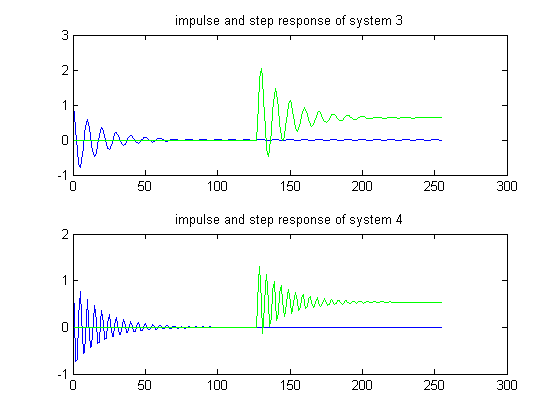

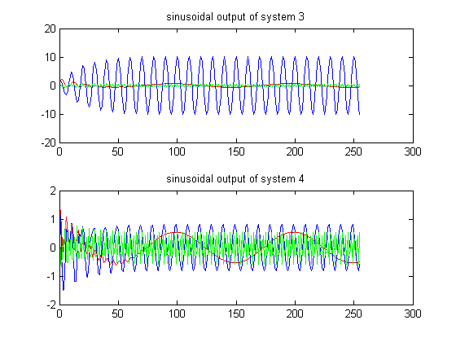

### 3(a)
How are System 3 and System 4 different?

#### Q3a(i)
Describe the impulse response of each system.

__answer__: The system 4 converges with higher frequency of oscillation

#### Q3a(ii)
How does using `2w` instead of `w` affect the impulse and step responses?

__answer__: the frequency of oscillation got larger and the maximum amplitude of the output is reduced by half.

#### Q3a(iii)
How does using `2w` instead of `w` affect the response to the cosines at the three different input frequencies?

__answer__: The signal with smallest frequency got larger with much bigger amplitude.


### 3(b)
Comparing System 3 and System 5,

```matlab
% impulse and step response
v31 = filter(b3, a3, x1);
v32 = filter(b3, a3, x2);
v51 = filter(b5, a5, x1);
v52 = filter(b5, a5, x2);

% sinusodial set
v33 = filter(b3, a3, x3);
v34 = filter(b3, a3, x4);
v35 = filter(b3, a3, x5);

v53 = filter(b5, a5 ,x3);
v54 = filter(b5, a5, x4);
v55 = filter(b5, a5, x5);

% lab1plot1(tv, y51, y52, 3)

figure();
subplot(2,1,1);
plot(tv, v31, tv, v32, 'g');
title('impulse and step response of system 3');
subplot(2,1,2);
plot(tv, v51, tv, v52, 'g');
title('impulse and step response of system 5');

figure();
subplot(2,1,1);
plot(tv, v33, 'r', tv, v34, 'b', tv, v35, 'g');
title('sinusoidal output of system 3');
subplot(2,1,2);
plot(tv, v53, 'r', tv, v54, 'b', tv, v55, 'g');
title('sinusoidal output of system 5');
```

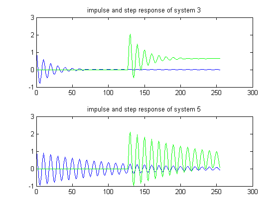

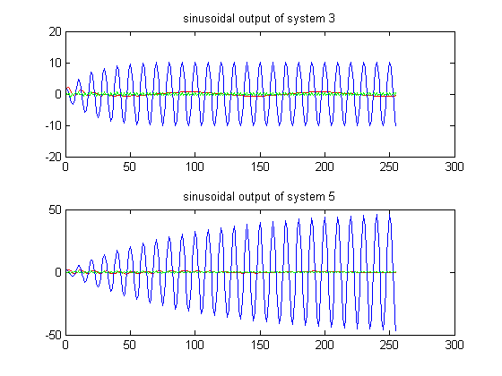

### 3(b)
How are System 3 and System 5 different?

#### Q3a(i)
how does increasing alpha affect:

__answer__:  system 5 takes more time/sample to see the steady state output.

#### Q3a(ii)
the duration of the impulse responses?

__answer__: The bigger ripple is created by system 5.

#### Q3a(iii)
the relative response to the three different input frequencies?

__answer__: The signal with higher frequency gets amplitude in increasing manner.


### 3(c)
Comparing System 3 and System 6:

```matlab
% impulse and step response
v31 = filter(b3, a3, x1);
v32 = filter(b3, a3, x2);
v61 = filter(b6, a6, x1);
v62 = filter(b6, a6, x2);

% sinusodial set
v33 = filter(b3, a3, x3);
v34 = filter(b3, a3, x4);
v35 = filter(b3, a3, x5);
v63 = filter(b6, a6 ,x3);
v64 = filter(b6, a6, x4);
v65 = filter(b6, a6, x5);

% lab1plot1(tv, y61, y62, 4)
figure();
subplot(2,1,1);
plot(tv, v31, tv, v32, 'g');
title('impulse and step response of system 3');
subplot(2,1,2);
plot(tv, v61, tv, v62, 'g');
title('impulse and step response of system 6');

figure();
subplot(2,1,1);
plot(tv, v33, 'r', tv, v34, 'b', tv, v35, 'g');
title('sinusoidal output of system 3');
subplot(2,1,2);
plot(tv, v63, 'r', tv, v64, 'b', tv, v65, 'g');
title('sinusoidal output of system 5');
```

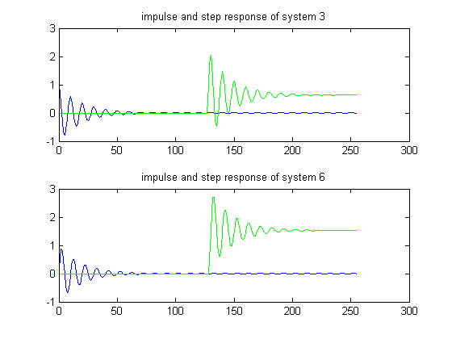

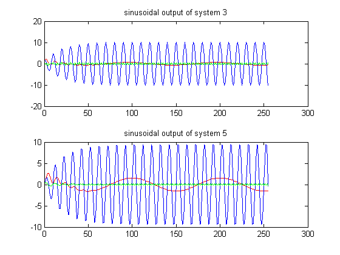

### 3(c)
How are System 3 and System 6 different?

#### Q3c(i)
Compare the impulse and frequency responses over the full time interval

#### Q3a(ii)
Zoom in on the first 20 samples and compare again.

#### Q3a(iii)
Compare the steady state amplitudes of the responses to cosines at the three different input frequencies.

### 3(d)
plot

```matlab
figure();
lab1plot1(tv, v31, v32, 1);
title('system 3');
lab1plot2(tv, v33, v34, v35, freq1, freq2, freq3, 2);
lab1plot1(tv, v41, v42, 3);
title('system 4');
lab1plot2(tv, v43, v44, v45, freq1, freq2, freq3, 4);

figure();
lab1plot1(tv, v31, v32, 1);
title('system 3');
lab1plot2(tv, v33, v34, v35, freq1, freq2, freq3, 2);
lab1plot1(tv, v51, v52, 3);
title('system 5');
lab1plot2(tv, v53, v54, v55, freq1, freq2, freq3, 4);

figure();
lab1plot1(tv, v31, v32, 1);
title('system 3');
lab1plot2(tv, v33, v34, v35, freq1, freq2, freq3, 2);
lab1plot1(tv, v61, v52, 3);
title('system 6');
lab1plot2(tv, v63, v64, v65, freq1, freq2, freq3, 4);
```

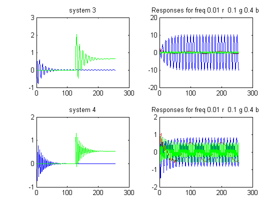

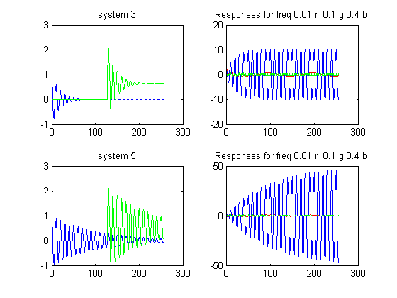

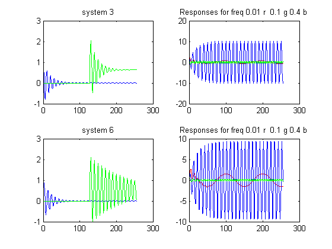


## LAB04
Cascade connection of two first order systems
```matlab
% system 1
a1 = [1, -0.9];
b1 = 1;
% system 7
a7 = 1;
b7 = [1, -0.9];
```

### 4(a)
Compute the impulse response for System 7.

Compute `y1` as the impulse response of System 1, and then use `y1` as the input for System 7. The output of System 7 will be `z1`. Plot `y1` and `z1` on the same axes. Explain the form of `z1`. (Zoom in to look at the first 20 samples of the output.)

```matlab
% filtered impulse response
y1 = filter(b1, a1, x1);
z1 = filter(b7, a7, y1);

% plot comparison
figure();
subplot(2,1,1);
plot(tv, y1, tv, z1, 'g');
title('y1 (b) vs.  z1 (g)');

% zoom in
subplot(2,1,2)
plot(tv, y1, tv, z1, 'g');
title('the first 20 samples: y1 (b) vs. z1 (g)');
axis([0, 20, -1, 1]);
```

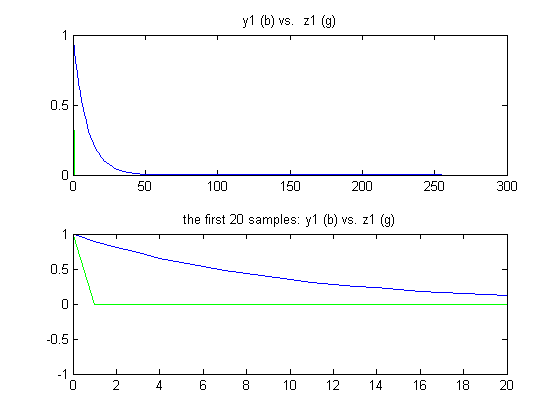

#### 4a(i)
What is the duration of the impulse response?

__answer__: it's 1 for impulse response for system 7.

#### 4a(ii)
Zoom in to look at the first 20 samples of the output.

#### 4a(iii)
Does the impulse response ever go to 0?

__answer__: yes it goes to 0 instantly.

#### 4a(iv)

Compute `y7` as the impulse response of System 7, and then use `y7` as the input for System 1. The output of System 1 will be `z7`. Plot `y7` and `z7` on the same axes. Explain the form of `z7`. (Zoom in to look at the first 20 samples of the output.)
```matlab
% filtered impulse response
y7 = filter(b7, a7, x1);
z7 = filter(b1, a1, y7);

% plot comparison
figure();
subplot(2,1,1);
plot(tv, y7, tv, z7, 'g');
title('y7 (b) vs.  z7 (g)');

% zoom in
subplot(2,1,2);
plot(tv, y7, tv, z7, 'g');
title('the first 20 samples: y7 (b) vs. z7 (g)');
axis([0, 20, -1, 1]);
```

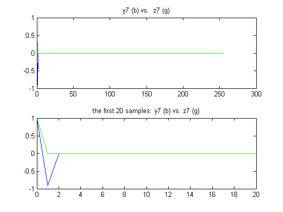

#### 4a(v)
Draw block diagrams for the two previous steps and label `y1`, `z1`, `y7`, and `z7`.

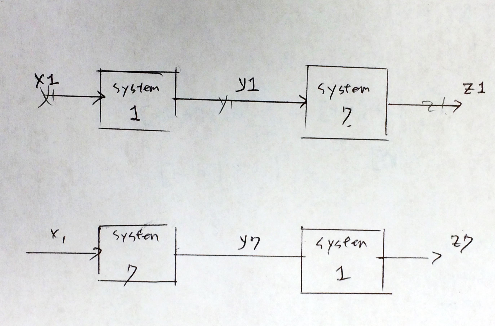

#### 4a(vi)
Analytically compute the first 5 values of `y1`, `z1`, `y7`, and `z7`.
$$
\begin{align*}
y1[n]&=\sum_{k=0}^{N_b}{x1[n-k]}-\sum_{m=1}^{N_a}{a_my1[n-m]}\\
&=x1[n]+0.9\left(y1[n-1]\right)\\\\
z1[n]&=\sum_{k=0}^{N_b}{y1[n-k]}-\sum_{m=1}^{N_a}{a_mz1[n-m]}\\
&=y1[n]-0.9\left(y1[n-1]\right)\\
\end{align*}
$$

| $$n$$ | 0 | 1 | 2 | 3 | 4 | 5 | $$\cdots$$ |
| :---: | - | - | - | - | - | - | :--------: |
| x1[n] | 1 | 0 | 0 | 0 | 0 | 0 | $$\cdots$$ |
| y1[n] | 1 | $$0.9$$ | $$0.9^2$$ | $$0.9^3$$ | $$0.9^4$$ | $$0.9^5$$ | $$\cdots$$ |
| z1[n] | 1 | 0 | 0 | 0 | 0 | 0 | $$\cdots$$ |

$$
\begin{align*}
y7[n]&=\sum_{k=0}^{N_b}{x1[n-k]}-\sum_{m=1}^{N_a}{a_my7[n-m]}\\
&=x1[n]-0.9\left(x1[n-1]\right)\\\\
z7[n]&=\sum_{k=0}^{N_b}{y7[n-k]}-\sum_{m=1}^{N_a}{a_mz7[n-m]}\\
&=y7[n]+0.9\left(z7[n-1]\right)\\
\end{align*}
$$

| $$n$$ | 0 | 1 | 2 | 3 | 4 | 5 | $$\cdots$$ |
| :---: | - | - | - | - | - | - | :--------: |
| x1[n] | 1 | 0 | 0 | 0 | 0 | 0 | $$\cdots$$ |
| y7[n] | 1 | $$-0.9$$ | 0| 0 | 0 | 0 | $$\cdots$$ |
| z7[n] | 1 | 0 | 0 | 0 | 0 | 0 |  $$\cdots$$ |

#### 4a(vii)
How would `y7` and `z7` change if the input to the cascaded system were $$x[n]=\delta[n]+\delta[n-1]$$ instead of just the impulse $$x[n]=\delta[n]$$?

| $$n$$ | 0 | 1 | 2 | 3 | 4 | 5 | $$\cdots$$ |
| :---: | - | - | - | - | - | - | :--------: |
| x1[n] | 1 | 1 | 0 | 0 | 0 | 0 | $$\cdots$$ |
| y7[n] | 1 | $$-0.9$$ | 0| 0 | 0 | 0 | $$\cdots$$ |
| z7[n] | 1 | 0 | 0 | 0 | 0 | 0 |  $$\cdots$$ |

