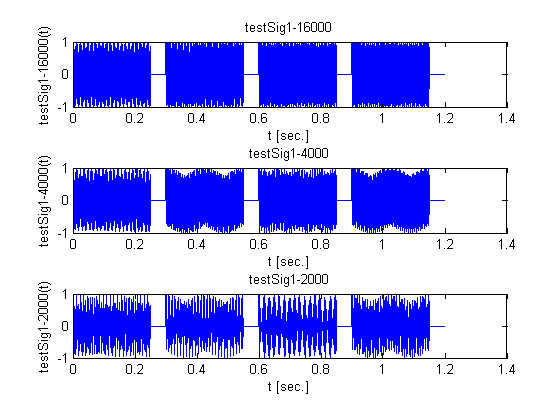

# lab03sub

## OBJECTIVES:
In this lab, learning about the way old push-button telephones worked is used as a tool to gain familiarity with generating useful sequences, filtering for sequences and learn more about the importance of sampling frequencies.


## PREALB:

### 1.

For each of the seven frequencies used for DTMF dialing signals, compute the following
- The number of samples per cycle if the sampling rate is $$8000\:\text{Hz}$$
- The number of cycles in the minimum $$50\:\text{ms}$$ interval

#### 1(a) ANSWER
The number of samples per cycle if the sampling rate is $$8000\:\text{Hz}$$
$$
\begin{align*}
f_0&\:\left[\tfrac{\text{cycle}}{\text{sec}}\right]\\
f_T&=8000\:\left[\tfrac{\text{sample}}{\text{sec}}\right]\\
\nu_0&=\frac{f_0}{f_T}\:\left[\tfrac{\text{cycle}}{\text{sample}}\right]
\end{align*}
$$

| $$f_0$$ | $$\nu_0$$ | $$\frac{1}{\nu_0}$$ |
| :------ | :-------- | :------------------ |
| 697 Hz | 0.087125 | 11.477761836 |
| 770 Hz | 0.09625 | 10.38961039 |
| 852 Hz | 0.1065 | 9.3896713615 |
| 941 Hz | 0.117625 | 8.5015940489 |
| 1209 Hz | 0.151125 | 6.6170388751 |
| 1336 Hz | 0.167 | 5.9880239521 |
| 1477 Hz | 0.184625 | 5.4163845633 |


#### 1(b) ANSWER
The number of cycles in the minimum $$50\:\text{ms}$$ interval
$$
\require{cancel}
\begin{align*}
t_\text{min}&=0.05\:\text{sec}\\
\#\text{CYCLE}&=(f_0)(t_\text{min})(\nu_0)\:\left[\tfrac{\cancel{\text{sample}}}{\cancel{\text{sec}}}\right]\left[\cancel{\text{sec}}\right]\left[\tfrac{\text{cycle}}{\cancel{\text{sample}}}\right]
\end{align*}
$$

| $$f_0$$ | $$\#\text{CYCLE}$$ |
| :------ | :-------- |
| 697 Hz | 3.03630625 |
| 770 Hz | 3.705625 |
| 852 Hz | 4.5369 |
| 941 Hz | 5.53425625 |
| 1209 Hz | 9.13550625 |
| 1336 Hz | 11.1556 |
| 1477 Hz | 13.63455625 |


### 2.
Review the signal generating `m`-files you used in previous laboratories. Draw a flow chart for a function that will create a signal vector for a telephone dialing signal. The function will have four inputs and one output as defined below. (You will write and test your function in the lab.)
```matlab
function dial_sig = my_dtmf(tone_time, quiet_time, fs, dial_vals)
% INPUTS:
% tone_time is the tone duration in seconds
% quiet_time is quiet time duration between tones in seconds fs is the sampling frequency in Hz
% dial_vals is a vector of integers from 1 to 12 representing the
% button numbers of the sequence of numbers to be dialed Note that the dialed "0" is button number 11!!!!!!
%
% OUTPUT:
% dial_sig is the vector of sampled values of the DTMF output signal for the number sequence
```

#### 2. ANSWER


### 3.
Determine the output vector created by the following MATLAB instructions where concatenation is used to build up a vector by computing components and appending them.
```matlab
out_vec = [ ];
for k = 1:4
	out_vec = [out_vec k*ones(1,5) ];
end
out_vec
```

__output__:
```
out_vec =

	Columns 1 through 6

	1	1	1	1	1	2

	Columns 7 through 12

	2	2	2	2	3	3

	Columns 13 through 18

	3	3	3	4	4	4

	Columns 19 through 20

	4	4
```

#### 3. ANSWER
It will create the vector of $$1\times20$$ matrix that has five sets of 1, 2, 3, 4, and 5 concatenated respectively.


### 4.
Determine the length in samples of the vector created by the following MATLAB instruction using your function. Determine the time duration of the sound created. (__NOTE__: You will create the function in the lab period, but you can answer this question based on the function description.)
```matlab
sample_freq = 8000;
dt = 0.2;
qt = 0.1;
dial_scu = [ 1 4 11 8 5 5 4 4 11 11 11 ] ; % note that dialed 0 is button 11
sig_1 = my_dtmf( dt, qt, sample_freq, dial_scu);
sound( sig_1, sample_freq);
```

#### 4. ANSWER
__length in samples of the vector__ and __time duration of the sound__
$$
\require{cancel}
\begin{align*}
\#\text{DIALS}&=11;\\
f_T&=8000\:\left[\tfrac{\text{sample}}{\text{sec}}\right];\\
t_\text{tone}&=0.2\:\text{sec}\\
t_\text{quiet}&=0.1\:\text{sec}\\
L_\text{sample}&=\#\text{DIALS}\cdot{f}_T\cdot\left(t_\text{tone}+t_\text{quiet}\right)\\
&=(11)(8000)(0.2+0.1)\:\left[\tfrac{\text{sample}}{\cancel{\text{sec}}}\right]\left[\cancel{\text{sec}}\right]\\
&=26,400;\\
t_\text{duration}&=\frac{L_\text{sample}}{f_T}\\
&=\frac{(26,400)}{(8000)}\:\frac{\left[\cancel{\text{sample}}\right]}{\left[\tfrac{\cancel{\text{sample}}}{\text{sec}}\right]}\\
&=3.3\:\text{sec};
\end{align*}
$$


## LAB

### STEP 1:
Create and debug a function to generate a DTMF signal as described in the preLab

#### 1(a)
Write your m-file to implement the function `my_dtmf`. Save it in a file called `my_dtmf.m` in your MATLAB working directory. Save it in your MATLAB current folder.

#### `my_dtmf.m`
```matlab
function dial_sig = my_dtmf(tone_time, quiet_time, fs, dial_vals)
% INPUTS:
% - tone_time is the tone duration in seconds
% - quiet_time is quiet time duration between tones in seconds
% - fs is the sampling frequency in Hz
% - dial_vals is a vector of integers from 1 to 12 representing the
% - button numbers of the sequence of numbers to be dialed
% Note that the dialed "0" is button number 11!!!!!!
%
% OUTPUT:
% - dial_sig is the vector of sampled values of the DTMF output signal
% for the number sequence

t_tone_new = 0:tone_time*fs-1;
num = length(dial_vals);
quiet_sig = zeros(1, fs*quiet_time);
f_tone = [
    697, 1209; 697, 1336; 697, 1477;...
    770, 1209; 770, 1336; 770, 1477;...
    852, 1209; 852, 1336; 852, 1477;...
    941, 1209; 941, 1336; 941, 1477;
    ];

dial_sig = []; %initializes the output to an empty vector

for ii=1:num
    lo = f_tone(dial_vals(ii),1);
    hi = f_tone(dial_vals(ii),2);
    new_sig = cos( 2 * pi * lo / fs * t_tone_new)...
        + cos( 2 * pi * hi / fs * t_tone_new );

    % normalize the output around 1
    new_sig = new_sig./abs(max(new_sig(:)));

    dial_sig = [dial_sig, new_sig, quiet_sig];
end
```

#### 1(b)
Call your function with a sampling frequency of $$8000$$, a tone time of $$0.5\:\text{sec}$$, a quiet time of $$0.1\:\text{sec}$$, and a dial value vector with a single number. Debug the `m`-file until there are no errors.

When the function runs without detected errors:
- Use sound to listen to your signal. Does it sound right? Compare it to a telephone when the same button is pressed. Be sure that you divided the output signal by the maximum value so that the output values will be between -1 and +1. Otherwise the nonlinear clipping will create additional frequencies in the sound.
- Use the plot instruction to plot your signal. Describe the display of the complete signal.

Repeat your test with a dial value vector containing two different numbers.

```matlab
fs = 8000;
t_tone = 0.5;
t_quiet = 0.1;

% ----- create signals -----
dial_val1 = [1 4 11 8 5 5 4 4 11 11 11];
test_sig1 = my_dtmf(t_tone, t_quiet, fs, dial_val1);

dial_val2 = [1 4 11 8 6 9 1 8 7 6 1]; % my number 1-408-691-8761
test_sig2 = my_dtmf(t_tone, t_quiet, fs, dial_val2);

% % ----- play the sound -----
% sound(test_sig1, fs)
%
% sound(test_sig2, fs);
%

% ----- plot the signals -----
figure();
subplot(2,1,1);
plot(test_sig1);
title('test-sig_1: SCU phone number');

subplot(2,1,2);
plot(test_sig2);
title('test-sig_2: my phone number');

```


#### 1(c)
Use the zoom feature of the figure display to show regions that are about $$200\:\text{samples}$$ wide. (Or use `axis` to do this.) Describe the zoomed-in display. (An example for comparison is shown below.)

```matlab
% fs = 8000;
% t_tone = 0.5;
% t_quiet = 0.1;

% ----- zoom into dial signal: 3, 5, 7 -----
dial_val3 = [3 5 7];
test_sig3 = my_dtmf(t_tone, t_quiet, fs, dial_val3);
N=length(test_sig3);
tv=(0:N-1)/fs;

% zoom in
figure();
subplot(3,1,1);
plot(tv, test_sig3);
axis([0 1.8 -1 1]);
title('first 3 dials: 3, 5, 7');
xlabel('t [sec.]'); ylabel('test-sig_3(t)');

subplot(3,1,2);
plot(tv, test_sig3);
axis([0 0.0625 -1 1]);     % 500 samples = 500/8000 sec
title('dials: 3 (600 samples)');
xlabel('t [sec.]'); ylabel('test-sig_3(t)');

subplot(3,1,3);
plot(tv, test_sig3);
axis([0.6 0.6625 -1 1]);
title('dials: 5 (600 samples)');
xlabel('t [sec.]'); ylabel('test-sig_3(t)');

% subplot(4,1,4);
% plot(tv, test_sig3);
% axis([1.2 1.2625 -1 1]);
% title('dials: 7 (600 samples)');
% xlabel('t [sec.]'); ylabel('test-sig_3(t)');
```


##### Q1(c)
Does it look like the sum of two sinusoids that have no harmonic relationship? If one were a harmonic of the other, how would the display be different?

##### A1(c)
Yes, it does.  If one were a harmonic of the other, the sum of the two sinusoids would start to resemble a square wave with ripples on the top peak. 

-----

### STEP 2:
Create an `m`-file to test and explore the DTMF signal generated by your function.

#### 2(a)
Create a script `m`-file named `lab03test01` to make some test signals with your function. For all signals, use a sampling frequency of $$8000\:\text{Hz}$$. These signals will be used in Laboratory 4 with filters that will detect the dialed sequence.
- Make signal `my_phone` with a tone time of 0.5 seconds, a quiet time of 0.1 seconds and a dial value vector set to a phone number you use.
- Make `sig5`, for the '5' button using the same parameters
- Make the following four additional test signals:

| Signal name | `dial_vals` | Tone time (sec.) | Quiet time (sec.) |
| :---------- | :---------- | :--------------: | :---------------: |
| `testSig1` | `dial_vals = [3 5 7 11]` | 0.25 | 0.05 |
| `testSig2` | `dial_vals = [3 5 7 11]` | 0.10 | 0.02 |
| `testSig3` | `dial_vals = [3 5 7 11]` | 0.50 | 0.10 |
| `testSig4` | `dial_vals = 1:12` | 0.25 | 0.05 |

- Use sound to play each of these signals and compare the first three. Use the sound instruction in the command window and wait until the sound is finished before typing the next sound instruction. __Do not put a sequence of sound instructions in an `m`-file script__.


#### `lab03test01.m`
```matlab
%% intialize
clear, clc, clf, cla, close all;

%% PART 2
% This is the matlab file to test signals with our function.

fs = 8000;

% ----- create signals -----
dial_val1 = [1 4 11 8 6 9 1 8 7 6 1]; % my number 1-408-691-8761
t_tone = 0.5;
t_quiet = 0.1;
my_phone = my_dtmf(t_tone, t_quiet, fs, dial_val1);

dial_val2 = [5];
sig5 = my_dtmf(t_tone, t_quiet, fs, dial_val2);

dial_val3 = [3 5 7 11];
t_tone1 = 0.25;
t_quiet1 = 0.05;
testSig1 = my_dtmf(t_tone1, t_quiet1, fs, dial_val3);

t_tone2 = 0.10;
t_quiet2 = 0.02;
testSig2 = my_dtmf(t_tone2, t_quiet2, fs, dial_val3);

t_tone3 = 0.50;
t_quiet3 = 0.10;
testSig3 = my_dtmf(t_tone3, t_quiet3, fs, dial_val3);

dial_val4 = 1:12;
t_tone4 = 0.25;
t_quiet4 = 0.05;
testSig4 = my_dtmf(t_tone4, t_quiet4, fs, dial_val4);

% ---- define the following: -----
% (1) sample size
% (2) time duration
% (3) time vector.

N1=length(my_phone);
t1=N1/fs;
tv1=(0:N1-1)/fs;

N2=length(sig5);
t2=N2/fs;
tv2=(0:N2-1)/fs;

N3=length(testSig1);
t3=N3/fs;
tv3=(0:N3-1)/fs;

N4=length(testSig2);
t4=N4/fs;
tv4=(0:N4-1)/fs;

N5=length(testSig3);
t5=N5/fs;
tv5=(0:N5-1)/fs;

N6=length(testSig4);
t6=N6/fs;
tv6=(0:N6-1)/fs;


% %----- REMOVE COMMENTS BELOW IF NECESSRAY -----
% % ---- play the sound -----
%
% sound(my_phone, fs);
% pause(6.7);
%
% sound(sig5);
% pause(0.7);
%
% sound(testSig1);
% pause(1.3);
%
% sound(testSig2);
% pause(0.48);
%
% sound(testSig3);
% pause(2.4);
%
% sound(testSig4);
% pause(3.6);
% % ----- export sound file -----
% filename1='01a-my_phone.wav';
% filename2='01b-sig5.wav';
% filename3='01c-testSig1.wav';
% filename4='01d-testSig2.wav';
% filename5='01e-testSig3.wav';
% filename6='01f-testSig4.wav';
%
% audiowrite(filename1, my_phone, fs);
% audiowrite(filename2, sig5, fs);
% audiowrite(filename3, testSig1, fs);
% audiowrite(filename4, testSig2, fs);
% audiowrite(filename5, testSig3, fs);
% audiowrite(filename6, testSig4, fs);

% ----- plot the signals -----
figure();
subplot(3,1,1);
plot(tv1, my_phone);
title('my-phone');
xlabel('t [sec.]'); ylabel('my-phone(t)');

subplot(3,1,2);
plot(tv2, sig5);
title('sig5');
xlabel('t [sec.]'); ylabel('sig5(t)');

subplot(3,1,3);
plot(tv3, testSig1);
title('testSig1');
xlabel('t [sec.]'); ylabel('testSig1(t)');

figure();
subplot(3,1,1);
plot(tv4, testSig2);
title('testSig2');
xlabel('t [sec.]'); ylabel('testSig2(t)');

subplot(3,1,2);
plot(tv5, testSig3);
title('testSig3');
xlabel('t [sec.]'); ylabel('testSig3(t)');

subplot(3,1,3);
plot(tv6, testSig4);
title('testSig4');
xlabel('t [sec.]'); ylabel('testSig4(t)');


% ----- time duration and sample sizes -----
N1 = horzcat('my_phone: total sample size = ', num2str(N1));
t1 = horzcat('my_phone: total time duration = ', num2str(t1));
N1,t1

N2 = horzcat('sig5: total sample size = ', num2str(N2));
t2 = horzcat('sig5: total time duration = ', num2str(t2));
N2,t2

N3 = horzcat('testSig1: total sample size = ', num2str(N3));
t3 = horzcat('testSig1: total time duration = ', num2str(t3));
N3,t3

N4 = horzcat('testSig2: total sample size = ', num2str(N4));
t4 = horzcat('testSig2: total time duration = ', num2str(t4));
N4,t4

N5 = horzcat('testSig3: total sample size = ', num2str(N5));
t5 = horzcat('testSig3: total time duration = ', num2str(t5));
N5, t5

N6 = horzcat('testSig4: total sample size = ', num2str(N6));
t6 = horzcat('testSig4: total time duration = ', num2str(t6));
N6, t6
```

__output__:
```
N1 =
my_phone: total sample size = 52800
t1 =
my_phone: total time duration = 6.6

N2 =
sig5: total sample size = 4800
t2 =
sig5: total time duration = 0.6

N3 =
testSig1: total sample size = 9600
t3 =
testSig1: total time duration = 1.2

N4 =
testSig2: total sample size = 3840
t4 =
testSig2: total time duration = 0.48

N5 =
testSig3: total sample size = 19200
t5 =
testSig3: total time duration = 2.4

N6 =
testSig4: total sample size = 28800
t6 =
testSig4: total time duration = 3.6
```


#### Q2(b)
What is the total duration of each of the six signals in samples? in time?


#### A2(b)
$$
\begin{align*}
t_{tot}&=\#\text{dials}\times\left(t_\text{tone}+t_\text{quiet}\right)\\
N_{tot}&=\#\text{dials}\times{f}_T\times\left(t_\text{tone}+t_\text{quiet}\right)\\
&=\left(t_{tot}\right)\times{f}_T
\end{align*}
$$

| signal | # dials | $$t_\text{tone}$$ | $$t_\text{quiet}$$ | sample size | time duration [sec.] |
| :----: | :-----: | :---------------: | :----------------: | :---------: | :------------------: |
| `my_phone` | 11 | 0.5 | 0.1 | 52800 | 6.6 |
| `sig5` | 1 | 0.5 | 0.1 | 4800 | 0.6 |
| `testSig1` | 4 | 0.25 | 0.05 | 9600 | 1.2 |
| `testSig2` | 4 | 0.10 | 0.02 | 3840 | 0.48 |
| `testSig3` | 4 | 0.50 | 0.10 | 19200 | 2.4 |
| `testSig4` | 12 | 0.25 | 0.05 | 28800 | 3.6 |

Demonstrate the sounds to your laboratory assistant.

-----

### STEP 3:
Explore the effect of the sampling frequency.

#### 3(a)
Create a script `m`-file named `lab03test02` to make some additional test signals with your function. Except for the sampling frequency, use the same parameters used for `testSig1` above.
- Make `testSig1_16000` using a sampling frequency of 16000.
- Make `testSig1_4000` using a sampling frequency of 4000.
- Make `testSig1_2000` using a sampling frequency of 2000.

#### `lab03test02.m`
```matlab
%% intialize
clear, clc, clf, cla, close all;

%% PART 3
% This is the matlab file to test signals with our function.

fs1 = 16000;
fs2 = 4000;
fs3 = 2000;

% ---- create signals -----
dial_val = [3 5 7 11];
t_tone = 0.25;
t_quiet = 0.05;
testSig1_16000 = my_dtmf(t_tone, t_quiet, fs1, dial_val);
testSig1_4000 = my_dtmf(t_tone, t_quiet, fs2, dial_val);
testSig1_2000 = my_dtmf(t_tone, t_quiet, fs3, dial_val);

% ---- define the following: -----
% (1) sample size
% (2) time duration
% (3) time vector.

N1=length(testSig1_16000);
t1=N1/fs1;
tv1=(0:N1-1)/fs1;

N2=length(testSig1_4000);
t2=N2/fs2;
tv2=(0:N2-1)/fs2;

N3=length(testSig1_2000);
t3=N3/fs3;
tv3=(0:N3-1)/fs3;

% % ---- play the sound -----
%
% sound(testSig1_16000);
% pause(3);
%
% sound(testSig1_4000);
% pause(3);
%
% sound(testSig1_2000);
% pause(3);

% % ----- export sound file -----
% filename1='02a-testSig1_16000.wav';
% filename2='02b-testSig1_4000.wav';
% filename3='02c-testSig1_2000.wav';
%
% audiowrite(filename1, testSig1_16000, fs1);
% audiowrite(filename2, testSig1_4000, fs2);
% audiowrite(filename3, testSig1_2000, fs3);

% ----- plot the signals -----
figure();
subplot(3,1,1);
plot(tv1, testSig1_16000);
title('testSig1-16000');
xlabel('t [sec.]'); ylabel('testSig1-16000(t)');

subplot(3,1,2);
plot(tv2, testSig1_4000);
title('testSig1-4000');
xlabel('t [sec.]'); ylabel('testSig1-4000(t)');

subplot(3,1,3);
plot(tv3, testSig1_2000);
title('testSig1-2000');
xlabel('t [sec.]'); ylabel('testSig1-2000(t)');

% ----- time duration and sample sizes -----
N1 = horzcat('testSig1-16000: total sample size = ', num2str(N1));
t1 = horzcat('testSig1-16000: total time duration = ', num2str(t1));
N1,t1

N2 = horzcat('testSig1-4000: total sample size = ', num2str(N2));
t2 = horzcat('testSig1-4000: total time duration = ', num2str(t2));
N2,t2

N3 = horzcat('testSig1-2000: total sample size = ', num2str(N3));
t3 = horzcat('testSig1-2000: total time duration = ', num2str(t3));
N3,t3
```

__output__:
```
N1 =
testSig1-16000: total sample size = 19200
t1 =
testSig1-16000: total time duration = 1.2

N2 =
testSig1-4000: total sample size = 4800
t2 =
testSig1-4000: total time duration = 1.2

N3 =
testSig1-2000: total sample size = 2400
t3 =
testSig1-2000: total time duration = 1.2
```




#### 3(b)
Use sound to listen to these three new signals and compare each to `testSig1`. In each case for the sound instruction use the sampling frequency that was used to create the signal.

$$
\begin{align*}
t_{tot}&=\#\text{dials}\times\left(t_\text{tone}+t_\text{quiet}\right)\\
N_{tot}&=\#\text{dials}\times{f}_T\times\left(t_\text{tone}+t_\text{quiet}\right)\\
&=\left(t_{tot}\right)\times{f}_T
\end{align*}
$$

| signal | $$f_T$$ | sample size | time duration [sec.] |
| :----: | :-----: | :---------: | :------------------: |
| `testSig1_16000` | 16000 | 19200 | 1.2 |
| `testSig1_4000` | 4000 | 4800 | 1.2 |
| `testSig1_2000` | 2000 | 2400 | 1.2 |

#### Q3(b)i
Is the time duration of each signal the same?

#### A3(b)i
Yes, they are 1.2 seconds.

#### Q3(b)ii
Do all the signals sound the same? Explain any differences you hear.

#### A3(b)ii
No, they are not.  As the sample frequency decreases, its sample size should decrease.  When you hear an audio in a such condtion, the tone of the sound will go down, meaning the tone will shift from treble to base.

Compare how it sounds
- [testSig1_16000][7]
- [testSig1_4000][8]
- [testSig1_2000][9]

#### Q3(b)iii
What is the length of each signal in samples?

#### A3(b)iii
See the table above.  The highest sample rate has largest sample size.


## SOUND FILES:
- [01a-my_phone.wav][1]
- [01b-sig5.wav][2]
- [01c-testSig1.wav][3]
- [01d-testSig2.wav][4]
- [01e-testSig3.wav][5]
- [01f-testSig4.wav][6]
- [02a-testSig1_16000.wav][7]
- [02b-testSig1_4000.wav][8]
- [02c-testSig1_2000.wav][9]

[1]: https://raw.githubusercontent.com/chanhi2000/ELEN133/master/lab/lab03sub/01a-my_phone.wav
[2]: https://raw.githubusercontent.com/chanhi2000/ELEN133/master/lab/lab03sub/01b-sig5.wav
[3]: https://raw.githubusercontent.com/chanhi2000/ELEN133/master/lab/lab03sub/01c-testSig1.wav
[4]: https://raw.githubusercontent.com/chanhi2000/ELEN133/master/lab/lab03sub/01d-testSig2.wav
[5]: https://raw.githubusercontent.com/chanhi2000/ELEN133/master/lab/lab03sub/01e-testSig3.wav
[6]: https://raw.githubusercontent.com/chanhi2000/ELEN133/master/lab/lab03sub/01f-testSig4.wav
[7]: https://raw.githubusercontent.com/chanhi2000/ELEN133/master/lab/lab03sub/02a-testSig1_16000.wav
[8]: https://raw.githubusercontent.com/chanhi2000/ELEN133/master/lab/lab03sub/02b-testSig1_4000.wav
[9]: https://raw.githubusercontent.com/chanhi2000/ELEN133/master/lab/lab03sub/02c-testSig1_2000.wav

