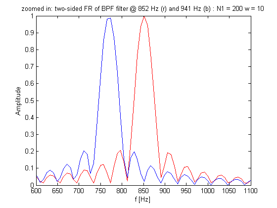
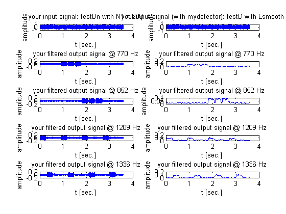

# lab04sub
Detecting DTMF Tones with FIR Filters

## OBJECTIVES:
In this laboratory we will:
- Use MATLAB to help us specify the most appropriate filter length and filter parameters to distinguish the button frequencies.
- Test the selected filter using test signals similar to those generated in Laboratory 3.

## PRELAB:
In this PreLab we will explore filters that can distinguish the third row tone at $$852\:\text{Hz}$$ from the second row tone at $$770\:\text{Hz}$$.

### 1.
In MATLAB type “`help fir1`” to read about the function that will generate low pass and bandpass filter coefficients. Part of that information is shown below.
`B = FIR1(N, Wn, WIN)` designs an N-th order FIR filter using the N+1 length vector WIN to window the impulse response.
- An `N`th order FIR filter will have $$(N+1)$$ coefficients. Its Z-transforms will have $$N$$ zeros, which we will not compute (we will cover z-transforms more fully in about two weeks).
- The cut-off frequency `Wn` must be between $$0<Wn<1.0$$, with $$1.0$$ corresponding to half the sample rate. Here, `Wn` is a normalized frequency that is $$\omega$$  that we have been dealing with so far (with a range of $$-\pi$$ to $$\pi$$) divided by $$\pi$$ . Since the magnitude will be even, simply dealing with the positive normalized frequency is sufficient.
- If `Wn` is a two-element vector, `Wn = [W1 W2]`, `FIR1` returns an order `N` bandpass filter with passband $$W1<W<W2$$.
- `WIN = rectwin(N+1)` will use a rectangular window.

We want to detect the row 3 frequency of $$852\:\text{Hz}$$, so we will specify a passband with $$852$$ in the center. The width of the passband should be chosen to be small enough so that the $$770\:\text{Hz}$$ signal cannot get through. For a passband of width `2*w` we would use the instructions below. Note that we have divided the two frequencies specifying the band edges by $$\tfrac{f_s}{2}$$ so that the frequency range for the function would be normalized to the range of 0 and 1 as required by the function definition.

-----

### 2.
The function `fir1` produces the filter coefficients based on our specifications, but it is hard to tell by looking at the coefficients how good a job the filter will do. We need to look at the filter frequency response. To put this in terms that we have already seen in class, the frequency response is simply the DTFT of the filter — *i.e.*, it shows the response as a function of frequency. Type “`help freqz`” to read about the function that will compute the frequency response.
`[H,W] = FREQZ(B,A,N)` returns the N-point complex frequency response vector `H` and the `N`-point frequency vector `W` in $$\tfrac{\text{radians}}{\text{sample}}$$ of the filter defined by a difference equation in which the `A` vector has the a coefficients and the `B` vector has the `b` coefficients. For our use, `B` will be the output of `fir1` and we will set `A` equal to the scalar value 1. Since we are dealing with a FINITE impulse response, the fact that `A=1` should make sense as it means that there are no coefficients for delayed output (`y`) terms. If there was feedback, the impulse response would be infinite.
- The frequency response is evaluated at `N` points equally spaced around the upper half of the unit circle of a `real` vs. `imag` plot. Generally, we consider the unit circle with an angle equal to that described by $$\omega$$ in radians. If `N` isn't specified, it defaults to $$512$$. (Note that this `N` has nothing to do with the filter length.)
- `[H,F] = FREQZ(B,A,N,Fs)` returns frequency vector `F` (in Hz), where `Fs` is the sampling frequency (in Hz).

We are specifying our frequency bands in Hz, so if we want to be able to easily interpret the frequency response, we will use the frequency vector in Hz for plotting. To see the frequency response we would use the following:
```matlab
N2=512;
[H852, fv] = freqz(b852,1,N2,fs); %N2 is the number of frequency response points
plot(fv, abs(H852))
```

This shows just the one-sided spectrum. To see the two-sided spectrum from $$-\tfrac{F_s}{2}$$ to $$\tfrac{F_s}{2}$$ do the following instead.
```matlab
N2=1024;
[H852, fv] = freqz(b852,1,N2,fs,'whole');
plot(fv-4000, fftshift(abs(H852)));
```

Note that in the plot command, `plot(fv, abs(H852))` would yield a plot from $$0$$ to just shy of $$8000$$ ($$8000$$ would start the next period — look at `fv(end)` to see.)

So, to see the two-sided plot, one must subtract $$\tfrac{F_s}{2}$$  (in this case, $$4000$$) and “`fftshift`” the values being plotted — in essence, this is picking up the irght hand side of the plot and putting it onto the left.
```matlab
% ----- EXERCISE 1: -----
% changes in resolution (N2) of FR 

fs = 8000;
fc = 852;
w = 82;
Wn = [fc-w, fc+w]/(fs/2);

N1 = 100;
b852 = fir1(  N1, Wn, rectwin(N1+1)  );

N2a = 512;
[H852a, fv1] = freqz(  b852, 1, N2a, fs,'whole'  );

N2b = 1024;
[H852b, fv2] = freqz(  b852, 1, N2b, fs,'whole'  );

title1 = 'one-sided FR of BPF filter @ 852 Hz w/ resolution, N2 = ';
title2 = 'two-sided FR of BPF filter @ 852 Hz w/ resolution, N2 = ';

% ----- one-sided plot ----- 
figure();
subplot(2,1,1);
plot(  fv1, abs(H852a)  );
title(  horzcat(title1, num2str(N2a))  );

subplot(2,1,2);
plot(  fv2, abs(H852b)  );
title(  horzcat(title1, num2str(N2b))  );

% ----- two-sided plot ----- 
figure();
subplot(2,1,1);
plot(  fv1-(fs/2), fftshift(abs(H852a))  );
title(  horzcat(title2, num2str(N2a)));

subplot(2,1,2);
plot(  fv2-(fs/2), fftshift(abs(H852b))  );
title(  horzcat(title2, num2str(N2b))  );
```


-----

### 3.
Use `N1 = 100` and `w = 80` to compute `b852` and then plot the frequency response as described above. It is your choice to plot the one-sided or the two-sided plot — but, you should understand and be comfortable with both. This should produce a filter with $$101$$ coefficients that tries to make a filter that will pass frequencies between $$772\:\text{Hz}$$ and $$932\:\text{Hz}$$. Observe the plot of the frequency response and see how well this filter works.
```matlab
% ----- EXERCISE 2: -----
% Change in filter based on the limited amount of sample points.

fs = 8000;
fc = 852;
w = 80;
Wn = [fc-w, fc+w]/(fs/2);

N1 = 100;
N2 = 1024;      % resolution of FR
b852 = fir1(  N1, Wn, rectwin(N1+1)  );
[H852, fv] = freqz(  b852, 1, N2, fs, 'whole'  );

title3 = 'one-sided FR of BPF filter @ 852 Hz';
title4 = 'two-sided FR of BPF filter @ 852 Hz';
title5 = 'two-sided FR of BPF filter @ 852 Hz (zoomed-in)';

% ----- plot frequency response -----
figure();
subplot(3,1,1);
plot(fv, abs(H852));
title(title3);
xlabel('f [Hz]'); ylabel('amplitude');

subplot(3,1,2);
plot(fv-(fs/2), fftshift(abs(H852)));
title(title4);
xlabel('f [Hz]'); ylabel('amplitude');

subplot(3,1,3);
plot(fv-(fs/2), fftshift(abs(H852)));
title(title5);
axis([670 1100 0 1]);

% linear interpolation: apprximate magnitude for 
% (1) 852 Hz, 
% (2) 772 Hz, and 
% (3) 932 Hz

a765 = fftshift(abs(H852(99)));  % 765 Hz
a773 = fftshift(abs(H852(100)));  % 773 Hz
a851 = fftshift(abs(H852(110)));  % 851 Hz
a859 = fftshift(abs(H852(111)));  % 859 Hz
a929 = fftshift(abs(H852(120)));  % 929 Hz
a937 = fftshift(abs(H852(121)));  % 937 Hz

a852 = a851 + (a859 - a851) * (852-851)/(859-851)
a772 = a765 + (a773 - a765) * (772-765)/(773-765)
a932 = a929 + (a937 - a929) * (932-929)/(937-929)

% Approximately 985 and 720 hits close to 0
```

__output__:
```
a852 
	= 0.9991
a772 
	= 0.3877
a932 
	= 0.3766
```


#### 3(a).
You should see a narrow band centered at $$852\:\text{Hz}$$ on frequency axis that either goes from  $$0\:\text{Hz}$$ to $$8000\:\text{Hz}$$ or from $$-4000\:\text{Hz}$$ to $$4000\:\text{Hz}$$. If you do not see this (note example below), check your parameters and instructions and then replot.

#### Q3(b)
Use the magnify feature in the figure window and display the small region with a nonzero frequency response in detail. What is the value of the frequency response at approximately $$852\:\text{Hz}$$? At approximately $$772\:\text{Hz}$$?, at approximately $$932\:\text{Hz}$$? At what frequency below $$852\:\text{Hz}$$ does the frequency response first go to zero? At what frequency above $$852\:\text{Hz}$$ does the frequency response first go to zero?

#### A3(b)
- @ $$852\:\text{Hz}$$, the amplitude is approximately 0.9991
- @ $$772\:\text{Hz}$$, the amplitude is approximately 0.3877
- @ $$932\:\text{Hz}$$, the amplitude is approximately 0.3766
- Examining the plot, @ $$985\:\text{Hz}$$ and $$720\:\text{Hz}$$ is the location where it will first go to zero.

------

In the example below, filters with `N1 = 50` and `w = 30` are used for row 3 and row 4 tone frequencies. On the right, the frequency response between $$600\:\text{Hz}$$ and $$1200\:\text{Hz}$$ is shown. Clearly these filters have a lot of overlap in frequency, and they are not narrow enough to separate the two frequencies.


For the following steps, use a script `m`-file for your MATLAB instructions. (Note that `figure(n)` creates a new figure window and plotting after that command will appear in the new window without disturbing existing figure windows.)


### 4.
Compute `b770` and `H770` in the same way and plot both `H770` and `H852` on the same axes with __`plot(fv, abs(H770),’-r’, fv, abs(H852),’-b’)`__ to plot the one-sided spectra in different colors as in the figure above. You can modify this to view the two-sided spectra as desired.

```matlab
% ----- EXERCISE 3: -----
% Examiniation of overlapping filter @ different frequencies.

fs = 8000;
fc1 = 852;
fc2 = 770;


N1 = 50;
w = 30;
Wn1 = [fc1-w, fc1+w]/(fs/2);
b852 = fir1(  N1, Wn1, rectwin(N1+1)  );

Wn2 = [fc2-w, fc2+w]/(fs/2);
b770 = fir1(  N1, Wn2, rectwin(N1+1)  );

N2 = 1024;
[H852, fv] = freqz(  b852, 1, N2, fs,  'whole'  ) ;
[H770, fv] = freqz(  b770, 1, N2, fs,  'whole'  ) ;

title1 = 'one-sided FR of BPF filter @ 852 Hz (r) and 770 Hz (b) : N1 = ';
title2 = 'two-sided FR of BPF filter @ 852 Hz (r) and 770 Hz (b) : N1 = ';
width = ' w = '; 

% ----- plot the frequency response ----- 
figure();
subplot(2,1,1)
plot(  fv, abs(H852), '-r', fv, abs(H770), '-b'  );
title(horzcat(title1, num2str(N1), width, num2str(w)));
xlabel('f [Hz]'); ylabel('Amplitude');

subplot(2,1,2)
plot(  fv-(fs/2), fftshift(abs(H852)), '-r',...
    fv-(fs/2), fftshift(abs(H770)), '-b' );
title(horzcat(title2, num2str(N1), width, num2str(w)));
xlabel('f [Hz]'); ylabel('Amplitude');
```


#### Q4
How much overlap is there between the two frequency bands? Print this plot and submit it with your PreLab. Note the values of `N1` and `w` on it.

#### A4
There's almost a complete overlap between these two bands. 

-----

### 5.
Try to reduce the overlap by repeating Step 4 with the following three sets of values of `w` and `N1`.
- `N1 = 100` and `w = 40`;
- `N1 = 100` and `w = 20`;
- `N1 = 200` and `w = 20`;

__NOTE__: Just reducing w will not necessarily narrow the width of your filter. As `w` is decreased, `N1` may have to be increased to attain the sharper frequency definition.

```matlab
% ----- EXERCISE 4: -----
% Remove the overlap
fs = 8000;
fc1 = 852;
fc2 = 770;

% ----- test1: ----- 
N1 = 100;
w1 = 40;

Wn1 = [fc1-w1, fc1+w1]/(fs/2);
Wn2 = [fc2-w1, fc2+w1]/(fs/2);
b852 = fir1(  N1, Wn1, rectwin(N1+1)  );
b770 = fir1(  N1, Wn2, rectwin(N1+1)  );

N2 = 1024;
[H852, fv] = freqz(  b852, 1, N2, fs,  'whole'  ) ;
[H770, fv] = freqz(  b770, 1, N2, fs,  'whole'  ) ;

title2 = 'zoomed in: two-sided FR of BPF filter @ 852 Hz (r) and 941 Hz (b) : N1 = ';
width = ' w = '; 

% ----- test1: plot the frequency response ----- 
subplot(3,1,1)
plot(  fv-(fs/2), fftshift(abs(H852)), '-r',...
    fv-(fs/2), fftshift(abs(H770)), '-b' );
title(horzcat(title2, num2str(N1), width, num2str(w1)));
xlabel('f [Hz]'); ylabel('Amplitude');
axis([ 600 1100 0 1]);

% ----- test2: reducing w by half -----
N1 = 100;
w1 = 20;

Wn1 = [fc1-w1, fc1+w1]/(fs/2);
Wn2 = [fc2-w1, fc2+w1]/(fs/2);
b852 = fir1(  N1, Wn1, rectwin(N1+1)  );
b770 = fir1(  N1, Wn2, rectwin(N1+1)  );

[H852, fv] = freqz(  b852, 1, N2, fs,  'whole'  ) ;
[H770, fv] = freqz(  b770, 1, N2, fs,  'whole'  ) ;

% ----- test2: plot the frequency response ----- 
subplot(3,1,2)
plot(  fv-(fs/2), fftshift(abs(H852)), '-r',...
    fv-(fs/2), fftshift(abs(H770)), '-b' );
title(horzcat(title2, num2str(N1), width, num2str(w1)));
xlabel('f [Hz]'); ylabel('Amplitude');
axis([ 600 1100 0 1]);

% ----- test3: double N1 -----
N1 = 200;
w1 = 20;

Wn1 = [fc1-w1, fc1+w1]/(fs/2);
Wn2 = [fc2-w1, fc2+w1]/(fs/2);
b852 = fir1(  N1, Wn1, rectwin(N1+1)  );
b770 = fir1(  N1, Wn2, rectwin(N1+1)  );
[H852, fv] = freqz(  b852, 1, N2, fs,  'whole'  ) ;
[H770, fv] = freqz(  b770, 1, N2, fs,  'whole'  ) ;

% ----- test3: plot the frequency response ----- 
subplot(3,1,3)
plot(  fv-(fs/2), fftshift(abs(H852)), '-r',...
    fv-(fs/2), fftshift(abs(H770)), '-b' );
title(horzcat(title2, num2str(N1), width, num2str(w1)));
xlabel('f [Hz]'); ylabel('Amplitude');
axis([ 600 1100 0 1]);
```


### 6.
Compare the results of Steps 4 and 5 with respect to the filter’s ability to suppress one of the tones. 

#### Q6
What is the effect of reducing `w`? What is the effect of increasing `N1`?

#### A6
- `w` adjusts the bandwidth. Reducing `w`, entails __narrower__ band on the frequency domain.
- `N1` adjusts the degree of the filter.  Increasing `N1` brings __more sample points__ for the filter and the shapes of the filter will look more __well-defined__ due to a large sample size. 


### 7.
Chose a set of values for `N1` and `w` that you think would be the best to use in filters that would reliably distinguish the row 3 tone from the row 2 tone and justify your choice. How long is your filter as a fraction of the minimum time between digits of $$45\:\text{ms}$$? Your choice does not have to be one of the four suggested in this Prelab.

```matlab
% ----- EXERCISE 5: -----
% Find the best N1 and w for the least overlapping.
fs = 8000;
fc1 = 852;
fc2 = 770;

% ----- test1: ----- 
N1 = 200;
w1 = 10;

Wn1 = [fc1-w1, fc1+w1]/(fs/2);
Wn2 = [fc2-w1, fc2+w1]/(fs/2);
b852 = fir1(  N1, Wn1, rectwin(N1+1)  );
b770 = fir1(  N1, Wn2, rectwin(N1+1)  );

N2 = 1024;
[H852, fv] = freqz(  b852, 1, N2, fs,  'whole'  ) ;
[H770, fv] = freqz(  b770, 1, N2, fs,  'whole'  ) ;

title2 = 'zoomed in: two-sided FR of BPF filter @ 852 Hz (r) and 941 Hz (b) : N1 = ';
width = ' w = '; 

% ----- test1: plot the frequency response ----- 
figure();
plot(  fv-(fs/2), fftshift(abs(H852)), '-r',...
    fv-(fs/2), fftshift(abs(H770)), '-b' );
axis([600 1100 0 1]);
title(horzcat(title2, num2str(N1), width, num2str(w1)));
xlabel('f [Hz]'); ylabel('Amplitude');
```



Given
$$
f_s=8000\:\left[\tfrac{\text{sample}}{\text{sec}}\right]
$$
We can find the tone signal's time by doing the following
$$
\begin{align*}
t_\text{tone}&=\frac{N1}{f_s}\\
&=\frac{200}{8000}\\
&=0.025
\end{align*}
$$
Doing so, the ratio between tone time to quiet time must be less than one. So,
$$
\frac{t_\text{tone}}{t_\text{quiet}}=\frac{0.025}{0.045}=0.55
$$

__For the Prelab, submit the answers to the questions, the plots and any Matlab scripts that you wrote.__


## LAB:

### STEP 1:
Create new test signals using methods from Laboratory 3.

#### 1(a)
Run a script m-file to create the following DTMF test signals

| Signal name | dial_vals | Tone time (sec.) | Quiet time (sec.) |
| :---------: | :-------- | :--------------: | :---------------: |
| `testA` | `dial_vals = [5,8,11,7,8,9]` | 0.25 | 0.05 |
| `testB` | `dial_vals = [5,8,11,7,8,9]` | 0.10 | 0.02 | 
| `testC` | `dial_vals = [5,8,11,7,8,9]` | 0.50 | 0.10 | 
| `testD` | `dial_vals = 1:12` | 0.25 | 0.05 |

```matlab
%% STEP 1
%
% ----- initialize: create signals -----
%
fs = 8000;

dial_vals1 = [5 8 11 7 8 9];
t_tone1 = 0.25;
t_quiet1 = 0.05;
testA = my_dtmf(t_tone1, t_quiet1, fs, dial_vals1);

t_tone2 = 0.10;
t_quiet2 = 0.02;
testB = my_dtmf(t_tone2, t_quiet2, fs, dial_vals1);

t_tone3 = 0.50;
t_quiet3 = 0.10;
testC = my_dtmf(t_tone3, t_quiet3, fs, dial_vals1);

dial_vals2 = 1:12;
testD = my_dtmf(t_tone1, t_quiet1, fs, dial_vals2);
%
% ---- define the following: -----
%
% (1) sample size
% (2) time duration
% (3) time vector.

Ns1=length(testA);
t1=Ns1/fs;
tv1=(0:Ns1-1)/fs;

Ns2=length(testB);
t2=Ns2/fs;
tv2=(0:Ns2-1)/fs;

Ns3=length(testC);
t3=Ns3/fs;
tv3=(0:Ns3-1)/fs;

Ns4=length(testD);
t4=Ns4/fs;
tv4=(0:Ns4-1)/fs;
```

------

### STEP 2: 
Use your filter designed in the Prelab (with your selection of `w` and `N1`) on your test signals.

In MATLAB type “`help filter`” to read about the function that will filter an input signal with a filter described by its the difference equation coefficients. You can also refer to lab #2.


#### 2(a)
- Create `b770` and `b852` as you did in the Prelab with your selection for `N1` and `w`.
- Use `testC` as an input signal and create filtered outputs `y770` and `y852` with your filters. 
- Plot the input signal and the two output signals on the same plot (using `subplot` with 3 rows and one column).
- Repeat the previous bullet using `testB` and describe the impact of the shorter tone time and shorter quiet time. 

```matlab
%% STEP 2
%
% ----- create the filter: -----
%
fs = 8000;
fc1 = 852;
fc2 = 770;

w = 10;
Wn1 = [fc1-w, fc1+w]/(fs/2);
Wn2 = [fc2-w, fc2+w]/(fs/2);

N1 = 200;
b852 = fir1(  N1, Wn1, rectwin(N1+1)  );
b770 = fir1(  N1, Wn2, rectwin(N1+1)  );
%
% ----- create a frequency response of the filter -----
%
% N2 = 1024;
% [H852, fv] = freqz(  b852, 1, N2, fs, 'whole'  );
% [H770, fv] = freqz(  b770, 1, N1, fs, 'whole'  );

title1a='the input signal: testC';
title1b='the input signal: testB';
title2='the filtered output signal @ 852 Hz';
title3='the filtered output signal @ 770 Hz';
%
% ----- filtered output for testC signal -----
%
% (1) using convolution 
%
% y852 = conv(testC, b852);
% y770 = conv(testC, b770);
%
% (2) using filter function
%
y852c = filter(b852, 1, testC);
y770c = filter(b770, 1, testC);
%
% ----- plot input and output signals ---- 
%
figure();
subplot(3,1,1)
plot(tv3, testC);
title(title1a);
xlabel('t [sec.]'); ylabel('amplitude');

subplot(3,1,2)
plot(tv3, y852c);
title(title2);
xlabel('t [sec.]'); ylabel('amplitude');

subplot(3,1,3);
plot(tv3, y770c);
title(title3);
xlabel('t [sec.]'); ylabel('amplitude');
```


#### 2(b)
How well does your filter do?
- How much does it suppress the other DTMF tones compared to the desired row tone?
- Is there any significant spread of the high amplitude response beyond the time intervals where the desired tone is present?

#### A2(b)
- It suppresses the other tone pretty well. The tone that doesn't have the frequency ($$852\:\text{Hz}$$) is suppressed compared to the amplitude of the desired tone.
- For `testB` we see a bigger spread of time intervals for our desired tone. The only difference is that `testB` had tone time, __0.1 sec__ and quiet time, __0.02__, whereas `testC` had tone time, __0.50 sec__ and quiet time, __0.10__.
The reason we see overlaps on filtered signal is that the tone time and quiet time weren't large enough to filter out the right segment at time. This overlap indicates the delay in the filter.

------

### STEP 3:
Explore the effect of changing the filter length.

The length of the filter determines the amount of computation required to produce the filter output, so if the filter length can be reduced, the implementation will be more efficient.

#### 3(a)
Repeat Step 2 using new filters for `b770` and `b852` with the same value for `w` but with the length reduced by a factor of 4. How do these results compare to Step 2 results?

```matlab
%% STEP 3
%
% ----- create the filter: -----
%
%% 3(a)
%
% ----- EXERCISE 1: N1=N1/4 -----
%
fs = 8000;
fc1 = 852;
fc2 = 770;

w = 10;
Wn1 = [fc1-w, fc1+w]/(fs/2);
Wn2 = [fc2-w, fc2+w]/(fs/2);

N1a = 200;
N1b = N1a / 4;

b852a = fir1(  N1a, Wn1, rectwin(N1a+1)  );
b770a = fir1(  N1a, Wn2, rectwin(N1a+1)  );

b852b = fir1(  N1b, Wn1, rectwin(N1b+1)  );
b770b = fir1(  N1b, Wn2, rectwin(N1b+1)  );
%
% ----- create a frequency response of the filter -----
%
% N2 = 1024;
% [H852, fv] = freqz(  b852, 1, N2, fs, 'whole'  );
% [H770, fv] = freqz(  b770, 1, N1, fs, 'whole'  );

title1a='your input signal: testC with N1 = ';
title1b='your input signal: testB with N1 = ';
title2='your filtered output signal @ 852 Hz';
title3='your filtered output signal @ 770 Hz';
%
% ----- filtered output for testC signal -----
%
% (1) using convolution 
%
% y852 = conv(testC, b852);
% y770 = conv(testC, b770);
%
% (2) using filter function
%
y852c1 = filter(b852a, 1, testC);
y770c1 = filter(b770a, 1, testC);
y852b1 = filter(b852a, 1, testB);
y770b1 = filter(b770a, 1, testB);

y852c2 = filter(b852b, 1, testC);
y770c2 = filter(b770b, 1, testC);
y852b2 = filter(b852b, 1, testB);
y770b2 = filter(b770b, 1, testB);
%
% ----- plot input and output signals (step 2 vs step 3) ----- 
%
figure();
subplot(3,2,1)
plot(tv3, testC);
title(  horzcat(title1a, num2str(N1a))  );
xlabel('t [sec.]'); ylabel('amplitude');

subplot(3,2,3)
plot(tv3, y852c1);
title(title2);
xlabel('t [sec.]'); ylabel('amplitude');

subplot(3,2,5);
plot(tv3, y770c1);
title(title3);
xlabel('t [sec.]'); ylabel('amplitude');

subplot(3,2,2)
plot(tv3, testC);
title(  horzcat(title1a, num2str(N1b))  );
xlabel('t [sec.]'); ylabel('amplitude');

subplot(3,2,4)
plot(tv3, y852c2);
title(title2);
xlabel('t [sec.]'); ylabel('amplitude');

subplot(3,2,6);
plot(tv3, y770c2);
title(title3);
xlabel('t [sec.]'); ylabel('amplitude');
%
% ---- filtered output for testB signal -----
%
% (1) using convolution 
%
% y852 = conv(testC, b852);
% y770 = conv(testC, b770);
%
% (2) using filter function
%
y852b = filter(b852a, 1, testB);
y770b = filter(b770a, 1, testB);
%
% ----- plot input and output signals ----- 
%
figure();
subplot(3,2,1)
plot(tv2, testB);
title(  horzcat(title1b, num2str(N1a))  );
xlabel('t [sec.]'); ylabel('amplitude');

subplot(3,2,3)
plot(tv2, y852b1);
title(title2);
xlabel('t [sec.]'); ylabel('amplitude');

subplot(3,2,5);
plot(tv2, y770b1);
title(title3);
xlabel('t [sec.]'); ylabel('amplitude');

subplot(3,2,2)
plot(tv2, testB);
title(  horzcat(title1b, num2str(N1b))  );
xlabel('t [sec.]'); ylabel('amplitude');

subplot(3,2,4)
plot(tv2, y852b2);
title(title2);
xlabel('t [sec.]'); ylabel('amplitude');

subplot(3,2,6);
plot(tv2, y770b2);
title(title3);
xlabel('t [sec.]'); ylabel('amplitude');
```


#### 3(a)
Repeat Step 2 using new filters with the same value for `w` but with the length from Step 1 increased by a factor of 2. How do these results compare to Step 2 results? Is there any noticeable benefit to increasing the length of the filter?

```matlab
%% 3(b)
%
% ----- EXERCISE 2: N1=N1*2 -----
%
N1a = 200;
N1c = N1a * 2;

b852a = fir1(  N1a, Wn1, rectwin(N1a+1)  );
b770a = fir1(  N1a, Wn2, rectwin(N1a+1)  );

b852c = fir1(  N1c, Wn1, rectwin(N1c+1)  );
b770c = fir1(  N1c, Wn2, rectwin(N1c+1)  );

title1a='your input signal: testC with N1 = ';
title1b='your input signal: testB with N1 = ';
title2='your filtered output signal @ 852 Hz';
title3='your filtered output signal @ 770 Hz';
%
% ---- filtered output for testC signal -----
%
% (1) using convolution 
%
% y852c1 = conv(testC, b852a);
% y770c1 = conv(testC, b770a);
% y852c1 = conv(testB, b852a);
% y770c1 = conv(testB, b770a);
%
% y852c3 = conv(testC, b852c);
% y770c3 = conv(testC, b770c);
% y852c3 = conv(testB, b852c);
% y770c3 = conv(testB, b770c);

%
% (2) using filter function
%
y852c1 = filter(b852a, 1, testC);
y770c1 = filter(b770a, 1, testC);
y852b1 = filter(b852a, 1, testB);
y770b1 = filter(b770a, 1, testB);

y852c3 = filter(b852c, 1, testC);
y770c3 = filter(b770c, 1, testC);
y852b3 = filter(b852c, 1, testB);
y770b3 = filter(b770c, 1, testB);
%
% ----- plot input and output signals (1) ----- 
%
figure();
subplot(3,2,1)
plot(tv3, testC);
title(  horzcat(title1a, num2str(N1a))  );
xlabel('t [sec.]'); ylabel('amplitude');

subplot(3,2,3)
plot(tv3, y852c1);
title(title2);
xlabel('t [sec.]'); ylabel('amplitude');

subplot(3,2,5);
plot(tv3, y770c1);
title(title3);
xlabel('t [sec.]'); ylabel('amplitude');

subplot(3,2,2)
plot(tv3, testC);
title(  horzcat(title1a, num2str(N1c))  );
xlabel('t [sec.]'); ylabel('amplitude');

subplot(3,2,4)
plot(tv3, y852c3);
title(title2);
xlabel('t [sec.]'); ylabel('amplitude');

subplot(3,2,6);
plot(tv3, y770c3);
title(title3);
xlabel('t [sec.]'); ylabel('amplitude');

%
% ----- plot input and output signals (2) ----- 
%
figure();
subplot(3,2,1)
plot(tv2, testB);
title(  horzcat(title1b, num2str(N1a))  );
xlabel('t [sec.]'); ylabel('amplitude');

subplot(3,2,3)
plot(tv2, y852b);
title(title2);
xlabel('t [sec.]'); ylabel('amplitude');

subplot(3,2,5);
plot(tv2, y770b);
title(title3);
xlabel('t [sec.]'); ylabel('amplitude');

subplot(3,2,2)
plot(tv2, testB);
title(  horzcat(title1b, num2str(N1c))  );
xlabel('t [sec.]'); ylabel('amplitude');

subplot(3,2,4)
plot(tv2, y852b3);
title(title2);
xlabel('t [sec.]'); ylabel('amplitude');

subplot(3,2,6);
plot(tv2, y770b3);
title(title3);
xlabel('t [sec.]'); ylabel('amplitude');
```


#### A3(b)
`N1c` represeents the doubling of `N1a`. Certainly it  contributed to stronger suppression.  However, for filtering `testB` signal with shorter tone time and quiet time, it wasn't able to avoid overlap / delay. The cause of delay is because `N1c` increased far significantly that the time it takes to filter the signal took longer.


#### 3(c)
Based on these results, would you modify your choices for `N1` and `w` in your filters? Explore new choices and make a plot showing the results for the choices you think produce the best results for the smallest value of `N1`. Note that:
- The choice of `N1` determines the smallest effective value of `w`. For a particular value of `N1`, reduction of `w` decreases the width of the frequency band that is passed. But at some point further reductions in `w` will make almost no difference in the filter
- `testB` does not meet the specification for the minimum time between tones created.

```matlab
%% 3(c) i: setup
%
% ----- EXERCISE 3: N1 of your pick -----
%
fs = 8000;
fc1 = 852;
fc2 = 770;

w = 10;
Wn1 = [fc1-w, fc1+w]/(fs/2);
Wn2 = [fc2-w, fc2+w]/(fs/2);

N1 = 100;
b852 = fir1(  N1, Wn1, rectwin(N1+1)  );
b770 = fir1(  N1, Wn2, rectwin(N1+1)  );

title1a='your input signal: testC with N1 = ';
title1b='your input signal: testB with N1 = ';
title2='your filtered output signal @ 852 Hz';
title3='your filtered output signal @ 770 Hz';
%
% ---- filtered output for testC signal -----
%
% (1) using convolution 
%
% y852 = conv(testC, b852);
% y770 = conv(testC, b770);
% y852 = conv(testC, b852);
% y770 = conv(testC, b770);

%
% (2) using filter function
%
y852c = filter(b852, 1, testC);
y770c = filter(b770, 1, testC);
y852b = filter(b852, 1, testB);
y770b = filter(b770, 1, testB);

%% 3(b) ii: plot comparison (1)
% ------------------------------------ %
% ----- 1. N1 = 100 vs. N1a = 200 ---- %
% ------------------------------------ %
%
% ----- plot input and output signals (N1a for testC)----- 
%
figure();
subplot(3,2,1)
plot(tv3, testC);
title(  horzcat(title1a, num2str(N1))  );
xlabel('t [sec.]'); ylabel('amplitude');

subplot(3,2,3)
plot(tv3, y852c);
title(title2);
xlabel('t [sec.]'); ylabel('amplitude');

subplot(3,2,5);
plot(tv3, y770c);
title(title3);
xlabel('t [sec.]'); ylabel('amplitude');

subplot(3,2,2)
plot(tv3, testC);
title(  horzcat(title1a, num2str(N1a))  );
xlabel('t [sec.]'); ylabel('amplitude');

subplot(3,2,4)
plot(tv3, y852c1);
title(title2);
xlabel('t [sec.]'); ylabel('amplitude');

subplot(3,2,6);
plot(tv3, y770c1);
title(title3);
xlabel('t [sec.]'); ylabel('amplitude');
%
% ----- plot input and output signals (N1a for testB) ----- 
%
figure();
subplot(3,2,1)
plot(tv2, testB);
title(  horzcat(title1b, num2str(N1))  );
xlabel('t [sec.]'); ylabel('amplitude');

subplot(3,2,3)
plot(tv2, y852b);
title(title2);
xlabel('t [sec.]'); ylabel('amplitude');

subplot(3,2,5);
plot(tv2, y770b);
title(title3);
xlabel('t [sec.]'); ylabel('amplitude');

subplot(3,2,2)
plot(tv2, testB);
title(  horzcat(title1b, num2str(N1a))  );
xlabel('t [sec.]'); ylabel('amplitude');

subplot(3,2,4)
plot(tv2, y852b1);
title(title2);
xlabel('t [sec.]'); ylabel('amplitude');

subplot(3,2,6);
plot(tv2, y770b1);
title(title3);
xlabel('t [sec.]'); ylabel('amplitude');
```


```matlab
%% 3(b) ii: plot comparison (2)
%
% ------------------------------------ %
% ----- 2. N1 = 100 vs. N1b = 50 ---- %
% ------------------------------------ %
%
% ----- plot input and output signals (N1a for testC)----- 
%
figure();
subplot(3,2,1)
plot(tv3, testC);
title(  horzcat(title1a, num2str(N1))  );
xlabel('t [sec.]'); ylabel('amplitude');

subplot(3,2,3)
plot(tv3, y852c);
title(title2);
xlabel('t [sec.]'); ylabel('amplitude');

subplot(3,2,5);
plot(tv3, y770c);
title(title3);
xlabel('t [sec.]'); ylabel('amplitude');

subplot(3,2,2)
plot(tv3, testC);
title(  horzcat(title1a, num2str(N1b))  );
xlabel('t [sec.]'); ylabel('amplitude');

subplot(3,2,4)
plot(tv3, y852c2);
title(title2);
xlabel('t [sec.]'); ylabel('amplitude');

subplot(3,2,6);
plot(tv3, y770c2);
title(title3);
xlabel('t [sec.]'); ylabel('amplitude');
%
% ----- plot input and output signals (N1a for testB) ----- 
%
figure();
subplot(3,2,1)
plot(tv2, testB);
title(  horzcat(title1b, num2str(N1))  );
xlabel('t [sec.]'); ylabel('amplitude');

subplot(3,2,3)
plot(tv2, y852b);
title(title2);
xlabel('t [sec.]'); ylabel('amplitude');

subplot(3,2,5);
plot(tv2, y770b);
title(title3);
xlabel('t [sec.]'); ylabel('amplitude');

subplot(3,2,2)
plot(tv2, testB);
title(  horzcat(title1b, num2str(N1b))  );
xlabel('t [sec.]'); ylabel('amplitude');

subplot(3,2,4)
plot(tv2, y852b2);
title(title2);
xlabel('t [sec.]'); ylabel('amplitude');

subplot(3,2,6);
plot(tv2, y770b2);
title(title3);
xlabel('t [sec.]'); ylabel('amplitude');
```


```matlab
%% 3(b) ii: plot comparison (3)
%
% ------------------------------------ %
% ----- 3. N1 = 100 vs. N1c = 400 ---- %
% ------------------------------------ %
%
% ----- plot input and output signals (N1a for testC)----- 
%
figure();
subplot(3,2,1)
plot(tv3, testC);
title(  horzcat(title1a, num2str(N1))  );
xlabel('t [sec.]'); ylabel('amplitude');

subplot(3,2,3)
plot(tv3, y852c);
title(title2);
xlabel('t [sec.]'); ylabel('amplitude');

subplot(3,2,5);
plot(tv3, y770c);
title(title3);
xlabel('t [sec.]'); ylabel('amplitude');

subplot(3,2,2)
plot(tv3, testC);
title(  horzcat(title1a, num2str(N1c))  );
xlabel('t [sec.]'); ylabel('amplitude');

subplot(3,2,4)
plot(tv3, y852c3);
title(title2);
xlabel('t [sec.]'); ylabel('amplitude');

subplot(3,2,6);
plot(tv3, y770c3);
title(title3);
xlabel('t [sec.]'); ylabel('amplitude');
%
% ----- plot input and output signals (N1a for testB) ----- 
%
figure();
subplot(3,2,1)
plot(tv2, testB);
title(  horzcat(title1b, num2str(N1))  );
xlabel('t [sec.]'); ylabel('amplitude');

subplot(3,2,3)
plot(tv2, y852b);
title(title2);
xlabel('t [sec.]'); ylabel('amplitude');

subplot(3,2,5);
plot(tv2, y770b);
title(title3);
xlabel('t [sec.]'); ylabel('amplitude');

subplot(3,2,2)
plot(tv2, testB);
title(  horzcat(title1b, num2str(N1c))  );
xlabel('t [sec.]'); ylabel('amplitude');

subplot(3,2,4)
plot(tv2, y852b3);
title(title2);
xlabel('t [sec.]'); ylabel('amplitude');

subplot(3,2,6);
plot(tv2, y770b3);
title(title3);
xlabel('t [sec.]'); ylabel('amplitude');
```


#### A3(c)
`N1` represeents the my ideal length.  The challenge of picking the right `N1` resides in how well it will filter the difficult signal like `testB`.  Surprisingly, the half of my original pick, improved the filter output better.

----- 

### STEP 4:
Build a detector for the DTMF tones

To build a detector for the high amplitude signals, the filter output signal can be rectified and smoothed.

#### 4(a)
Write an `m`-file function `mydetector.m` called by `Y = mydetector(x, smoothLength)` where `x` will be the output of one of your filters and smoothLength will be the length of a moving average filter to smooth out variations. The objective of this function is to convert a band of high amplitude oscillation into an indicator pulse of about the same width. In your function
- Rectify `x` using `xa=abs(x)`;
- Smooth `xa` using the filter function with `b=(ones(1, smoothLength))/smoothLength`

```matlab
function Y = mydetector(x, smoothLength)
% % INPUTS:
% - x is output of one of your filter.
% - smoothLength is length of moving average filter to smooth out the
% variations.
% - thresh is the threshold level for amplitude to flip to 0 or 1.
%
% OUTPUT:
% - Y is the vector filtered output with better amplitude 

xa = abs(x);   % rectified output (nonnegative)
b = (  ones(1,smoothLength)/smoothLength  );
Y = filter(b, 1, xa);
end
```

#### 4(b)
- Using the values of `N1` and `w` you selected from Step 3, create four filters : `b770`, `b852`, `b1209`, and `b1336`.
- Test the `mydetector` function using these filters on `testD` which contains all the tones and adjust `smoothLength` so that the oscillations in the result are less than about 10% of the amplitude. What happens to the shape and width of the pulses in the output from `mydetector` when `smoothLength` is set to a large number?

```matlab
%% STEP 4 
%
%% 4(a) Setup
%
% ----- create the filter -----
%
fs = 8000;
fc1 = 770;
fc2 = 852;
fc3 = 1209;
fc4 = 1336;

w = 10;
Wn1 = [fc1-w, fc1+w]/(fs/2);
Wn2 = [fc2-w, fc2+w]/(fs/2);
Wn3 = [fc3-w, fc3+w]/(fs/2);
Wn4 = [fc4-w, fc4+w]/(fs/2);

N1 = 100;
b770 = fir1(  N1, Wn1, rectwin(N1+1)  );
b852 = fir1(  N1, Wn2, rectwin(N1+1)  );
b1209 = fir1(  N1, Wn3, rectwin(N1+1)  );
b1336 = fir1(  N1, Wn4, rectwin(N1+1)  );

title1a='your input signal: testD with Lsmooth = ';
title1b='your input signal (with mydetector): testD with N1 = ';
title2='your filtered output signal @ 770 Hz';
title3='your filtered output signal @ 852 Hz';
title4='your filtered output signal @ 1209 Hz';
title5a='your filtered output signal @ 1336 Hz';
title5b='your filtered output signal @ 1336 Hz (zoomed in)';
%
% ----- filtered output for testD signal -----
%
% (1) using convolution 
%
% y770d = conv(testD, b770);
% y852d = conv(testD, b852);
% y1209d = conv(testD, b1209);
% y1336d = conv(testD, b1336);
%
% (2) using filter function
%
y770d = filter(b770, 1, testD);
y852d = filter(b852, 1, testD);
y1209d = filter(b1209, 1, testD);
y1336d = filter(b1336, 1, testD);
%
% ----- use mydetector.m function to fix -----
%
Lsmooth = 200;
y770dr = mydetector(y770d, Lsmooth);
y852dr = mydetector(y852d, Lsmooth);
y1209dr = mydetector(y1209d, Lsmooth);
y1336dr = mydetector(y1336d, Lsmooth);
%
% ----- plot input and output signals ----- 
%
figure();
subplot(5,2,1)
plot(tv4, testD);
title(  horzcat(title1a, num2str(Lsmooth))  );
xlabel('t [sec.]'); ylabel('amplitude');

subplot(5,2,3)
plot(tv4, y770d);
title(title2);
xlabel('t [sec.]'); ylabel('amplitude');

subplot(5,2,5);
plot(tv4, y852d);
title(title3);
xlabel('t [sec.]'); ylabel('amplitude');

subplot(5,2,7);
plot(tv4, y1209d);
title(title4);
xlabel('t [sec.]'); ylabel('amplitude');

subplot(5,2,9);
plot(tv4, y1336d);
title(title5a);
xlabel('t [sec.]'); ylabel('amplitude');
%
% ----- plot input and output signals (with my detector) ----- 
%
subplot(5,2,2)
plot(tv4, testD);
title(  horzcat(title1b, num2str(Lsmooth))  );
xlabel('t [sec.]'); ylabel('amplitude');

subplot(5,2,4)
plot(tv4, y770dr);
title(title2);
xlabel('t [sec.]'); ylabel('amplitude');

subplot(5,2,6);
plot(tv4, y852dr);
title(title3);
xlabel('t [sec.]'); ylabel('amplitude');

subplot(5,2,8);
plot(tv4, y1209dr);
title(title4);
xlabel('t [sec.]'); ylabel('amplitude');

subplot(5,2,10);
plot(tv4, y1336dr);
title(title5a);
xlabel('t [sec.]'); ylabel('amplitude');

%
% ----- check if -----
% the oscillation in the pulses with highest amplitude have 10% of the
% amplitude in the oscillation
figure();
subplot(2,1,1);
plot(tv4, y1336dr);
title(title5a);
xlabel('t [sec.]'); ylabel('amplitude');


subplot(2,1,2);
plot(tv4, y1336dr);
title(title5b);
xlabel('t [sec.]'); ylabel('amplitude');
axis([tv4(2400), tv4(4700), min(y1336dr), max(y1336dr)]);

sampleSig = y1336dr(2688:4416);
loamp = min(sampleSig);
hiamp = max(sampleSig);
x = rms(sampleSig)
z = hiamp - loamp

if (z < 0.1 * x)
    sprintf('amplitude within 10%%')
end
```

__output__:
```
x = 
	0.3172
z = 
	0.0277
ans = 
	amplitude within 10%
``` 


#### A4(b)
My pick for the quantity of `smoothLength` is 200. The role of `smoothLength` is to reduce the ripple in the original signal and transform the shape of sinusoidal wave into a pulse shape with smoother curve, by averaging and reducing the variations between points. There's the reason, you would adjust the `smoothLength` at __not so high__ or __not so low__ number.  If it is set too high, there's a problem recognizing the pulse width of DTMF tone, since it smoothened out too much. If it is set too low, it will be hard to see the desired pulse shape.


#### 4(c)
To complete a detector for the 8 button, multiply the smoothed rectified output of the `b852` filter and the smoothed rectified output of the `b1336` filter. (__Note__: Use the `.*` operation to multiply point by point, not the `*` operation which will do a vector product.) On a single plot with four rows, plot the input signal `testD`, the smoothed rectified output of the `b852` filter, the smoothed rectified output of the `b1336` filter, and the product of the two waveforms. Submit this with your lab report.

```matlab
% ----- plot input and output signals (with my detector) ----- 
%
figure();
subplot(4,1,1)
plot(tv4, testD);
title(  horzcat(title1, num2str(Lsmooth))  );
xlabel('t [sec.]'); ylabel('amplitude');

subplot(4,1,2)
plot(tv4, y852dr);
title(title2);
xlabel('t [sec.]'); ylabel('amplitude');

subplot(4,1,3);
plot(tv4, y1336dr);
title(title3);
xlabel('t [sec.]'); ylabel('amplitude');

subplot(4,1,4);
plot(tv4, y8dr);
title(title4a);
xlabel('t [sec.]'); ylabel('amplitude');

%
% ---- plot zoom in -----
%
figure();
subplot(3,1,1)
plot(tv4, y8dr);
title(title4a);
xlabel('t [sec.]'); ylabel('amplitude');

subplot(3,1,2)
plot(tv4, y8dr);
title(title4b);
xlabel('t [sec.]'); ylabel('amplitude');
axis([2.0991, 2.387, min(y8dr), max(y8dr)]);

subplot(3,1,3)
plot(tv4, y8dr);
title(title4c);
xlabel('t [sec.]'); ylabel('amplitude');
axis([tv4(14400), tv4(16705), min(y8dr), max(y8dr)]);

%
% ----- finding the lowest value of the pulse (inside the number 8) -----
%
loamp1a = y8dr(17095);
loamp2a = y8dr(18816);
loampa = min(y8dr(17095:18816))

%
% ----- finding the width of each pulse  -----
%
Lpulse1a = 2.387 - 2.0991;
Lpulse2a = t4/12;
Lpulsea = mean([Lpulse1a, Lpulse2a])

%
% ----- finding the highest of the pulse (outside the number 8) -----
%
hiamp1a = y8dr(14400);
hiamp2a = y8dr(16705);
hiampa = max(y8dr(14400:16705))
```

__output__:
```
loampb = 
	0.0960
Lpulseb =
	0.2940
hiampb = 
	0.0189
```


#### 4(c)
To complete a detector for the 4 button, multiply the smoothed rectified output of the `b770` filter and the smoothed rectified output of the `b1209` filter. On a single plot with four rows, plot the input signal testD, the smoothed rectified output of the `b770` filter, the smoothed rectified output of the `b1209` filter, and the product of the two waveforms. Submit this with your lab report.

```matlab
%% 4(c) 
%
% ---- create a detector for the button 4 -----
%
fc1 = 770;
fc3 = 1209;

Wn1 = [fc1-w, fc1+w]/(fs/2);
Wn3 = [fc3-w, fc3+w]/(fs/2);

N1 = 100;
b770 = fir1(  N1, Wn1, rectwin(N1+1)  );
b1209 = fir1(  N1, Wn3, rectwin(N1+1)  );

y770d = filter(b770, 1, testD);
y1209d = filter(b1209, 1, testD);
y4d = y770d .* y1209d;
%
% ----- use mydetector.m function to fix -----
%
Lsmooth = 200;
y770dr = mydetector(y770d, Lsmooth);
y1209dr = mydetector(y1209d, Lsmooth);
y4dr = mydetector(y4d, Lsmooth);

title1b='your input signal (with mydetector): testD with N1 = ';
title2='your filtered output signal @ 770 Hz';
title3='your filtered output signal @ 1209 Hz';
title4a='your filtered output signal for button 4';
title4b='your filtered output signal for button 4 (zoomed in)';
title4c='your filtered output signal outside button 4 (2nd highest amp)';
%
% ----- plot input and output signals (with my detector) ----- 
%
figure();
subplot(4,1,1)
plot(tv4, testD);
title(  horzcat(title1, num2str(N1))  );
xlabel('t [sec.]'); ylabel('amplitude');

subplot(4,1,2)
plot(tv4, y770dr);
title(title2);
xlabel('t [sec.]'); ylabel('amplitude');

subplot(4,1,3);
plot(tv4, y1209dr);
title(title3);
xlabel('t [sec.]'); ylabel('amplitude');

subplot(4,1,4);
plot(tv4, y4dr);
title(title4);
xlabel('t [sec.]'); ylabel('amplitude');

%
% ---- plot zoom in -----
%
figure();
subplot(3,1,1)
plot(tv4, y4dr);
title(title4a);
xlabel('t [sec.]'); ylabel('amplitude');
%
subplot(3,1,2)
plot(tv4, y4dr);
title(title4b);
xlabel('t [sec.]'); ylabel('amplitude');
axis([tv4(7200), tv4(9500), min(y4dr), max(y4dr)]);
% 
subplot(3,1,3)
plot(tv4, y4dr);
title(title4c);
xlabel('t [sec.]'); ylabel('amplitude');
axis([tv4(9600), tv4(11900), min(y4dr), max(y4dr)]);
%
% ----- finding the lowest value of the pulse (inside the number 4) -----
%
loamp1b = y4dr(7200);
loamp2b = y4dr(9500);
loampb = min(y4dr(7478:9211))

%
% ----- finding the width of each pulse  -----
%
Lpulse1b = tv4(9500) - tv4(7200);
Lpulse2b = t4/12;
Lpulseb = mean([Lpulse1b, Lpulse2b])

%
% ----- finding the highest of the pulse (outside the number 8) -----
%
hiamp1b = y4dr(9600);
hiamp2b = y4dr(11900);
hiampb = max(y4dr(9600:11900))
```

__output__:
```
loampb = 
	0.0989
Lpulseb =
	0.2938
hiampb = 
	0.0191
```


#### 4(d)
How well does your detector work? What is the lowest value in the pulse indicating the 4 and 8 buttons? How wide is each pulse? What is the highest value in the output when the 4 or 8 button is not pressed?

#### A4(d)

| button | lowest amplitude | width of pulse | highest amplitude when not pressed |
| :----: | :--------------: | :------------: | :--------------------------------: |
| 4 | 0.0989 | 0.2938 | 0.0191 |
| 8 | 0.0960 | 0.2940 | 0.0189 |

It's fairly functional, as shown on the plots. It's fairly easy to find the desired pulse for certain button pressed by multiplying two filtered outputs.

However, the downside to it is that, when you multiply them with amplitude smaller than 1, the output will yield the smaller amplitude.  So it's best to take heed on amplitude reduction, when multiplying two filtered outputs.

#### 4(e)
Describe in a couple of sentences how you would design filters for the remaining buttons.

#### A4(e)


To apply the same methodology in these matlab code shown above, the ideas and steps seem simple.
- Find the corresponding 2 frequencies of a signal to detect.
- Create the filters accordingly for 2 frequencies picked.
- Filter the signal with these two filters and generate 2 filtered outputs
- Use a function like `mydetector` to create a signal with a shape of pulse to distiniguish the desired signal better.
- Multiply these fitered signal to see the overlap.


#### 4(f) Comment 
In the lab, we came across the odd findings in the filtered/modified pulse shape. 


### STEP 5:
If you have more time (not required): How well does your detector work when the input is noisy?

All systems must be designed to function with some allowance for random variations in the signals.
- Type “`help randn`” to read about the function that creates a random signal.
- Make a noisy signal by adding random noise to `testSig4` using
```matlab
testDn = testD + a*randn(1, length(testD)); 
testDn = TestD4n/(max(abs(testDn)));
```
Choose values of `a` and test `mydetector` for the noisy signal. Find the highest value of `a` at which you think your detector still works reliably. Using sound, listen to the noisy test signal and see how well you can hear the tones. Create a plot for this as you did in Step 4 and submit it with your laboratory report with the value of a indicated on it.


## A5.
I made a separate function called, `mydetectorMod` that has one more parameter, `thresh`, that indicates the threshold value to set the amplitude to 1 for the value above `thresh`.
(Thanks for the help of our TA, Tanor)
```matlab
function Z = mydetectorMod(x, smoothLength, thresh)
% % INPUTS:
% - x is output of one of your filter.
% - smoothLength is length of moving average filter to smooth out the
% variations.
% - thresh is the threshold level for amplitude to flip to 0 or 1.
%
% OUTPUT:
% - Y is the vector filtered output with better amplitude 

xa = abs(x);   % rectified output (nonnegative)
b = (ones(1,smoothLength)/smoothLength);
Y = filter(b, 1, xa);

% flip either 0 or 1
Z = zeros(1,length(Y));
Z(Y>thresh) = 1;
end
```

Believing this is an improved detector, I proceeded to see if it can actually filter better.
After many runs, I set `a=0.8`. It was the value where the filter will lose its capability to distinguish and filter correctly.

```matlab
%% STEP 5
%
%% 5(a) Setup
%
% ----- create the filter: -----
%
fs = 8000;
fc1 = 770;
fc2 = 852;
fc3 = 1209;
fc4 = 1336;

w = 10;
Wn1 = [fc1-w, fc1+w]/(fs/2);
Wn2 = [fc2-w, fc2+w]/(fs/2);
Wn3 = [fc3-w, fc3+w]/(fs/2);
Wn4 = [fc4-w, fc4+w]/(fs/2);

N1 = 200;
b770 = fir1(  N1, Wn1, rectwin(N1+1)  );
b852 = fir1(  N1, Wn2, rectwin(N1+1)  );
b1209 = fir1(  N1, Wn3, rectwin(N1+1)  );
b1336 = fir1(  N1, Wn4, rectwin(N1+1)  );

% 
% ----- create a noisy signal -----
%
a = 0.8;  % your personal noise level 
testDn = testD + a*randn(  1, length(testD)  );
testDn = testDn/(max(abs(testDn)));

% %
% % ----- filtered output for testD signal -----
% %
% % (1) using convolution 
% % 
% y770d = conv(testD, b770);
% y852d = conv(testD, b852);
% y1209d = conv(testD, b1209);
% y1336d = conv(testD, b1336);
%
% (2) using filter function
% 
y770d = filter(b770, 1, testDn);
y852d = filter(b852, 1, testDn);
y1209d = filter(b1209, 1, testDn);
y1336d = filter(b1336, 1, testDn);

%
% ----- use mydetector.m function to fix -----
%
Lsmooth = 200;
y770dr1 = mydetector(y770d, Lsmooth);
y852dr1 = mydetector(y852d, Lsmooth);
y1209dr1 = mydetector(y1209d, Lsmooth);
y1336dr1 = mydetector(y1336d, Lsmooth);

%
% ----- use mydetectorMod.m function to improvec -----
%
thres = 0.05;
y770dr2 = mydetectorMod(y770d, Lsmooth, thres);
y852dr2 = mydetectorMod(y852d, Lsmooth, thres);
y1209dr2 = mydetectorMod(y1209d, Lsmooth, thres);
y1336dr2 = mydetectorMod(y1336d, Lsmooth, thres);

title1a='your input signal: testDn with N1 = ';
title1b='your input signal (with mydetector): testD with Lsmooth = ';
title1c='your input signal (with mydetectorMod): testD with thres = ';
title2='your filtered output signal @ 770 Hz';
title3='your filtered output signal @ 852 Hz';
title4='your filtered output signal @ 1209 Hz';
title5='your filtered output signal @ 1336 Hz';

% 
% ----- plot input / output signals (noise signal vs. mydetector)----- 
%
figure();
subplot(5,2,1)
plot(tv4, testDn);
title(  horzcat(title1a, num2str(N1))  );
xlabel('t [sec.]'); ylabel('amplitude');

subplot(5,2,3)
plot(tv4, y770d);
title(title2);
xlabel('t [sec.]'); ylabel('amplitude');

subplot(5,2,5);
plot(tv4, y852d);
title(title3);
xlabel('t [sec.]'); ylabel('amplitude');

subplot(5,2,7);
plot(tv4, y1209d);
title(title4);
xlabel('t [sec.]'); ylabel('amplitude');

subplot(5,2,9);
plot(tv4, y1336d);
title(title5);
xlabel('t [sec.]'); ylabel('amplitude');

subplot(5,2,2)
plot(tv4, testDn);
title(  horzcat(title1b, num2str(Lsmooth))  );
xlabel('t [sec.]'); ylabel('amplitude');

subplot(5,2,4)
plot(tv4, y770dr1);
title(title2);
xlabel('t [sec.]'); ylabel('amplitude');

subplot(5,2,6);
plot(tv4, y852dr1);
title(title3);
xlabel('t [sec.]'); ylabel('amplitude');

subplot(5,2,8);
plot(tv4, y1209dr1);
title(title4);
xlabel('t [sec.]'); ylabel('amplitude');

subplot(5,2,10);
plot(tv4, y1336dr1);
title(title5);
xlabel('t [sec.]'); ylabel('amplitude');

% 
% ----- plot input / output signals (noise signal vs. mydetectorMod) ----- 
%
figure();
subplot(5,2,1)
plot(tv4, testDn);
title(  horzcat(title1a, num2str(N1))  );
xlabel('t [sec.]'); ylabel('amplitude');

subplot(5,2,3)
plot(tv4, y770d);
title(title2);
xlabel('t [sec.]'); ylabel('amplitude');

subplot(5,2,5);
plot(tv4, y852d);
title(title3);
xlabel('t [sec.]'); ylabel('amplitude');

subplot(5,2,7);
plot(tv4, y1209d);
title(title4);
xlabel('t [sec.]'); ylabel('amplitude');

subplot(5,2,9);
plot(tv4, y1336d);
title(title5);
xlabel('t [sec.]'); ylabel('amplitude');

subplot(5,2,2)
plot(tv4, testDn);
title(  horzcat(title1c, num2str(thres))  );
xlabel('t [sec.]'); ylabel('amplitude');

subplot(5,2,4)
plot(tv4, y770dr2);
title(title2);
xlabel('t [sec.]'); ylabel('amplitude');

subplot(5,2,6);
plot(tv4, y852dr2);
title(title3);
xlabel('t [sec.]'); ylabel('amplitude');

subplot(5,2,8);
plot(tv4, y1209dr2);
title(title4);
xlabel('t [sec.]'); ylabel('amplitude');

subplot(5,2,10);
plot(tv4, y1336dr2);
title(title5);
xlabel('t [sec.]'); ylabel('amplitude');
```




```matlab
%% 5(b) 
%
% ---- create a detector for the button 8 -----
%
fc2 = 852;
fc4 = 1336;

Wn2 = [fc2-w, fc2+w]/(fs/2);
Wn4 = [fc4-w, fc4+w]/(fs/2);

N1 = 200;
b852 = fir1(  N1, Wn2, rectwin(N1+1)  );
b1336 = fir1(  N1, Wn4, rectwin(N1+1)  );

y852d = filter(b852, 1, testDn);
y1336d = filter(b1336, 1, testDn);
y8d = y852d .* y1336d;
%
% ----- use mydetector.m function to fix -----
%
Lsmooth = 100;
y852dr1 = mydetector(y852d, Lsmooth);
y1336dr1 = mydetector(y1336d, Lsmooth);
y8dr1 = mydetector(y8d, Lsmooth);
%
% ----- use mydetector.m function to improve -----
%
thres = 0.05;
y852dr2 = mydetectorMod(y852d, Lsmooth, thres);
y1336dr2 = mydetectorMod(y1336d, Lsmooth, thres);
y8dr2 = y852dr2 .* y1336dr2;

title1a='your input signal: testDn with N1 = ';
title1b='your input signal (with mydetector): testD with Lsmooth = ';
title1c='your input signal (with mydetectorMod): testD with thres = ';
title2='your filtered output signal @ 852 Hz';
title3='your filtered output signal @ 1336 Hz';
title4='your filtered output signal for button 8';

% 
% ----- plot input / output signals (noise signal vs. mydetector)----- 
%
figure();
subplot(4,2,1)
plot(tv4, testDn);
title(  horzcat(title1a, num2str(N1))  );
xlabel('t [sec.]'); ylabel('amplitude');

subplot(4,2,3)
plot(tv4, y852d);
title(title2);
xlabel('t [sec.]'); ylabel('amplitude');

subplot(4,2,5);
plot(tv4, y1336d);
title(title3);
xlabel('t [sec.]'); ylabel('amplitude');

subplot(4,2,7);
plot(tv4, y8d);
title(title4);
xlabel('t [sec.]'); ylabel('amplitude');

subplot(4,2,2)
plot(tv4, testDn);
title(  horzcat(title1b, num2str(Lsmooth))  );
xlabel('t [sec.]'); ylabel('amplitude');

subplot(4,2,4)
plot(tv4, y852dr1);
title(title2);
xlabel('t [sec.]'); ylabel('amplitude');

subplot(4,2,6);
plot(tv4, y1336dr1);
title(title3);
xlabel('t [sec.]'); ylabel('amplitude');

subplot(4,2,8);
plot(tv4, y8dr1);
title(title4);
xlabel('t [sec.]'); ylabel('amplitude');

% 
% ----- plot input / output signals (noise signal vs. mydetectorMod) ----- 
%
figure();
subplot(4,2,1)
plot(tv4, testDn);
title(  horzcat(title1a, num2str(N1))  );
xlabel('t [sec.]'); ylabel('amplitude');

subplot(4,2,3)
plot(tv4, y852d);
title(title2);
xlabel('t [sec.]'); ylabel('amplitude');

subplot(4,2,5);
plot(tv4, y1336d);
title(title3);
xlabel('t [sec.]'); ylabel('amplitude');

subplot(4,2,7);
plot(tv4, y8d);
title(title4);
xlabel('t [sec.]'); ylabel('amplitude');

subplot(4,2,2)
plot(tv4, testDn);
title(  horzcat(title1c, num2str(thres))  );
xlabel('t [sec.]'); ylabel('amplitude');

subplot(4,2,4)
plot(tv4, y852dr2);
title(title2);
xlabel('t [sec.]'); ylabel('amplitude');

subplot(4,2,6);
plot(tv4, y1336dr2);
title(title3);
xlabel('t [sec.]'); ylabel('amplitude');

subplot(4,2,8);
plot(tv4, y8dr2);
title(title4);
xlabel('t [sec.]'); ylabel('amplitude');
```


```matlab
%% 5(c) 
%
% ---- create a detector for the button 4 -----
%
fc1 = 770;
fc3 = 1209;

Wn1 = [fc1-w, fc1+w]/(fs/2);
Wn3 = [fc3-w, fc3+w]/(fs/2);

N1 = 200;
b770 = fir1(  N1, Wn1, rectwin(N1+1)  );
b1209 = fir1(  N1, Wn3, rectwin(N1+1)  );

y770d = filter(b770, 1, testDn);
y1209d = filter(b1209, 1, testDn);
y4d = y770d .* y1209d;
% 
% ----- use mydetector.m function to fix -----
% 
Lsmooth = 100;
y770dr1 = mydetector(y770d, Lsmooth);
y1209dr1 = mydetector(y1209d, Lsmooth);
y4dr1 = mydetector(y4d, Lsmooth);

% 
% ----- use mydetectorMod.m function to improve -----
% 
thres = 0.05;
y770dr2 = mydetectorMod(y770d, Lsmooth, thres);
y1209dr2 = mydetectorMod(y1209d, Lsmooth, thres);
y4dr2 = y770dr2 .* y1209dr2;

title1a='your input signal: testDn with N1 = ';
title1b='your input signal (with mydetector): testD with Lsmooth = ';
title1c='your input signal (with mydetectorMod): testD with thres = ';
title2='your filtered output signal @ 852 Hz';
title3='your filtered output signal @ 1336 Hz';
title4='your filtered output signal for button 8';

% 
% ----- plot input / output signals (noise signal vs. mydetector)----- 
%
figure();
subplot(4,2,1)
plot(tv4, testDn);
title(  horzcat(title1a, num2str(N1))  );
xlabel('t [sec.]'); ylabel('amplitude');

subplot(4,2,3)
plot(tv4, y770d);
title(title2);
xlabel('t [sec.]'); ylabel('amplitude');

subplot(4,2,5);
plot(tv4, y1209d);
title(title3);
xlabel('t [sec.]'); ylabel('amplitude');

subplot(4,2,7);
plot(tv4, y4d);
title(title4);
xlabel('t [sec.]'); ylabel('amplitude');

subplot(4,2,2)
plot(tv4, testDn);
title(  horzcat(title1b, num2str(Lsmooth))  );
xlabel('t [sec.]'); ylabel('amplitude');

subplot(4,2,4)
plot(tv4, y770dr1);
title(title2);
xlabel('t [sec.]'); ylabel('amplitude');

subplot(4,2,6);
plot(tv4, y1209dr1);
title(title3);
xlabel('t [sec.]'); ylabel('amplitude');

subplot(4,2,8);
plot(tv4, y4dr1);
title(title4);
xlabel('t [sec.]'); ylabel('amplitude');

% 
% ----- plot input / output signals (noise signal vs. mydetectorMod) ----- 
%
figure();
subplot(4,2,1)
plot(tv4, testDn);
title(  horzcat(title1a, num2str(N1))  );
xlabel('t [sec.]'); ylabel('amplitude');

subplot(4,2,3)
plot(tv4, y770d);
title(title2);
xlabel('t [sec.]'); ylabel('amplitude');

subplot(4,2,5);
plot(tv4, y1209d);
title(title3);
xlabel('t [sec.]'); ylabel('amplitude');

subplot(4,2,7);
plot(tv4, y4d);
title(title4);
xlabel('t [sec.]'); ylabel('amplitude');

subplot(4,2,2)
plot(tv4, testDn);
title(  horzcat(title1c, num2str(thres))  );
xlabel('t [sec.]'); ylabel('amplitude');

subplot(4,2,4)
plot(tv4, y770dr2);
title(title2);
xlabel('t [sec.]'); ylabel('amplitude');

subplot(4,2,6);
plot(tv4, y1209dr2);
title(title3);
xlabel('t [sec.]'); ylabel('amplitude');

subplot(4,2,8);
plot(tv4, y4dr2);
title(title4);
xlabel('t [sec.]'); ylabel('amplitude');

% 
% ----- sound output -----
% you will hear higher hiss sound.

% % play button: 1-12
% sound(testDn, fs);
% pause(3.6);

% % play button: 4 5 6
% sound(y770d, fs);
% pause(3.6);

% % play button: 7 8 9 
% sound(y852d, fs);
% pause(3.6);

% % play button: 1 4 7 * 
% sound(y1209d, fs);
% pause(3.6);

% % play button: 2 5 8 0 
% sound(y1336d, fs);
% pause(3.6);

% play button: 8
% sound(y8d, fs);
% pause(3.6);
% 
% play button: 4
% sound(y4d, fs);
% pause(3.6);
```


#### 5(b)
__Evalutation__: Creating `mydetectorMod` did contribute to a bigger improvement.  All we have to do is detect whether the tone is passed or not.  So, we have freedom to manipulate the amplitude of whatever signal is passed and modify so that it will be clear and recognizable.  Only weakness to this new function, `mydetectorMod` will be when the constant `a` is so large that the signal is no longer distinguishable and impossible to filter it correctly.

