# lab05sub

## OBJECTIVES:
- Use MATLAB to help us learn the DFT and how to use it to detect DTMF tones.
- Test the selected filter using test signals similar to those generated in Laboratories 3 and 4.


## BACKGROUND NOTES:
The MATLAB `fft` function computes the Discrete Fourier Transform (DFT) of an input signal of length $$N$$ at $$N$$ points uniformly spaced in frequency from $$0$$ to the sampling frequency. Unlike `freqz` however, it does not return a vector of those evaluation frequencies points, so if it is needed to plot the Fourier transform, we have to create it.

The DFT has no time localization within the N-point sequence, so the DFT of a sequence of tones will show energy at all the tone frequencies with no information about the time order of the tones. The `fft` output for a complete dialing sequence would clearly shows peaks at the row and column frequencies. However, from that result we cannot determine exactly which buttons were used or even how many buttons were pressed. When the DFT of short segments of the signal are used, it is possible to see the frequencies for a single button, but the peak at the button frequencies will be spread out over a much wider range because of the reduced value of N.

In this laboratory you will explore using results of the `fft` of short segments of a dial sequence to create a signal for each button that will indicate when it is active. You will look at the tradeoffs between selecting a short length so that two buttons will never occur at the same time and the quiet period can be detected or selecting longer lengths that have better frequency resolution.


## PRELAB:
In this PreLab, we will explore using the Fourier transform to identify all the frequencies in a signal at the same time. In the previous laboratory, we used the MATLAB function `freqz` to compute the frequency response of a filter that was specified by the coefficients of its difference equation. The frequency response is a function of the continuous frequency variable, so we also specified how many values of the frequency should be selected for evaluation. For example, the command line __`>> [H770, fv] = freqz(b770, 1, 512, fs);`__ specifies that the frequency response should be evaluated at 512 values uniformly spaced in frequency from $$0$$ to $$\tfrac{f_s}{2}$$. The frequency response values were placed in the output vector `H770` and the vector of frequencies evaluated was placed in the output vector `fv`.

We can compute the Discrete Fourier Transform (DFT) of a signal more efficiently using a MATLAB function called `fft`. Like `freqz`, it will select samples of the continuous frequency variable for evaluation of the Fourier transform. The number of frequencies selected by the `fft` function is the same as the number of sampled data values in the signal vector. When we use `fft`, we have to make our own `fv` vector.

### 1.
Read the above Background Notes and start of the PreLab and understand, as much as possible, what the `fft` will be providing for you. In MATLAB, type “`help fft`” to read about the function that will generate values of the Fourier transform at selected frequency values.

### 2.
We will look at the Fourier transform of `testSig3` from your Laboratory 3 and see if we can determine which buttons were used to generate the signal.

Using your `m`-files from Laboratory 3, create `testSig3`. Verify that it is correct using the sound function.

Print a plot of testSig3 to be used later in this Prelab.

#### `my_dtmf.m`
```matlab
function dial_sig = my_dtmf(tone_time, quiet_time, fs, dial_vals)
% INPUTS:
% - tone_time is the tone duration in seconds
% - quiet_time is quiet time duration between tones in seconds
% - fs is the sampling frequency in Hz
% - dial_vals is a vector of integers from 1 to 12 representing the
% - button numbers of the sequence of numbers to be dialed
% Note that the dialed "0" is button number 11!!!!!!
%
% OUTPUT:
% - dial_sig is the vector of sampled values of the DTMF output signal
% for the number sequence

t_tone_new = 0:tone_time*fs-1;
num = length(dial_vals);
quiet_sig = zeros(1, fs*quiet_time);
f_tone = [
    697, 1209; 697, 1336; 697, 1477;...
    770, 1209; 770, 1336; 770, 1477;...
    852, 1209; 852, 1336; 852, 1477;...
    941, 1209; 941, 1336; 941, 1477;
    ];

dial_sig = []; %initializes the output to an empty vector

for ii=1:num
    lo = f_tone(dial_vals(ii),1);
    hi = f_tone(dial_vals(ii),2);
    new_sig = cos( 2 * pi * lo / fs * t_tone_new)...
        + cos( 2 * pi * hi / fs * t_tone_new );

    % normalize the output around 1
    new_sig = new_sig./abs(max(new_sig(:)));

    dial_sig = [dial_sig, new_sig, quiet_sig];
end
```

```matlab
%%
% ----- EXERCISE 1: -----
%
% Generate signal `testSig3` (from lab 03)

fs = 8000;

dial_val3 = [3 5 7 11];
t_tone3 = 0.50;
t_quiet3 = 0.10;
testSig3 = my_dtmf(t_tone3, t_quiet3, fs, dial_val3);

% ----- define the following: -----
% (1) sample size
% (2) time duration
% (3) time vector.

N3=length(testSig3);
t3=N3/fs;
tv3=(0:N3-1)/fs;

% % ---- play the sound -----
% sound(testSig3, fs);
% pause(2.4);

% ---- plot the signal -----
figure();
plot(tv3, testSig3);
title('testSig3');
xlabel('t [sec.]'); ylabel('testSig3(t)');
```

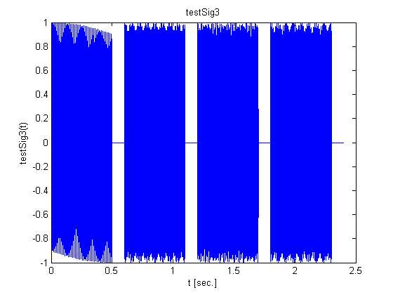


### 3.
Create `S3=fft(testSig3)`, the Fourier transform of `testSig3`, using `fft`. View the results with plot(S3). What do you observe? How do you explain this?

### 4.
Try the plot again with `plot(abs(S3))`. Now what do you see? How is it related to the DTMF test signal you generated? (__NOTE__: If your plot does not show a signal with 14 pulses in four sub-groups, check the signal you are using with sound and check the commands you are using for the `fft`.)

```matlab
%%
% ----- EXERCISE 2: -----
%
% Fourier Transform the signal

S3 = fft(testSig3);
figure();
plot(S3)
% make observation and explain

figure();
plot(abs(S3));
% make observation and explain how it's related to your DTMF signal,
% `testSig3`

fv = (0 : (length(S3)-1)) * fs / length(S3);
figure();
subplot(2,1,1)
plot(fv, abs(S3));
subplot(2,1,2)
plot(fv-(fs/2), fftshift(abs(S3)));
```
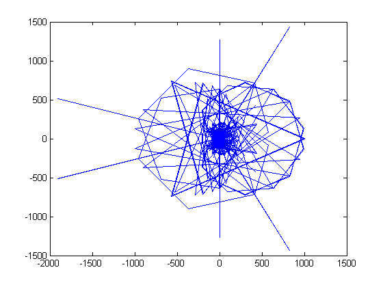

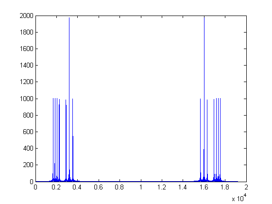

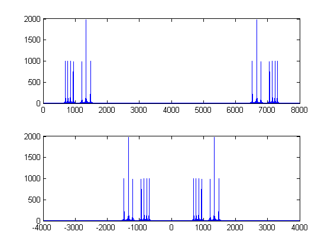


### A3.
The first plot you will see is the output of `fft(testSig3)` in real / imaginary doamin.
Seeing this plot and analyzing and interpreting its frequency response is much more difficult, since it doesn't indicate anything about __amplitude__ and __phase__.

### A4.
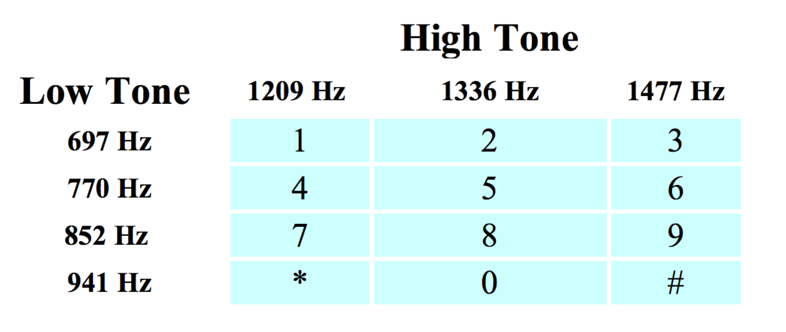

The second plot is much more relatable to us. This plot maps the amplitude for frequency response.  Each peak indicates the frequency that the signal retains.  The first half shows the one-sided frequency response and the second half shows the two-sided frequency response. The second one is more visually helpful, since the plot is centered at zero, and we want to know which frequecies exist in the signal.

It's worthy to note that the peak with the highest amplitude should be one. It's at $$f=1336\:\text{Hz}$$. And there's nothing wrong about it, since the button 5 and 0 both have high tone of frequency at $$f=1336\:\text{Hz}$$


### 5.
The main frequencies present in a signal are hard to interpret from a plot such as the one we just created because the values of the transform are plotted as a function of the index of the transform data array. For `fs=8000` we can create a frequency vector for the frequencies used by `fft` with:
```matlab
fv = (0:length(S3)-1) * fs/length(S3);
plot(fv, abs(S3));
```

On this plot, use the zoom feature of the plot window to identify the horizontal location and height of the peak of each pulse on the left half of the display. Record the height of each pulse as well as the center frequency and width in $$\text{Hz}$$ of each pulse.

```matlab
%%
% ----- EXERCISE 3: -----
%
% Test your understanding

% ----- create a new signal `sig3a` -----
n1a=1;
n2a=4000;
sig3a = testSig3(n1a:n2a);

% ----- define the following: -----
% (1) sample size
% (2) time duration
% (3) time vector.

N3=length(testSig3);
t3=N3/fs;
tv3=(0:N3-1)/fs;

% ----- plot the signals -----
figure();
subplot(2,1,1);
plot(tv3, testSig3);
axis( [n1a/fs, n2a/fs, -1, 1]) ;
title3a = horzcat('sig3a: the subregion of testSig3 from n=', ...
    num2str(n1a), ':', num2str(n2a));
title(title3a);

% to convince yourself that it is indeed in the right region,
subplot(2,1,2);
plot(sig3a);
title('sig3a');

% ----- Compute DFT of sig3a -----
S3a = fft(sig3a);
fv3 = (0 : (length(S3a)-1)) * fs / length(S3a);

% ----- plot DFT of sig3a -----
figure();
subplot(3,1,1);
plot(fv3-(fs/2), fftshift(abs(S3a)) );
title('sig3a: two-sided FR overview');

subplot(3,1,2);
plot(fv3-(fs/2), fftshift(abs(S3a)) );
% axis([2000, 3000, 0, max(abs(S3a))+100]);
title('sig3a: lower frequency region');

subplot(3,1,3);
plot(fv3-(fs/2), fftshift(abs(S3a)) );
% axis([3000, 3700, 0, max(abs(S3a))+100]);
title('sig3a: higher frequency region');
```

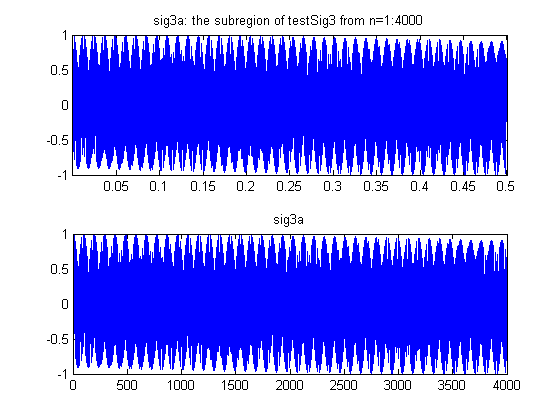

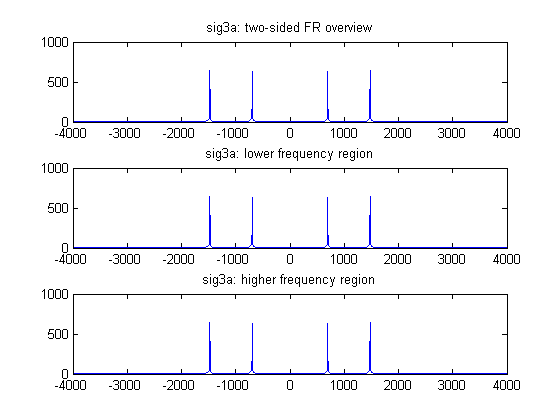


#### 5(a)
How would you characterize the shape of the pulses?

#### A5(a)
This is the frequency response of section of the signal, `testSig3` sampled at $$n=0:4000$$. This is sampled when the tone of buttun 3 is played.


#### 5(b)
Why is one pulse on the left side larger than all the others?

#### 5(c)
What are the pulses on the right side?

#### 5(d)
Can you tell what sequence of buttons generated this signal just by looking at this result? Why or why not?

It is also important to also be comfortable with the `fftshift` command and to be able to generate plots as we have viewed them in class. Type the following to view a ‘shifted’ plot that is centered at $$f=0$$.
```matlab
plot(fv-(fs/2), fftshift(abs(S3)));
```
For remaining plots, use whichever version you are comfortable with, but make sure you understand both.


### 6.
Create a new signal that is a short time segment of `testSig3` using
```matlab
n1=1;
n2=4000;
sig3a = testSig3(n1:n2);
```
On your printed plot of `testSig3`, mark the region corresponding to `sig3a`.
Compute the DFT and plot the results as you did for the complete `testSig3`. Note that you will have to create a new vector, `fv`, for the plot using the length of `sig3a` which is determined by `n1` or `n2`. You can also use the MATLAB function `length(sig3a)` or `size(sig3a)`.

On this plot of the Fourier transform of `sig3a`, use the zoom feature to identify the horizontal location and height of the peak of each pulse on the left half of the display. Record the height of each pulse as well as the center frequency and width in $$\text{Hz}$$ of each pulse.
```matlab
%%
% ----- EXERCISE 4: -----
%
%%
% 4(a)
%
% Repeat exercise 3 with other signals ----

% ----- create a new signals: -----
% (1) `sig3b`,
% (2) `sig3c`, and
% (3) `sig3d`

n1b=4801;
n2b=8800;
sig3b = testSig3(n1b:n2b);

n1c=2401;
n2c=6400;
sig3c = testSig3(n1c:n2c);

n1d=1901;
n2d=2100;
sig3d = testSig3(n1d:n2d);

% ----- define the following: -----
% (1) sample size
% (2) time duration
% (3) time vector.

N3=length(testSig3);
t3=N3/fs;
tv3=(0:N3-1)/fs;

title3b = horzcat('sig3b: the subregion of testSig3 from n=', ...
    num2str(n1b), ':', num2str(n2b));
title3c = horzcat('sig3c: the subregion of testSig3 from n=', ...
    num2str(n1c), ':', num2str(n2c));
title3d = horzcat('sig3d: the subregion of testSig3 from n=', ...
    num2str(n1d), ':', num2str(n2d));

% ----- plot the signals:  -----
% (1) `sig3b`,
% (2) `sig3c`, and
% (3) `sig3d`

figure();
subplot(3,1,1);
plot(testSig3);
axis( [n1b, n2b, -1, 1] ) ;
title(title3b);

subplot(3,1,2);
plot(testSig3);
axis( [n1c, n2c, -1, 1] ) ;
title(title3c);

subplot(3,1,3);
plot(testSig3);
axis( [n1d, n2d, -1, 1]) ;
title(title3d);

% to convince yourself that it is indeed in the right region,
figure();
subplot(3,1,1);
plot(sig3b);
title('sig3b');

subplot(3,1,2);
plot(sig3c);
title('sig3c');

subplot(3,1,3);
plot(sig3d);
title('sig3d');
```

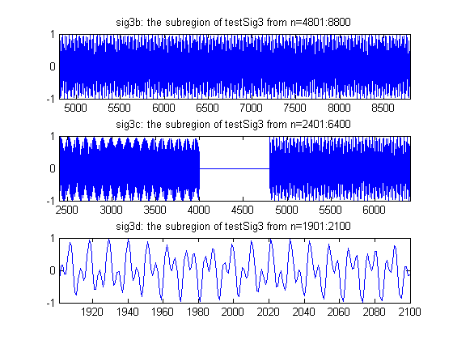

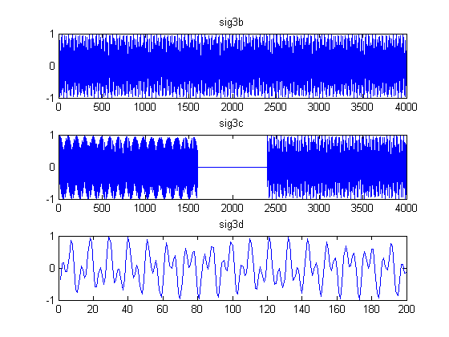


#### 6(a)
Print the plot window with a zoomed in view of one of the pulses. Label it with the signal name.

#### 6(b)
How would you characterize the shape of the pulses?

#### 6(c)
Can you tell which buttons generated this signal just by looking at this result? Why or why not?


### 7.
Repeat __Step 6__ completely for three other signals defined below. Compare the pulse shapes of these results to the result in __Step 6__. How does using a shorter signal vector for `sig3d` affect the width of the pulse?

#### 7(a)
`sig3b` with `n1=4801` and `n2=8800`.

#### 7(b)
`sig3c` with `n1=2401` and `n2=6400`

#### 7(c)
`sig3d` with `n1=1901` and `n2=2100`


Submit the answers to the questions, the plot of `testSig3` with the four time segments marked, and the four plots from __steps 4 to 7__.
```matlab
%%
% 4(b)
%
% ----- Compute DFT of signals: -----
% (1) `sig3b`,
% (2) `sig3c`, and
% (3) `sig3d`

S3b = fft(sig3b);
S3c = fft(sig3c);
S3d = fft(sig3d);

fv3b = (0 : (length(S3b)-1)) * fs / length(S3b);
fv3c = (0 : (length(S3c)-1)) * fs / length(S3c);
fv3d = (0 : (length(S3d)-1)) * fs / length(S3d);

% ----- plot DFT of sig3b -----
figure();
subplot(3,1,1);
plot(fv3b-(fs/2), abs(fftshift(S3b)) );
title('sig3b: two-sided FR overview ');

subplot(3,1,2);
plot(fv3b-(fs/2), abs(fftshift(S3b)) );
% axis([2656, 2672, 0, max(abs(S3b))+100]);
title('sig3b: lower frequency region');

subplot(3,1,3);
plot(fv3b-(fs/2), abs(fftshift(S3b)) );
% axis([3220, 3240, 0, max(abs(S3b))+100]);
title('sig3b:  higher frequency region');
%
%
% ----- plot DFT of sig3c -----
figure();
subplot(3,1,1);
plot(fv3c-(fs/2), abs(fftshift(S3c)) );
title('sig3c: two-sided FR overview ');

subplot(3,1,2);
plot(fv3c-(fs/2), abs(fftshift(S3c)) );
% axis([2400, 2800, 0, max(abs(S3c))+100]);
title('sig3c: lower frequency region');

subplot(3,1,3);
plot(fv3c-(fs/2), abs(fftshift(S3c)) );
% axis([3150, 3400, 0, max(abs(S3c))+100]);
title('sig3c: higher frequency region');


% ----- plot DFT of sig3d -----
figure();
subplot(3,1,1);
plot(fv3d-(fs/2), abs(fftshift(S3d)) );
title('sig3d: two-sided FR overview ');

subplot(3,1,2);
plot(fv3d-(fs/2), abs(fftshift(S3d)) );
% axis([2400, 2800, 0, max(abs(S3d))+100]);
title('sig3d: lower frequency region');

subplot(3,1,3);
plot(fv3d-(fs/2), abs(fftshift(S3d)) );
% axis([3150, 3400, 0, max(abs(S3d))+100]);
title('sig3d: higher frequency region');
```

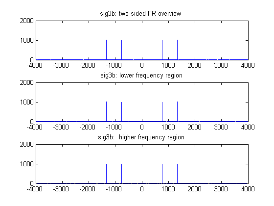

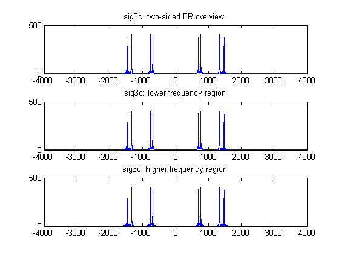

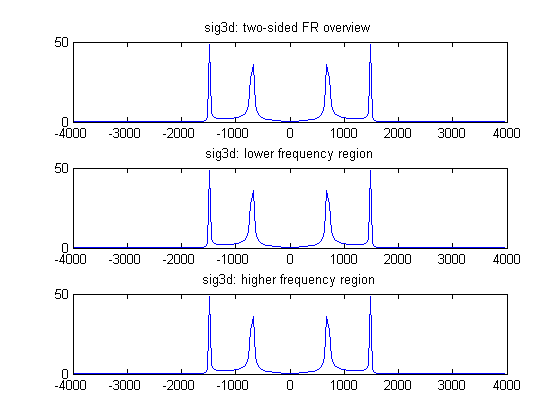
