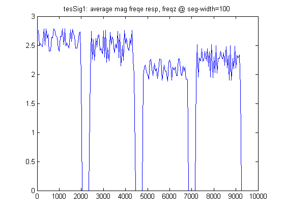
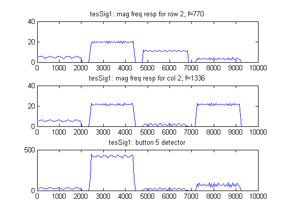

# lab05sub

## OBJECTIVES:
- Use MATLAB to help us learn the DFT and how to use it to detect DTMF tones.
- Test the selected filter using test signals similar to those generated in Laboratories 3 and 4.


## PRELAB:

### 1.
Read the above Background Notes and start of the PreLab and understand, as much as possible, what the `fft` will be providing for you. In MATLAB, type “`help fft`” to read about the function that will generate values of the Fourier transform at selected frequency values.

### 2.
Using your `m`-files from Laboratory 3, create `testSig3`. Verify that it is correct using the sound function.

Print a plot of testSig3 to be used later in this Prelab.

#### `my_dtmf.m`
```matlab
function dial_sig = my_dtmf(tone_time, quiet_time, fs, dial_vals)
% INPUTS:
% - tone_time is the tone duration in seconds
% - quiet_time is quiet time duration between tones in seconds
% - fs is the sampling frequency in Hz
% - dial_vals is a vector of integers from 1 to 12 representing the
% - button numbers of the sequence of numbers to be dialed
% Note that the dialed "0" is button number 11!!!!!!
%
% OUTPUT:
% - dial_sig is the vector of sampled values of the DTMF output signal
% for the number sequence

t_tone_new = 0:tone_time*fs-1;
num = length(dial_vals);
quiet_sig = zeros(1, fs*quiet_time);
f_tone = [
	697, 1209; 697, 1336; 697, 1477;...
	770, 1209; 770, 1336; 770, 1477;...
	852, 1209; 852, 1336; 852, 1477;...
	941, 1209; 941, 1336; 941, 1477;
	];

dial_sig = []; %initializes the output to an empty vector

for ii=1:num
	lo = f_tone(dial_vals(ii),1);
	hi = f_tone(dial_vals(ii),2);
	new_sig = cos( 2 * pi * lo / fs * t_tone_new)...
		+ cos( 2 * pi * hi / fs * t_tone_new );

	% normalize the output around 1
	new_sig = new_sig./abs(max(new_sig(:)));

	dial_sig = [dial_sig, new_sig, quiet_sig];
end
```

```matlab
%%
% ----- EXERCISE 1: -----
%
% Generate signal `testSig3` (from lab 03)

fs = 8000;

dial_val3 = [3 5 7 11];
t_tone3 = 0.50;
t_quiet3 = 0.10;
testSig3 = my_dtmf(t_tone3, t_quiet3, fs, dial_val3);

% ----- define the following: -----
% (1) sample size
% (2) time duration
% (3) time vector.

N3=length(testSig3);
t3=N3/fs;
tv3=(0:N3-1)/fs;

% % ---- play the sound -----
% sound(testSig3, fs);
% pause(2.4);

% ---- plot the signal -----
figure();
plot(tv3, testSig3);
title('testSig3');
xlabel('t [sec.]'); ylabel('testSig3(t)');
```


### 3.
Create `S3=fft(testSig3)`, the Fourier transform of `testSig3`, using `fft`. View the results with plot(S3). What do you observe? How do you explain this?

### 4.
Try the plot again with `plot(abs(S3))`. Now what do you see? How is it related to the DTMF test signal you generated? (__NOTE__: If your plot does not show a signal with 14 pulses in four sub-groups, check the signal you are using with sound and check the commands you are using for the `fft`.)

```matlab
%%
% ----- EXERCISE 2: -----
%
% Fourier Transform the signal

S3 = fft(testSig3);
figure();
plot(S3)
% make observation and explain

figure();
plot(abs(S3));
% make observation and explain how it's related to your DTMF signal,
% `testSig3`

fv = (0 : (length(S3)-1)) * fs / length(S3);
figure();
subplot(2,1,1)
plot(fv, abs(S3));
subplot(2,1,2)
plot(fv-(fs/2), fftshift(abs(S3)));
```


### A3.
The first plot you will see is the output of `fft(testSig3)` in real / imaginary doamin.
Seeing this plot and analyzing and interpreting its frequency response is much more difficult, since it doesn't indicate anything about __amplitude__ and __phase__.

### A4.


The second plot is much more relatable to us. This plot maps the amplitude for frequency response.  Each peak indicates the frequency that the signal retains.  The first half shows the one-sided frequency response and the second half shows the two-sided frequency response. The second one is more visually helpful, since the plot is centered at zero, and we want to know which frequecies exist in the signal.

It's worthy to note that the peak with the highest amplitude should be one. It's at $$f=1336\:\text{Hz}$$. And there's nothing wrong about it, since the button 5 and 0 both have high tone of frequency at $$f=1336\:\text{Hz}$$


### 5.
The main frequencies present in a signal are hard to interpret from a plot such as the one we just created because the values of the transform are plotted as a function of the index of the transform data array. For `fs=8000` we can create a frequency vector for the frequencies used by `fft` with:
```matlab
fv = (0:length(S3)-1) * fs/length(S3);
plot(fv, abs(S3));
```

On this plot, use the zoom feature of the plot window to identify the horizontal location and height of the peak of each pulse on the left half of the display. Record the height of each pulse as well as the center frequency and width in $$\text{Hz}$$ of each pulse.

```matlab
%%
% ----- EXERCISE 3: -----
%
% Test your understanding

% ----- create a new signal `sig3a` -----
n1a=1;
n2a=4000;
sig3a = testSig3(n1a:n2a);

% ----- define the following: -----
% (1) sample size
% (2) time duration
% (3) time vector.

N3=length(testSig3);
t3=N3/fs;
tv3=(0:N3-1)/fs;

% ----- plot the signals -----
figure();
subplot(2,1,1);
plot(tv3, testSig3);
axis( [n1a/fs, n2a/fs, -1, 1]) ;
title3a = horzcat('sig3a: the subregion of testSig3 from n=', ...
	num2str(n1a), ':', num2str(n2a));
title(title3a);

% to convince yourself that it is indeed in the right region,
subplot(2,1,2);
plot(sig3a);
title('sig3a');

% ----- Compute DFT of sig3a -----
S3a = fft(sig3a);
fv3 = (0 : (length(S3a)-1)) * fs / length(S3a);

% ----- plot DFT of sig3a -----
figure();
subplot(3,1,1);
plot(fv3-(fs/2), fftshift(abs(S3a)) );
title('sig3a: two-sided FR overview');

subplot(3,1,2);
plot(fv3-(fs/2), fftshift(abs(S3a)) );
% axis([2000, 3000, 0, max(abs(S3a))+100]);
title('sig3a: lower frequency region');

subplot(3,1,3);
plot(fv3-(fs/2), fftshift(abs(S3a)) );
% axis([3000, 3700, 0, max(abs(S3a))+100]);
title('sig3a: higher frequency region');
```


#### 5(a)
How would you characterize the shape of the pulses?

#### A5(a)
This is the frequency response of section of the signal, `testSig3` sampled at $$n=0:4000$$. This is sampled when the tone of buttun 3 is played.


#### 5(b)
Why is one pulse on the left side larger than all the others?

#### 5(c)
What are the pulses on the right side?

#### 5(d)
Can you tell what sequence of buttons generated this signal just by looking at this result? Why or why not?

It is also important to also be comfortable with the `fftshift` command and to be able to generate plots as we have viewed them in class. Type the following to view a ‘shifted’ plot that is centered at $$f=0$$.
```matlab
plot(fv-(fs/2), fftshift(abs(S3)));
```
For remaining plots, use whichever version you are comfortable with, but make sure you understand both.


### 6.
Create a new signal that is a short time segment of `testSig3` using
```matlab
n1=1;
n2=4000;
sig3a = testSig3(n1:n2);
```
On your printed plot of `testSig3`, mark the region corresponding to `sig3a`.
Compute the DFT and plot the results as you did for the complete `testSig3`. Note that you will have to create a new vector, `fv`, for the plot using the length of `sig3a` which is determined by `n1` or `n2`. You can also use the MATLAB function `length(sig3a)` or `size(sig3a)`.

On this plot of the Fourier transform of `sig3a`, use the zoom feature to identify the horizontal location and height of the peak of each pulse on the left half of the display. Record the height of each pulse as well as the center frequency and width in $$\text{Hz}$$ of each pulse.
```matlab
%%
% ----- EXERCISE 4: -----
%
%%
% 4(a)
%
% Repeat exercise 3 with other signals ----

% ----- create a new signals: -----
% (1) `sig3b`,
% (2) `sig3c`, and
% (3) `sig3d`

n1b=4801;
n2b=8800;
sig3b = testSig3(n1b:n2b);

n1c=2401;
n2c=6400;
sig3c = testSig3(n1c:n2c);

n1d=1901;
n2d=2100;
sig3d = testSig3(n1d:n2d);

% ----- define the following: -----
% (1) sample size
% (2) time duration
% (3) time vector.

N3=length(testSig3);
t3=N3/fs;
tv3=(0:N3-1)/fs;

title3b = horzcat('sig3b: the subregion of testSig3 from n=', ...
	num2str(n1b), ':', num2str(n2b));
title3c = horzcat('sig3c: the subregion of testSig3 from n=', ...
	num2str(n1c), ':', num2str(n2c));
title3d = horzcat('sig3d: the subregion of testSig3 from n=', ...
	num2str(n1d), ':', num2str(n2d));

% ----- plot the signals:  -----
% (1) `sig3b`,
% (2) `sig3c`, and
% (3) `sig3d`

figure();
subplot(3,1,1);
plot(testSig3);
axis( [n1b, n2b, -1, 1] ) ;
title(title3b);

subplot(3,1,2);
plot(testSig3);
axis( [n1c, n2c, -1, 1] ) ;
title(title3c);

subplot(3,1,3);
plot(testSig3);
axis( [n1d, n2d, -1, 1]) ;
title(title3d);

% to convince yourself that it is indeed in the right region,
figure();
subplot(3,1,1);
plot(sig3b);
title('sig3b');

subplot(3,1,2);
plot(sig3c);
title('sig3c');

subplot(3,1,3);
plot(sig3d);
title('sig3d');
```


#### 6(a)
Print the plot window with a zoomed in view of one of the pulses. Label it with the signal name.

#### 6(b)
How would you characterize the shape of the pulses?

#### 6(c)
Can you tell which buttons generated this signal just by looking at this result? Why or why not?


### 7.
Repeat __Step 6__ completely for three other signals defined below. Compare the pulse shapes of these results to the result in __Step 6__. How does using a shorter signal vector for `sig3d` affect the width of the pulse?

#### 7(a)
`sig3b` with `n1=4801` and `n2=8800`.

#### 7(b)
`sig3c` with `n1=2401` and `n2=6400`

#### 7(c)
`sig3d` with `n1=1901` and `n2=2100`


Submit the answers to the questions, the plot of `testSig3` with the four time segments marked, and the four plots from __steps 4 to 7__.
```matlab
%%
% 4(b)
%
% ----- Compute DFT of signals: -----
% (1) `sig3b`,
% (2) `sig3c`, and
% (3) `sig3d`

S3b = fft(sig3b);
S3c = fft(sig3c);
S3d = fft(sig3d);

fv3b = (0 : (length(S3b)-1)) * fs / length(S3b);
fv3c = (0 : (length(S3c)-1)) * fs / length(S3c);
fv3d = (0 : (length(S3d)-1)) * fs / length(S3d);

% ----- plot DFT of sig3b -----
figure();
subplot(3,1,1);
plot(fv3b-(fs/2), abs(fftshift(S3b)) );
title('sig3b: two-sided FR overview ');

subplot(3,1,2);
plot(fv3b-(fs/2), abs(fftshift(S3b)) );
% axis([2656, 2672, 0, max(abs(S3b))+100]);
title('sig3b: lower frequency region');

subplot(3,1,3);
plot(fv3b-(fs/2), abs(fftshift(S3b)) );
% axis([3220, 3240, 0, max(abs(S3b))+100]);
title('sig3b:  higher frequency region');
%
%
% ----- plot DFT of sig3c -----
figure();
subplot(3,1,1);
plot(fv3c-(fs/2), abs(fftshift(S3c)) );
title('sig3c: two-sided FR overview ');

subplot(3,1,2);
plot(fv3c-(fs/2), abs(fftshift(S3c)) );
% axis([2400, 2800, 0, max(abs(S3c))+100]);
title('sig3c: lower frequency region');

subplot(3,1,3);
plot(fv3c-(fs/2), abs(fftshift(S3c)) );
% axis([3150, 3400, 0, max(abs(S3c))+100]);
title('sig3c: higher frequency region');


% ----- plot DFT of sig3d -----
figure();
subplot(3,1,1);
plot(fv3d-(fs/2), abs(fftshift(S3d)) );
title('sig3d: two-sided FR overview ');

subplot(3,1,2);
plot(fv3d-(fs/2), abs(fftshift(S3d)) );
% axis([2400, 2800, 0, max(abs(S3d))+100]);
title('sig3d: lower frequency region');

subplot(3,1,3);
plot(fv3d-(fs/2), abs(fftshift(S3d)) );
% axis([3150, 3400, 0, max(abs(S3d))+100]);
title('sig3d: higher frequency region');
```


## LAB:

### STEP 1:
Write a MATLAB script m-file to analyze a signal in sequences of short segments with 50% overlap.

#### OUTPUT OF `lab05part01.m`

##### Figure 01a


##### Figure 01b


##### Figure 01c


##### Figure 01d


##### Figure 01e


##### Figure 01f


##### Figure 01g


### QUESTIONS 1
Compare the plots

#### 1(a)
__Does the average value clearly show the difference between when a button signal is
present and when there is a quiet period?__

Yes, it does. The gap between the tone time and quiet time exists.


#### 1(b)
__Do the row 2 and column 2 magnitude plots accurately show when these tones are
present?__


Yes, the `testSig3` played button 3, 5, 7, 11, respectively. Row 2 must detect buttons 4, 5, and 6. and column 2 must detect 2, 5, 8, 11.
- For row 2, it must detect the button 5 
- For column 2, it must detect 5 and 11

(See the Figure 01c, e, g)


#### 1(c)
__What rule would you use to decide which button had been pressed at each time
during the signal?__

My rule to determine which button is pressed is to multiply the corresponding row and column fiilter output and capture the remaining pulse left after multiplication.


#### 1(d)
__Is there a chance for confusions or wrong detections?__

There is a danger of misinterpretation, if your filter isn't doing the job properly, *i.e.* when the difference in amplitudes for filtered signal isn't distinguishable.  


### STEP 2:
Explore the effect of changing the segment length.

#### OUTPUT OF `lab05part02.m`

##### command prompt
```
ans =
	row 1&2, and col 1&2 for seg_width=100
fv_row1 = 
	720
fv_row2 = 
	800
fv_col1 =
	1200
fv_col2 =
	1360
diff_row1 =
	23
diff_row2 =
	30
diff_col1 = 
	9
diff_col2 =
	24

ans =
	row 1&2, and col 1&2 for seg_width=200
fv_row1 = 
	680
fv_row2 = 
	760
fv_col1 =
	1200
fv_col2 =
	1320
diff_row1 =
	17
diff_row2 =
	10
diff_col1 = 
	9
diff_col2 =
	16

ans =
	row 1&2, and col 1&2 for seg_width=400
fv_row1 = 
	700
fv_row2 = 
	780
fv_col1 =
	1200
fv_col2 =
	1340
diff_row1 = 
	3
diff_row2 =
    10
diff_col1 =
	9
diff_col2 = 
	4
```

##### Figure 02a


##### Figure 02b


##### Figure 02c


##### Figure 02d


### QUESTIONS 2

- `row1` = $$697\:\text{Hz}$$
- `row2` = $$770\:\text{Hz}$$
- `col1` = $$1209\:\text{Hz}$$
- `col2` = $$1336\:\text{Hz}$$

| `seg_width` | `row1` | `row2` | `col1` | `col2` |
| :---------: | :-----: | :-----: | :-----: | :-----: |
| 100 | 720 | 800 | 1200 | 1360 |
| 200 | 680 | 760 | 1200 | 1320 |
| 400 | 700 | 780 | 1200 | 1340 |

| `seg_width` | `diff_row1` | `diff_row2` | `diff_col1` | `diff_col2` |
| :---------: | :---------: | :---------: | :---------: | :---------: |
| 100 | 23 | 30 | 9 | 24 |
| 200 | 17 | 10 | 9 | 16 |
| 400 | 3 | 10 | 9 | 4 |


#### 2(a)
__Compute the actual frequencies represented by the four frequency indices you selected in Step 1 and compare them to the desired tone frequencies. Which is closest? Which has the most difference?__

- For `seg_width=100`
	- `col1` has the closest frequency value to the desired frequency.
	- `row2` has the biggest difference in value to the desired frequency.

#### 2(b)
__Compare the results of Step 1 to results obtained when the segment length is increased to 200 and then 400. Which is closest? Which has the most difference?__

- For `seg_width=200`
	- `col1` has the closest frequency value to the desired frequency.
	- `row1` has the biggest difference in value to the desired frequency.
- For `seg_width=400`
	- `row1` has the closest frequency value to the desired frequency.
	- `row2` has the biggest difference in value to the desired frequency.


### STEP 3:
Explore the effect of just computing more values of the Fourier transform.

#### OUTPUT OF `lab05part03a.m`
##### Figure 03a-1a


##### Figure 03a-1b


##### Figure 03a-1c


##### Figure 03a-1d


##### Figure 03a-1e


##### Figure 03a-1f


##### Figure 03a-1g


##### Figure 03a-1h


#### OUTPUT OF `lab05part03b.m`
##### Figure 03b-1a


##### Figure 03b-1b


##### Figure 03b-1c


##### Figure 03b-1d


##### Figure 03b-1e


##### Figure 03b-1f


##### Figure 03b-1g


##### Figure 03b-1h



#### OUTPUT OF `lab05part03c.m`
##### Figure 03c-1a


##### Figure 03c-1b


##### Figure 03c-1c


##### Figure 03c-1d


##### Figure 03c-1e


##### Figure 03c-1f


##### Figure 03c-1g


##### Figure 03c-1h


### QUESTIONS 3

#### 3(a)

##### For `testSig3`
- Compare plots for `seg_width=100`
	- original
	
	
	- modified
	
	

- Compare plots for `seg_width=200`
	- original
	
	
	- modified
	
	

- Compare plots for `seg_width=400`
	- original
	
	
	- modified
	
	

##### For `testSig1`
- Compare plots for `seg_width=100`
	- original
	
	
	- modified
	
	

- Compare plots for `seg_width=200`
	- original
	
	
	- modified
	
	

- Compare plots for `seg_width=400`
	- original
	
	
	- modified
	
	

##### For `testSig2`
- Compare plots for `seg_width=100`
	- original
	
	
	- modified
	
	

- Compare plots for `seg_width=200`
	- original
	
	
	- modified
	
	

- Compare plots for `seg_width=400`
	- original
	
	
	- modified
	
	

#### 3(b)
How well does your button 5 detector work?

##### For `testSig3`


##### For `testSig1`


##### For `testSig2`


### STEP 4: 
Extra: How well does your detector work on an unknown signal?

#### OUTPUT OF `lab05part04.m`
##### Figure 04a


##### Figure 04b


##### Figure 04c


### QUESTIONS 4

#### 4(a)
__How well does your button 5 detector work? and, if it failed in some cases, suggest improvements in your detector that would yield better results.__

I will evaluate highly of my detector for button 5.  Although it wouldn't give a nice flat square wave, there's a big amplitude difference between filtered segment of tones.

I chose `a = 0.4` for the particular example.


### STEP 5:
__Extra: Consider how the results would be different if we had used the energy at each frequency point instead of the magnitude.__

#### OUTPUT OF `lab05part05.m`
##### Figure 05a


##### Figure 05b


### QUESTIONS 5

#### 5(a)
__how would results using SAE be different from results us SA?__

Takeway of this exercise is that when you "absolute square" the output, it will give you much better output.

The idea behind it is. when you multiply two high values, you get higher value, and vice versa.


## APPENDIX

### `my_dtmf.m`
```matlab
function dial_sig = my_dtmf(tone_time, quiet_time, fs, dial_vals)
% INPUTS:
% - tone_time is the tone duration in seconds
% - quiet_time is quiet time duration between tones in seconds
% - fs is the sampling frequency in Hz
% - dial_vals is a vector of integers from 1 to 12 representing the
% - button numbers of the sequence of numbers to be dialed
% Note that the dialed "0" is button number 11!!!!!!
%
% OUTPUT:
% - dial_sig is the vector of sampled values of the DTMF output signal 
% for the number sequence

t_tone_new = 0:tone_time*fs-1;
num = length(dial_vals);
quiet_sig = zeros(1, fs*quiet_time);
f_tone = [
	697, 1209; 697, 1336; 697, 1477;... 
	770, 1209; 770, 1336; 770, 1477;...
	852, 1209; 852, 1336; 852, 1477;...
	941, 1209; 941, 1336; 941, 1477;
	];

dial_sig = []; %initializes the output to an empty vector

for ii=1:num
	lo = f_tone(dial_vals(ii),1);
	hi = f_tone(dial_vals(ii),2);
	new_sig = cos( 2 * pi * lo / fs * t_tone_new)...
		+ cos( 2 * pi * hi / fs * t_tone_new );
	
	% normalize the output around 1
	new_sig = new_sig./abs(max(new_sig(:)));

	dial_sig = [dial_sig, new_sig, quiet_sig];
end
```

### `lab05part01.m`
```matlab
%% intialize
clear, clc, clf, cla, close all;
%
%% STEP 1
% Write a MATLAB script m-file to analyze a signal in sequences of short 
% segments with 50% overlap.
%
% ----- create signals -----
%
% Generate signal `testSig3` (from lab 03)
%
fs = 8000;
%
dial_val3 = [3 5 7 11];
t_tone3 = 0.50;
t_quiet3 = 0.10;
testSig3 = my_dtmf(t_tone3, t_quiet3, fs, dial_val3);
%
% ----- define the following: -----
% (1) sample size
% (2) time duration
% (3) time vector.
%
N3=length(testSig3);
t3=N3/fs;
tv3=(0:N3-1)/fs;
%
% the total number of complete segments of length
%
f_row1 = 697;
f_row2 = 770;
f_col1 = 1209;
f_col2 = 1336;
%
% plot the whole signal
%
figure();
plot(tv3, testSig3);
title('testSig3: the whole signal');
%
for seg_width = [100, 200 ,400] 
	seg_step = 0.5 * seg_width;
	n_seg = N3/seg_step-1;
	%
	R = zeros(n_seg, 6);
	%
	nstart=1;
	for ii=1:n_seg
		n = nstart:nstart+seg_width-1;
		testSig3tmp = testSig3(n);
		S3 = fft(testSig3tmp);
		%
		n_row1 = round(f_row1 * seg_width / fs + 1);
		n_row2 = round(f_row2 * seg_width / fs + 1);
		n_col1 = round(f_col1 * seg_width / fs + 1);
		n_col2 = round(f_col2 * seg_width / fs + 1);
		%   
		R(ii,1) = n(end)-seg_step;
		R(ii,2) = mean(abs(S3));
		R(ii,3) = abs(S3(n_row1));
		R(ii,4) = abs(S3(n_row2));
		R(ii,5) = abs(S3(n_col1));
		R(ii,6) = abs(S3(n_col2));
		%
		nstart = nstart + seg_step;
	end
	%
	tc = R(:,1).';
	avg = R(:,2).';
	absRow1 = R(:,3).';
	absRow2 = R(:,4).';
	absCol1 = R(:,5).';
	absCol2 = R(:,6).';
	%
	title1 = 'center time vs. average mag freqe resp @ seg-width=';
	title2a = 'mag freq resp for row 1, f=';
	title2b = 'mag freq resp for row 2, f=';
	title2c = 'mag freq resp for col 1, f=';
	title2d = 'mag freq resp for col 2, f=';
	%
	% plot the frequency responses
	%
	figure();
	plot(tc, avg);
	title(  horzcat(  title1, num2str(seg_width)  )  );
	%
	figure();
	subplot(4,1,1);
	plot(tc, absRow1);
	title(  horzcat(  title2a, num2str(f_row1))  );
	%
	subplot(4,1,2);
	plot(tc, absRow2);
	title(  horzcat(  title2b, num2str(f_row2))  );
	%
	subplot(4,1,3);
	plot(tc, absCol1);
	title(  horzcat(  title2c, num2str(f_col1))  );
	%
	subplot(4,1,4);
	plot(tc, absCol2);
	title(  horzcat(  title2d, num2str(f_col2))  );
end
```

### `lab05part02.m`
```matlab
%% intialize
clear, clc, clf, cla, close all;
%
%% STEP 2
% Explore the effect of changing the segment length
%
% Generate signal `testSig3` (from lab 03)
%
fs = 8000;
%
dial_val3 = [3 5 7 11];
t_tone3 = 0.50;
t_quiet3 = 0.10;
testSig3 = my_dtmf(t_tone3, t_quiet3, fs, dial_val3);
%
% ----- define the following: -----
% (1) sample size
% (2) time duration
% (3) time vector.
%
N3=length(testSig3);
t3=N3/fs;
tv3=(0:N3-1)/fs;
%
% the total number of complete segments of length
%
f_row1 = 697;
f_row2 = 770;
f_col1 = 1209;
f_col2 = 1336;
%
for seg_width = [100, 200 ,400] 
	seg_step = 0.5 * seg_width;
	n_seg = N3/seg_step-1;
	%
	R = zeros(n_seg, 6);
	%
	nstart=1;
	for ii=1:n_seg
		n = nstart:nstart+seg_width-1;
		testSig3tmp = testSig3(n);
		S3 = fft(testSig3tmp);
		%
		n_row1 = round(f_row1 * seg_width / fs + 1);
		n_row2 = round(f_row2 * seg_width / fs + 1);
		n_col1 = round(f_col1 * seg_width / fs + 1);
		n_col2 = round(f_col2 * seg_width / fs + 1);
		%
		R(ii,1) = n(end)-seg_step;
		R(ii,2) = mean(abs(S3));
		R(ii,3) = abs(S3(n_row1));
		R(ii,4) = abs(S3(n_row2));
		R(ii,5) = abs(S3(n_col1));
		R(ii,6) = abs(S3(n_col2));
		%
		nstart = nstart + seg_step;
	end
	%
	% to identify the freqeucny quantity
	%
	fvtitle = 'row 1&2, and col 1&2 for seg_width=';
	sprintf(horzcat(fvtitle, num2str(seg_width)))
	fv_row1 = (n_row1 - 1) * fs / seg_width
	fv_row2 = (n_row2 - 1) * fs / seg_width
	fv_col1 = (n_col1 - 1) * fs / seg_width
	fv_col2 = (n_col2 - 1) * fs / seg_width
	%
	% find the difference from the actual frequency value.
	%
	diff_row1= abs(f_row1-fv_row1)
	diff_row2= abs(f_row2-fv_row2)
	diff_col1= abs(f_col1-fv_col1)
	diff_col2= abs(f_col2-fv_col2)
	%    
	tc = R(:,1).';
	avg = R(:,2).';
	absRow1 = R(:,3).';
	absRow2 = R(:,4).';
	absCol1 = R(:,5).';
	absCol2 = R(:,6).';
	%
	title1 = 'center time vs. average mag freqe resp @ seg-width=';
	title2a = 'mag freq resp for row 1, f=';
	title2b = 'mag freq resp for row 2, f=';
	title2c = 'mag freq resp for col 1, f=';
	title2d = 'mag freq resp for col 2, f=';
	%
	% plot the frequency responses
	%
	figure();
	plot(tc, avg);
	title(  horzcat(  title1, num2str(seg_width)  )  );
	%
	figure();
	subplot(4,1,1);
	plot(tc, absRow1);
	title(  horzcat(  title2a, num2str(f_row1))  );
	%
	subplot(4,1,2);
	plot(tc, absRow2);
	title(  horzcat(  title2b, num2str(f_row2))  );
	%
	subplot(4,1,3); 
	plot(tc, absCol1);
	title(  horzcat(  title2c, num2str(f_col1))  );
	%
	subplot(4,1,4);
	plot(tc, absCol2);
	title(  horzcat(  title2d, num2str(f_col2))  ); 
end
```


### `lab05part03a.m`
```matlab
%% intialize
clear, clc, clf, cla, close all;
%
%% STEP 3(a)-1
% Explore the effect of just computing more values of the 
% Fourier transform.
%
% Generate signal `testSig3` (from lab 03)
%
fs = 8000;
%
dial_val3 = [3 5 7 11];
t_tone3 = 0.50;
t_quiet3 = 0.10;
testSig3 = my_dtmf(t_tone3, t_quiet3, fs, dial_val3);
%
% ----- define the following: -----
% (1) sample size
% (2) time duration
% (3) time vector.
%
N3=length(testSig3);
t3=N3/fs;
tv3=(0:N3-1)/fs;
%
% the total number of complete segments of length
%
f_row1 = 697;
f_row2 = 770;
f_col1 = 1209;
f_col2 = 1336;
%
for segWidthFactor = [1, 2, 4] 
	seg_width = 100;
	seg_step = 0.5 * seg_width;
	%
	n_seg3 = N3 / seg_step-1;
	%
	nstart=1;
	for ii=1:n_seg3
		n = nstart:nstart+seg_width-1;
		testSig3tmp = testSig3(n);
		newSegWidth = seg_width * segWidthFactor;
		S3 = fft(testSig3tmp, newSegWidth);
		%
		n_row1 = round(f_row1 * seg_width / fs + 1);
		n_row2 = round(f_row2 * seg_width / fs + 1);
		n_col1 = round(f_col1 * seg_width / fs + 1);
		n_col2 = round(f_col2 * seg_width / fs + 1);
		%
		R3(ii,1) = n(end)-seg_step;
		R3(ii,2) = mean(abs(S3));
		R3(ii,3) = abs(S3(n_row1));
		R3(ii,4) = abs(S3(n_row2));
		R3(ii,5) = abs(S3(n_col1));
		R3(ii,6) = abs(S3(n_col2));
		%
		nstart = nstart + seg_step;
	end
	%  
	tc3 = R3(:,1).';
	avg3 = R3(:,2).';
	abs3Row1 = R3(:,3).';
	abs3Row2 = R3(:,4).';
	abs3Col1 = R3(:,5).';
	abs3Col2 = R3(:,6).';
	%
	title1 = 'tesSig3: average mag freqe resp, freqz @ seg-width=';
	title2a = 'tesSig3: mag freq resp for row 1, f=';
	title2b = 'tesSig3: mag freq resp for row 2, f=';
	title2c = 'tesSig3: mag freq resp for col 1, f=';
	title2d = 'tesSig3: mag freq resp for col 2, f=';
	%
	% plot information for testSig3
	%
	figure();
	plot(tc3, avg3);
	title(  horzcat(  title1, num2str(newSegWidth)  )  );
	%
	figure();
	subplot(4,1,1);
	plot(tc3, abs3Row1);
	title(  horzcat(  title2a, num2str(f_row1))  );
	%
	subplot(4,1,2);
	plot(tc3, abs3Row2);
	title(  horzcat(  title2b, num2str(f_row2))  );
	%
	subplot(4,1,3);
	plot(tc3, abs3Col1);
	title(  horzcat(  title2c, num2str(f_col1))  );
	%
	subplot(4,1,4);
	plot(tc3, abs3Col2);
	title(  horzcat(  title2d, num2str(f_col2))  );
end


%% STEP 3(a)-2
% Make a button 5 detector
% 
% Generate signal `testSig3` (from lab 03)
%
fs = 8000;
%
dial_val3 = [3 5 7 11];
t_tone3 = 0.50;
t_quiet3 = 0.10;
testSig3 = my_dtmf(t_tone3, t_quiet3, fs, dial_val3);
%
% ----- define the following: -----
% (1) sample size
% (2) time duration
% (3) time vector.
%
N3=length(testSig3);
t3=N3/fs;
tv3=(0:N3-1)/fs;
%
% the total number of complete segments of length
%
f_row1 = 697;
f_row2 = 770;
f_col1 = 1209;
f_col2 = 1336;
%
seg_width = 100;
%
seg_step = 0.5 * seg_width;
n_seg = N3 / seg_step-1;
%
nstart=1;
for ii=1:n_seg
	n = nstart:nstart+seg_width-1;
	testSig3tmp = testSig3(n);
	S3 = fft(testSig3tmp, 100);
	%
	n_row1 = round(f_row1 * seg_width / fs + 1);
	n_row2 = round(f_row2 * seg_width / fs + 1);
	n_col1 = round(f_col1 * seg_width / fs + 1);
	n_col2 = round(f_col2 * seg_width / fs + 1);
	%
	R3(ii,1) = n(end)-seg_step;
	R3(ii,2) = mean(abs(S3));
	R3(ii,3) = abs(S3(n_row1));
	R3(ii,4) = abs(S3(n_row2));
	R3(ii,5) = abs(S3(n_col1));
	R3(ii,6) = abs(S3(n_col2));
	%
	nstart = nstart + seg_step;
end
%
tc3 = R3(:,1).';
avg3 = R3(:,2).';
abs3Row1 = R3(:,3).';
abs3Row2 = R3(:,4).';
abs3Col1 = R3(:,5).';
abs3Col2 = R3(:,6).';
%
% generate a button 5 detector
%
btn5det3 = abs3Row2 .* abs3Col2;
%
title1 = 'tesSig3: average mag freqe resp @ seg-width=';
title2a = 'tesSig3: mag freq resp for row 2, f=';
title2b = 'tesSig3: mag freq resp for col 2, f=';
title3 = 'tesSig3: button 5 detector';
%
figure();
plot(tc3, avg3);
title(  horzcat(  title1, num2str(seg_width)  )  );
%
figure();
subplot(3,1,1);
plot(tc3, abs3Row2);
title(  horzcat(  title2a, num2str(f_row2))  );
%
subplot(3,1,2);
plot(tc3, abs3Col2);
title(  horzcat(  title2b, num2str(f_col2))  );
%
subplot(3,1,3);
plot(tc3, btn5det3);
title( title3 );
```

### `lab05part03b.m`
```matlab
%% intialize
clear, clc, clf, cla, close all;
%
%% STEP 3(b)-1
% Explore the effect of just computing more values of the 
% Fourier transform.
%
% Generate signal `testSig1` (from lab 03)
%
fs = 8000;
%
dial_val3 = [3 5 7 11];
%
t_tone1 = 0.25;
t_quiet1 = 0.05;
testSig1 = my_dtmf(t_tone1, t_quiet1, fs, dial_val3);
%
% ----- define the following: -----
% (1) sample size
% (2) time duration
% (3) time vector.
%
N1=length(testSig1);
t1=N1/fs;
tv1=(0:N1-1)/fs;
%
% the total number of complete segments of length
%
f_row1 = 697;
f_row2 = 770;
f_col1 = 1209;
f_col2 = 1336;
%
for segWidthFactor = [1, 2, 4] 
	seg_width = 100;
	seg_step = 0.5 * seg_width;
	%
	n_seg1 = N1 / seg_step-1;
	%
	nstart=1;
	for ii=1:n_seg1
		n = nstart:nstart+seg_width-1;
		testSig1tmp = testSig1(n);
		newSegWidth = seg_width * segWidthFactor;
		S1 = fft(testSig1tmp, newSegWidth);
		%
		n_row1 = round(f_row1 * seg_width / fs + 1);
		n_row2 = round(f_row2 * seg_width / fs + 1);
		n_col1 = round(f_col1 * seg_width / fs + 1);
		n_col2 = round(f_col2 * seg_width / fs + 1);
		%
		R1(ii,1) = n(end)-seg_step;
		R1(ii,2) = mean(abs(S1));
		R1(ii,3) = abs(S1(n_row1));
		R1(ii,4) = abs(S1(n_row2));
		R1(ii,5) = abs(S1(n_col1));
		R1(ii,6) = abs(S1(n_col2));
		%
		nstart = nstart + seg_step;
	end
	%
	tc1 = R1(:,1).';
	avg1 = R1(:,2).';
	abs1Row1 = R1(:,3).';
	abs1Row2 = R1(:,4).';
	abs1Col1 = R1(:,5).';
	abs1Col2 = R1(:,6).';
	%
	title1 = 'tesSig1: average mag freqe resp, freqz @ seg-width=';
	title2a = 'tesSig1: mag freq resp for row 1, f=';
	title2b = 'tesSig1: mag freq resp for row 2, f=';
	title2c = 'tesSig1: mag freq resp for col 1, f=';
	title2d = 'tesSig1: mag freq resp for col 2, f=';
	%
	% plot information for testSig1
	%
	figure();
	plot(tc1, avg1);
	title(  horzcat(  title1, num2str(newSegWidth)  )  );
	%
	figure();
	subplot(4,1,1);
	plot(tc1, abs1Row1);
	title(  horzcat(  title2a, num2str(f_row1))  );
	%
	subplot(4,1,2);
	plot(tc1, abs1Row2);
	title(  horzcat(  title2b, num2str(f_row2))  );
	%
	subplot(4,1,3);
	plot(tc1, abs1Col1);
	title(  horzcat(  title2c, num2str(f_col1))  );
	%
	subplot(4,1,4);
	plot(tc1, abs1Col2);
	title(  horzcat(  title2d, num2str(f_col2))  );
	%
end

%% STEP 3(b)-2
% Make a button 5 detector
% 
% Generate signal `testSig3` (from lab 03)
%
fs = 8000;
%
dial_val3 = [3 5 7 11];
t_tone1 = 0.25;
t_quiet1 = 0.05;
testSig1 = my_dtmf(t_tone1, t_quiet1, fs, dial_val3);
%
% ----- define the following: -----
% (1) sample size
% (2) time duration
% (3) time vector.
%
N1=length(testSig1);
t1=N1/fs;
tv1=(0:N1-1)/fs;
%
% the total number of complete segments of length
%
f_row1 = 697;
f_row2 = 770;
f_col1 = 1209;
f_col2 = 1336;
%
seg_width = 100;
%
seg_step = 0.5 * seg_width;
n_seg = N1 / seg_step-1;
%
nstart=1;
for ii=1:n_seg
	n = nstart:nstart+seg_width-1;
	testSig1tmp = testSig1(n);
	S1 = fft(testSig1tmp, 100);
	%
	n_row1 = round(f_row1 * seg_width / fs + 1);
	n_row2 = round(f_row2 * seg_width / fs + 1);
	n_col1 = round(f_col1 * seg_width / fs + 1);
	n_col2 = round(f_col2 * seg_width / fs + 1);
	%
	R1(ii,1) = n(end)-seg_step;
	R1(ii,2) = mean(abs(S1));
	R1(ii,3) = abs(S1(n_row1));
	R1(ii,4) = abs(S1(n_row2));
	R1(ii,5) = abs(S1(n_col1));
	R1(ii,6) = abs(S1(n_col2));
	%
	nstart = nstart + seg_step;
end
%
tc1 = R1(:,1).';
avg1 = R1(:,2).';
abs1Row1 = R1(:,3).';
abs1Row2 = R1(:,4).';
abs1Col1 = R1(:,5).';
abs1Col2 = R1(:,6).';
%
% generate a button 5 detector
%
btn5det1 = abs1Row2 .* abs1Col2;
%
title1 = 'tesSig1: average mag freqe resp @ seg-width=';
title2a = 'tesSig1: mag freq resp for row 2, f=';
title2b = 'tesSig1: mag freq resp for col 2, f=';
title3 = 'tesSig1: button 5 detector';
%
figure();
plot(tc1, avg1);
title(  horzcat(  title1, num2str(seg_width)  )  );
%
figure();
subplot(3,1,1);
plot(tc1, abs1Row2);
title(  horzcat(  title2a, num2str(f_row2))  );
%
subplot(3,1,2);
plot(tc1, abs1Col2);
title(  horzcat(  title2b, num2str(f_col2))  );
%
subplot(3,1,3);
plot(tc1, btn5det1);
title( title3 );
```

### `lab05part03c.m`
```matlab
%% intialize
clear, clc, clf, cla, close all;
%
%% STEP 3(c)-1
% Explore the effect of just computing more values of the 
% Fourier transform.
%
% Generate signal `testSig2` (from lab 03)
%
fs = 8000;
%
dial_val3 = [3 5 7 11];
%
t_tone2 = 0.10;
t_quiet2 = 0.02;
testSig2 = my_dtmf(t_tone2, t_quiet2, fs, dial_val3);
%
% ----- define the following: -----
% (1) sample size
% (2) time duration
% (3) time vector.
%
N2=length(testSig2);
t2=N2/fs;
tv2=(0:N2-1)/fs;
%
% the total number of complete segments of length
%
f_row1 = 697;
f_row2 = 770;
f_col1 = 1209;
f_col2 = 1336;
%
for segWidthFactor = [1, 2, 4] 
	seg_width = 100;
	seg_step = 0.5 * seg_width;
	%
	n_seg2 = N2 / seg_step-1;
	%
	nstart=1;
	for ii=1:n_seg2
		n = nstart:nstart+seg_width-1;
		testSig2tmp = testSig2(n);
		newSegWidth = seg_width * segWidthFactor;
		S2 = fft(testSig2tmp, newSegWidth);
		%
		n_row1 = round(f_row1 * seg_width / fs + 1);
		n_row2 = round(f_row2 * seg_width / fs + 1);
		n_col1 = round(f_col1 * seg_width / fs + 1);
		n_col2 = round(f_col2 * seg_width / fs + 1);
		%
		R2(ii,1) = n(end)-seg_step;
		R2(ii,2) = mean(abs(S2));
		R2(ii,3) = abs(S2(n_row1));
		R2(ii,4) = abs(S2(n_row2));
		R2(ii,5) = abs(S2(n_col1));
		R2(ii,6) = abs(S2(n_col2));
		%
		nstart = nstart + seg_step;
	end
	%  
	tc2 = R2(:,1).';
	avg2 = R2(:,2).';
	abs2Row1 = R2(:,3).';
	abs2Row2 = R2(:,4).';
	abs2Col1 = R2(:,5).';
	abs2Col2 = R2(:,6).';
	%    
	title1 = 'tesSig2: average mag freqe resp,freqz @ seg-width=';
	title2a = 'tesSig2: mag freq resp for row 1, f=';
	title2b = 'tesSig2: mag freq resp for row 2, f=';
	title2c = 'tesSig2: mag freq resp for col 1, f=';
	title2d = 'tesSig2: mag freq resp for col 2, f=';
	%
	% plot information for testSig2
	%
	figure();
	plot(tc2, avg2);
	title(  horzcat(  title1, num2str(newSegWidth)  )  );
	%
	figure();
	subplot(4,1,1);
	plot(tc2, abs2Row1);
	title(  horzcat(  title2a, num2str(f_row1))  );
	%
	subplot(4,1,2);
	plot(tc2, abs2Row2);
	title(  horzcat(  title2b, num2str(f_row2))  );
	%
	subplot(4,1,3);
	plot(tc2, abs2Col1);
	title(  horzcat(  title2c, num2str(f_col1))  );
	%
	subplot(4,1,4);
	plot(tc2, abs2Col2);
	title(  horzcat(  title2d, num2str(f_col2))  );
end

%% STEP 3(c)-2
% Make a button 5 detector
% 
% Generate signal `testSig3` (from lab 03)
%
fs = 8000;
%
t_tone2 = 0.10;
t_quiet2 = 0.02;
testSig2 = my_dtmf(t_tone2, t_quiet2, fs, dial_val3);
%
% ----- define the following: -----
% (1) sample size
% (2) time duration
% (3) time vector.
%
N2=length(testSig2);
t2=N2/fs;
tv2=(0:N2-1)/fs;
%
% the total number of complete segments of length
%
f_row1 = 697;
f_row2 = 770;
f_col1 = 1209;
f_col2 = 1336;
%
seg_width = 100;
seg_step = 0.5 * seg_width;
n_seg = N2 / seg_step-1;
%
nstart=1;
for ii=1:n_seg
	n = nstart:nstart+seg_width-1;
	testSig2tmp = testSig2(n);
	S2 = fft(testSig2tmp, 100);
	%
	n_row1 = round(f_row1 * seg_width / fs + 1);
	n_row2 = round(f_row2 * seg_width / fs + 1);
	n_col1 = round(f_col1 * seg_width / fs + 1);
	n_col2 = round(f_col2 * seg_width / fs + 1);
	%
	R2(ii,1) = n(end)-seg_step;
	R2(ii,2) = mean(abs(S2));
	R2(ii,3) = abs(S2(n_row1));
	R2(ii,4) = abs(S2(n_row2));
	R2(ii,5) = abs(S2(n_col1));
	R2(ii,6) = abs(S2(n_col2));
	%
	nstart = nstart + seg_step;
end
%
tc2 = R2(:,1).';
avg2 = R2(:,2).';
abs2Row1 = R2(:,3).';
abs2Row2 = R2(:,4).';
abs2Col1 = R2(:,5).';
abs2Col2 = R2(:,6).';
%
% generate a button 5 detector
%
btn5det2 = abs2Row2 .* abs2Col2;
%
title1 = 'tesSig2: average mag freqe resp @ seg-width=';
title2a = 'tesSig2: mag freq resp for row 2, f=';
title2b = 'tesSig2: mag freq resp for col 2, f=';
title3 = 'tesSig2: button 5 detector';
%
figure();
plot(tc2, avg2);
title(  horzcat(  title1, num2str(seg_width)  )  );
%
figure();
subplot(3,1,1);
plot(tc2, abs2Row2);
title(  horzcat(  title2a, num2str(f_row2))  );
%
subplot(3,1,2);
plot(tc2, abs2Col2);
title(  horzcat(  title2b, num2str(f_col2))  );
%
subplot(3,1,3);
plot(tc2, btn5det2);
title( title3 );
```

### `lab05part04.m`
```matlab
%% intialize
clear, clc, clf, cla, close all;
%
%% STEP 4 
% Extra: How well does your detector work on an unknown signal?
%
% Generate signal `testSig3` (from lab 03)
%
fs = 8000;
%
dial_val3 = [3 5 7 11];
t_tone3 = 0.50;
t_quiet3 = 0.10;
testSig3 = my_dtmf(t_tone3, t_quiet3, fs, dial_val3);
%
% ----- define the following: -----
% (1) sample size
% (2) time duration
% (3) time vector.
%
N3=length(testSig3);
t3=N3/fs;
tv3=(0:N3-1)/fs;
%
% create a noisy signal
%
a = 0.4;
testSig3n = testSig3 + a * randn(1, N3);
%
% the total number of complete segments of length
%
f_row1 = 697;
f_row2 = 770;
f_col1 = 1209;
f_col2 = 1336;
%
seg_width = 100;
seg_step = 0.5 * seg_width;
n_seg3 = N3 / seg_step-1;
%
figure();
plot(tv3, testSig3n);
title('testSig3n');
%
nstart=1;
for ii=1:n_seg3
	n = nstart:nstart+seg_width-1;
	testSig3tmp = testSig3n(n);
	S3 = fft(testSig3tmp, 100);
	%
	n_row1 = round(f_row1 * seg_width / fs + 1);
	n_row2 = round(f_row2 * seg_width / fs + 1);
	n_col1 = round(f_col1 * seg_width / fs + 1);
	n_col2 = round(f_col2 * seg_width / fs + 1);
	%
	R3(ii,1) = n(end)-seg_step;
	R3(ii,2) = mean(abs(S3));
	R3(ii,3) = abs(S3(n_row1));
	R3(ii,4) = abs(S3(n_row2));
	R3(ii,5) = abs(S3(n_col1));
	R3(ii,6) = abs(S3(n_col2));
	%
	nstart = nstart + seg_step;
end
%
tc3 = R3(:,1).';
avg3 = R3(:,2).';
abs3Row1 = R3(:,3).';
abs3Row2 = R3(:,4).';
abs3Col1 = R3(:,5).';
abs3Col2 = R3(:,6).';
%
% generate a button 5 detector
%
btn5det3 = abs3Row2 .* abs3Col2;
%
title1 = 'tesSig3: average mag freqe resp @ seg-width=';
title2a = 'tesSig3: mag freq resp for row 2, f=';
title2b = 'tesSig3: mag freq resp for col 2, f=';
title3 = 'tesSig3: button 5 detector';
%
figure();
plot(tc3, avg3);
title(  horzcat(  title1, num2str(seg_width)  )  );
%
figure();
subplot(3,1,1);
plot(tc3, abs3Row2);
title(  horzcat(  title2a, num2str(f_row2))  );
%
subplot(3,1,2);
plot(tc3, abs3Col2);
title(  horzcat(  title2b, num2str(f_col2))  );
%
subplot(3,1,3);
plot(tc3, btn5det3);
title( title3 );
```


### `lab05part05.m`
```matlab
%% intialize
clear, clc, clf, cla, close all;
%
%% STEP 4 
% Extra: Consider how the results would be different if we had used 
% the energy at each frequency point instead of the magnitude.
%
% Generate signal `testSig3` (from lab 03)
%
fs = 8000;
%
dial_val3 = [3 5 7 11];
t_tone3 = 0.50;
t_quiet3 = 0.10;
testSig3 = my_dtmf(t_tone3, t_quiet3, fs, dial_val3);
%
% ----- define the following: -----
% (1) sample size
% (2) time duration
% (3) time vector.
%
N3=length(testSig3);
t3=N3/fs;
tv3=(0:N3-1)/fs;
%
% the total number of complete segments of length
%
f_row1 = 697;
f_row2 = 770;
f_col1 = 1209;
f_col2 = 1336;
%
seg_width = 100;
seg_step = 0.5 * seg_width;
n_seg3 = N3 / seg_step-1;
%
nstart=1;
for ii=1:n_seg3
	n = nstart:nstart+seg_width-1;
	testSig3tmp = testSig3(n);
	S3 = fft(testSig3tmp, 100);
	S3AE = abs(S3) .* abs(S3);
	%
	n_row1 = round(f_row1 * seg_width / fs + 1);
	n_row2 = round(f_row2 * seg_width / fs + 1);
	n_col1 = round(f_col1 * seg_width / fs + 1);
	n_col2 = round(f_col2 * seg_width / fs + 1);
	%
	R3(ii,1) = n(end)-seg_step;
	R3(ii,2) = mean(S3AE);
	R3(ii,3) = S3AE(n_row1);
	R3(ii,4) = S3AE(n_row2);
	R3(ii,5) = S3AE(n_col1);
	R3(ii,6) = S3AE(n_col2);
	%
	nstart = nstart + seg_step;
end
%
tc3 = R3(:,1).';
avg3 = R3(:,2).';
abs3Row1 = R3(:,3).';
abs3Row2 = R3(:,4).';
abs3Col1 = R3(:,5).';
abs3Col2 = R3(:,6).';
%
% generate a button 5 detector
%
btn5det3 = abs3Row2 .* abs3Col2;
%
title1 = 'tesSig3: average mag freqe resp @ seg-width=';
title2a = 'tesSig3: mag freq resp for row 2, f=';
title2b = 'tesSig3: mag freq resp for col 2, f=';
title3 = 'tesSig3: button 5 detector';
%
figure();
plot(tc3, avg3);
title(  horzcat(  title1, num2str(seg_width)  )  );
%
figure();
subplot(3,1,1);
plot(tc3, abs3Row2);
title(  horzcat(  title2a, num2str(f_row2))  );
%
subplot(3,1,2);
plot(tc3, abs3Col2);
title(  horzcat(  title2b, num2str(f_col2))  );
%
subplot(3,1,3);
plot(tc3, btn5det3);
title( title3 );
```