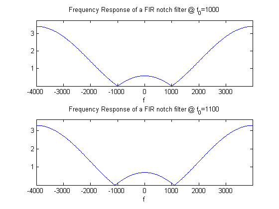
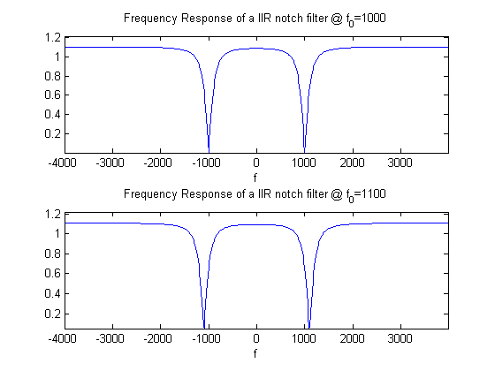

# lab06sub
FIR and IIR Filters for Audio Processing

## OBJECTTIVES:
- use MATLAB to process audio files using several filters and we will note the effects of the filters on sounds from `.wav` files. 
- use low pass and band pass filters designed with `fir1` used in previous laboratories and notch filters as described below. 
- test echo filters and a nonlinear filter which modulates the frequencies.


## PRELAB:

### 1.
A short voice and music file will be supplied in the lab. Find a short `.wav` file that you would like to test in the lab and read it with MATLAB. Use sound to verify. (Be sure to use `FS` in the sound function.) 
```matlab
file1 = '\\samba1\clee5\dcengr\Downloads\ELEN133\lab\lab06\wav\xtheme.wav';
[y1, Fs1, bits1] = wavread(file1);
file2 = '\\samba1\clee5\dcengr\Downloads\ELEN133\lab\lab06\wav\tone_1026.wav';
[y2, Fs2, bits2] = wavread(file2);
file3 = '\\samba1\clee5\dcengr\Downloads\ELEN133\lab\lab06\wav\ghostbusters.wav';

[y3, Fs3, bits3] = wavread(file3);
%
% play the sound to verify the function works
%
sound(y1, Fs1);
pause(3);
sound(y2, Fs2);
pause(3);
sound(y3, Fs3);
```

### 2.
Design an FIR notch filter by specifying the placement of two zeros.
- For a sampling rate of $$8000\:\text{Hz}$$, design an FIR filter to notch out $$1000\:\text{Hz}$$ by placing two zeros on the unit circle at the value of $$\omega_0$$ that corresponds to $$1000\:\text{Hz}$$. Define $$\omega_0$$ and the sampling frequency as parameters so you will only have to make a change in one place if a different value is needed.
	- Compute the filter coefficients for this filter which has two zeros. Note that for two zeros on the unit circle at $$\pm\omega_0$$, 
	$$
	H(z)=\frac{\left(z-e^{j\omega_0}\right)\left(z-e^{-j\omega_0}\right)}{z^2}
	$$
	- Use `freqz` to plot the frequency response of this filter. How would you characterize the width and depth of the notch at $$1\:\text{kHz}$$? Print the plot.
- Repeat for a sampling frequency of $$11\:\text{kHz}$$.

#### ANSWER TO 2.
Given,
$$
\begin{cases}
f_s=8000\:\text{Hz}\\
f_0=1000\:\text{Hz}\\
\end{cases}
$$
Define
$$
\begin{align*}
\omega_0&=2\pi\frac{f_0}{f_s}\\
&=2\pi\frac{(1000)}{(8000)}\\
&=\frac{\pi}{4}\\\\
H_1(z)&=\frac{\left(z-e^{j\omega_0}\right)\left(z-e^{-j\omega_0}\right)}{z^2}\\
&=\frac{\left(z-e^{j\left(\tfrac{\pi}{4}\right)}\right)\left(z-e^{-j\left(\tfrac{\pi}{4}\right)}\right)}{z^2}\\
&=\frac{z^2-z\left(e^{j\tfrac{\pi}{4}}+e^{-j\tfrac{\pi}{4}}\right)+1}{z^2}\\
&=\frac{z^2-z\left(2\cos{\left(\frac{\pi}{4}\right)}\right)+1}{z^2}\\
&=\frac{z^2-z\left(\sqrt{3}\right)+1}{z^2}\\
\end{align*}
$$
Also, given
$$
\begin{cases}
f_s=8000\:\text{Hz}\\
f_0=1100\:\text{Hz}\\
\end{cases}
$$
Define
$$
\begin{align*}
\omega_0&=2\pi\frac{f_0}{f_s}\\
&=2\pi\frac{(1100)}{(8000)}\\
&=\frac{11\pi}{80}\\\\
H_2(z)&=\frac{\left(z-e^{j\omega_0}\right)\left(z-e^{-j\omega_0}\right)}{z^2}\\
&=\frac{\left(z-e^{j\left(\tfrac{11\pi}{80}\right)}\right)\left(z-e^{-j\left(\tfrac{11\pi}{80}\right)}\right)}{z^2}\\
&=\frac{z^2-z\left(e^{j\tfrac{11\pi}{80}}+e^{-j\tfrac{11\pi}{80}}\right)+1}{z^2}\\
&=\frac{z^2-z\left(2\cos{\left(\frac{11\pi}{80}\right)}\right)+1}{z^2}\\
&=\frac{z^2-z\left(1.81628\right)+1}{z^2}\\
\end{align*}
$$
```matlab
titlez='Frequency Response of a FIR notch filter @ f_0=';
%
fs = 8000;
f0 = 1000; % frequency to notch
w0 = 2*pi*f0/fs;
%
P1F = [1 0 0];
Z1F = [1 -2*cos(w0) 1];
%
N = 512;
[H1F, w] = freqz(Z1F, P1F, N, 'whole');
%
figure();
subplot(2,1,1);
plot((w-pi)*fs/(2*pi), fftshift(abs(H1F)));
axis(...
    [  min((w-pi)*fs/(2*pi))-(fs/2/pi/N)...
    max((w-pi)*fs/(2*pi))+fs/2/pi/N min(abs(H1F))...
    max((abs(H1F))*1.1)  ]...
    );
title(  horzcat(titlez, num2str(f0))  );
xlabel('f');
%
% 2(b) Design an FIR notch filter @ f_0=1100
%
fs = 8000;
f0 = 1100; % frequency to notch
w0 = 2*pi*f0/fs;
%
P2F = [1 0 0];
Z2F = [1 -2*cos(w0) 1];
%
N = 512;
[H2F, w] = freqz(Z2F, P2F, N, 'whole');
%
subplot(2,1,2);
plot((w-pi)*fs/(2*pi), fftshift(abs(H2F)));
axis(...
    [  min((w-pi)*fs/(2*pi))-(fs/2/pi/N)...
    max((w-pi)*fs/(2*pi))+fs/2/pi/N min(abs(H2F))...
    max((abs(H2F))*1.1)  ]...
    );
title(  horzcat(titlez, num2str(f0))  );
xlabel('f');
```

__output__: 



### 3.
Design an IIR notch filter
- Repeat the FIR design but in addition to the two zeros, add two poles at $$z=\rho{e}^{\pm{j}\omega_0}$$ so that
$$
H(z)=\frac{\left(z-e^{j\omega_0}\right)\left(z-e^{-j\omega_0}\right)}{\left(z-\rho{e}^{j\omega_0}\right)\left(z-\rho{e}^{-j\omega_0}\right)}
$$
	- For both sampling frequencies from part 3, compute the filter coefficients for this filter (which has two zeros and two poles) when $$\rho=0.9$$.
	- Use `freqz` to plot the frequency response of these filters. How would you characterize the width and depth of the notch at $$1\:\text{kHz}$$?

### ANSWER TO 3.
Given,
$$
\begin{cases}
f_s=8000\:\text{Hz}\\
f_0=1000\:\text{Hz}\\
\end{cases}
$$
Define
$$
\begin{align*}
\omega_0&=2\pi\frac{f_0}{f_s}\\
&=2\pi\frac{(1000)}{(8000)}\\
&=\frac{\pi}{4}\\\\
H_1(z)&=\frac{\left(z-e^{j\omega_0}\right)\left(z-e^{-j\omega_0}\right)}{\left(z-\rho{e}^{j\omega_0}\right)\left(z-\rho{e}^{-j\omega_0}\right)}\\
&=\frac{\left(z-e^{j\left(\tfrac{\pi}{4}\right)}\right)\left(z-e^{-j\left(\tfrac{\pi}{4}\right)}\right)}{\left(z-\rho{e}^{j\left(\tfrac{\pi}{4}\right)}\right)\left(z-\rho{e}^{-j\left(\tfrac{\pi}{4}\right)}\right)}\\
&=\frac{z^2-z\left(e^{j\tfrac{\pi}{4}}+e^{-j\tfrac{\pi}{4}}\right)+1}{z^2-z\rho\left(e^{j\tfrac{\pi}{4}}+e^{-j\tfrac{\pi}{4}}\right)+rho^2}\\
&=\frac{z^2-z\left(2\cos{\left(\frac{\pi}{4}\right)}\right)+1}{z^2-z\left(2\rho\cos{\left(\frac{\pi}{4}\right)}\right)+rho^2}\\
&=\frac{z^2-z\left(\sqrt{3}\right)+1}{z^2-z\left(2\rho\cos{\left(\frac{\pi}{4}\right)}\right)+rho^2}\\
\end{align*}
$$
Also, given
$$
\begin{cases}
f_s=8000\:\text{Hz}\\
f_0=1100\:\text{Hz}\\
\end{cases}
$$
Define
$$
\begin{align*}
\omega_0&=2\pi\frac{f_0}{f_s}\\
&=2\pi\frac{(1100)}{(8000)}\\
&=\frac{11\pi}{80}\\\\
H_2(z)&=\frac{\left(z-e^{j\omega_0}\right)\left(z-e^{-j\omega_0}\right)}{\left(z-\rho{e}^{j\omega_0}\right)\left(z-\rho{e}^{-j\omega_0}\right)}\\
&=\frac{\left(z-e^{j\left(\tfrac{11\pi}{80}\right)}\right)\left(z-e^{-j\left(\tfrac{11\pi}{80}\right)}\right)}{\left(z-\rho{e}^{j\left(\tfrac{11\pi}{80}\right)}\right)\left(z-\rho{e}^{-j\left(\tfrac{11\pi}{80}\right)}\right)}\\
&=\frac{z^2-z\left(e^{j\tfrac{11\pi}{80}}+e^{-j\tfrac{11\pi}{80}}\right)+1}{z^2-z\rho\left(e^{j\tfrac{11\pi}{80}}+e^{-j\tfrac{11\pi}{80}}\right)+\rho^2}\\
&=\frac{z^2-z\left(2\cos{\left(\frac{11\pi}{80}\right)}\right)+1}{z^2-z\left(2\rho\cos{\left(\frac{11\pi}{80}\right)}\right)+\rho^2}\\
&=\frac{z^2-z\left(1.81628\right)+1}{z^2-z\left(2\rho\cos{\left(\frac{11\pi}{80}\right)}\right)+\rho^2}\\
\end{align*}
$$
```matlab
titlez='Frequency Response of a IIR notch filter @ f_0=';
rho = 0.9;
%
fs = 8000;
f0 = 1000; % frequency to notch
w0 = 2*pi*f0/fs;
%
P1I = [1 -2*rho*cos(w0) rho^2];
Z1I = [1 -2*cos(w0) 1];
%
N = 512;
[H1I, w] = freqz(Z1I, P1I, N, 'whole');
%
figure();
subplot(2,1,1);
plot((w-pi)*fs/(2*pi), fftshift(abs(H1I)));
axis(...
    [  min((w-pi)*fs/(2*pi))-(fs/2/pi/N)...
    max((w-pi)*fs/(2*pi))+fs/2/pi/N min(abs(H1I))...
    max((abs(H1I))*1.1)  ]...
    );
title(  horzcat(titlez, num2str(f0))  );

xlabel('f');
%
% 2(b) Design an FIR notch filter @ f_0=1100
%
fs = 8000;
f0 = 1100; % frequency to notch
w0 = 2*pi*f0/fs;
%
P2I = [1 -2*rho*cos(w0) rho^2];
Z2I = [1 -2*cos(w0) 1];
%
N = 512;
[H2I, w] = freqz(Z2I, P2I, N, 'whole');
%
subplot(2,1,2);
plot((w-pi)*fs/(2*pi), fftshift(abs(H2I)));
axis(...
    [  min((w-pi)*fs/(2*pi))-(fs/2/pi/N)...
    max((w-pi)*fs/(2*pi))+fs/2/pi/N min(abs(H2I))...
    max((abs(H2I))*1.1)  ]...
    );
title(  horzcat(titlez, num2str(f0))  );
xlabel('f');
%
```

__output__:

