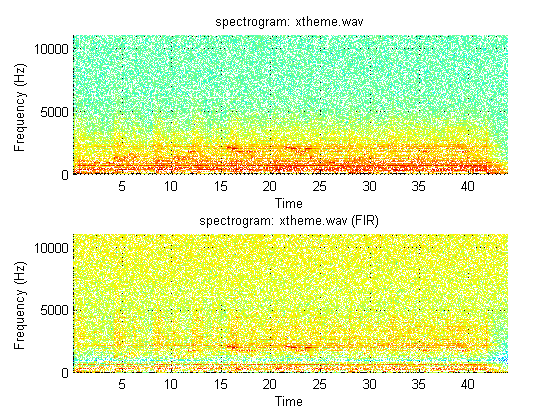

# lab06sub
FIR and IIR Filters for Audio Processing

## OBJECTIVES:
- use MATLAB to process audio files using several filters and we will note the effects of the filters on sounds from `.wav` files.
- use low pass and band pass filters designed with `fir1` used in previous laboratories and notch filters as described below.
- test echo filters and a nonlinear filter which modulates the frequencies.


## PRELAB:

### 1.
A short voice and music file will be supplied in the lab. Find a short `.wav` file that you would like to test in the lab and read it with MATLAB. Use sound to verify. (Be sure to use `FS` in the sound function.)
```matlab
file1 = '\\samba1\clee5\dcengr\Downloads\ELEN133\lab\lab06\wav\xtheme.wav';
[y1, Fs1, bits1] = wavread(file1);
file2 = '\\samba1\clee5\dcengr\Downloads\ELEN133\lab\lab06\wav\tone_1026.wav';
[y2, Fs2, bits2] = wavread(file2);
file3 = '\\samba1\clee5\dcengr\Downloads\ELEN133\lab\lab06\wav\ghostbusters.wav';

[y3, Fs3, bits3] = wavread(file3);
%
% play the sound to verify the function works
%
sound(y1, Fs1);
pause(3);
sound(y2, Fs2);
pause(3);
sound(y3, Fs3);
```

### 2.
Design an FIR notch filter by specifying the placement of two zeros.
- For a sampling rate of $$8000\:\text{Hz}$$, design an FIR filter to notch out $$1000\:\text{Hz}$$ by placing two zeros on the unit circle at the value of $$\omega_0$$ that corresponds to $$1000\:\text{Hz}$$. Define $$\omega_0$$ and the sampling frequency as parameters so you will only have to make a change in one place if a different value is needed.
	- Compute the filter coefficients for this filter which has two zeros. Note that for two zeros on the unit circle at $$\pm\omega_0$$,
	$$
	H(z)=\frac{\left(z-e^{j\omega_0}\right)\left(z-e^{-j\omega_0}\right)}{z^2}
	$$
	- Use `freqz` to plot the frequency response of this filter. How would you characterize the width and depth of the notch at $$1\:\text{kHz}$$? Print the plot.
- Repeat for a sampling frequency of $$11\:\text{kHz}$$.

#### ANSWER TO 2.
Given,
$$
\begin{cases}
f_s=8000\:\text{Hz}\\
f_0=1000\:\text{Hz}\\
\end{cases}
$$
Define
$$
\begin{align*}
\omega_0&=2\pi\frac{f_0}{f_s}\\
&=2\pi\frac{(1000)}{(8000)}\\
&=\frac{\pi}{4}\\\\
H_1(z)&=\frac{\left(z-e^{j\omega_0}\right)\left(z-e^{-j\omega_0}\right)}{z^2}\\
&=\frac{\left(z-e^{j\left(\tfrac{\pi}{4}\right)}\right)\left(z-e^{-j\left(\tfrac{\pi}{4}\right)}\right)}{z^2}\\
&=\frac{z^2-z\left(e^{j\tfrac{\pi}{4}}+e^{-j\tfrac{\pi}{4}}\right)+1}{z^2}\\
&=\frac{z^2-z\left(2\cos{\left(\frac{\pi}{4}\right)}\right)+1}{z^2}\\
&=\frac{z^2-z\left(\sqrt{3}\right)+1}{z^2}\\
\end{align*}
$$
Also, given
$$
\begin{cases}
f_s=8000\:\text{Hz}\\
f_0=1100\:\text{Hz}\\
\end{cases}
$$
Define
$$
\begin{align*}
\omega_0&=2\pi\frac{f_0}{f_s}\\
&=2\pi\frac{(1100)}{(8000)}\\
&=\frac{11\pi}{80}\\\\
H_2(z)&=\frac{\left(z-e^{j\omega_0}\right)\left(z-e^{-j\omega_0}\right)}{z^2}\\
&=\frac{\left(z-e^{j\left(\tfrac{11\pi}{80}\right)}\right)\left(z-e^{-j\left(\tfrac{11\pi}{80}\right)}\right)}{z^2}\\
&=\frac{z^2-z\left(e^{j\tfrac{11\pi}{80}}+e^{-j\tfrac{11\pi}{80}}\right)+1}{z^2}\\
&=\frac{z^2-z\left(2\cos{\left(\frac{11\pi}{80}\right)}\right)+1}{z^2}\\
&=\frac{z^2-z\left(1.81628\right)+1}{z^2}\\
\end{align*}
$$
```matlab
titlez='Frequency Response of a FIR notch filter @ f_0=';
%
fs = 8000;
f0 = 1000; % frequency to notch
w0 = 2*pi*f0/fs;
%
P1F = [1 0 0];
Z1F = [1 -2*cos(w0) 1];
%
N = 512;
[H1F, w] = freqz(Z1F, P1F, N, 'whole');
%
figure();
subplot(2,1,1);
plot((w-pi)*fs/(2*pi), fftshift(abs(H1F)));
axis(...
    [  min((w-pi)*fs/(2*pi))-(fs/2/pi/N)...
    max((w-pi)*fs/(2*pi))+fs/2/pi/N min(abs(H1F))...
    max((abs(H1F))*1.1)  ]...
    );
title(  horzcat(titlez, num2str(f0))  );
xlabel('f');
%
% 2(b) Design an FIR notch filter @ f_0=1100
%
fs = 8000;
f0 = 1100; % frequency to notch
w0 = 2*pi*f0/fs;
%
P2F = [1 0 0];
Z2F = [1 -2*cos(w0) 1];
%
N = 512;
[H2F, w] = freqz(Z2F, P2F, N, 'whole');
%
subplot(2,1,2);
plot((w-pi)*fs/(2*pi), fftshift(abs(H2F)));
axis(...
    [  min((w-pi)*fs/(2*pi))-(fs/2/pi/N)...
    max((w-pi)*fs/(2*pi))+fs/2/pi/N min(abs(H2F))...
    max((abs(H2F))*1.1)  ]...
    );
title(  horzcat(titlez, num2str(f0))  );
xlabel('f');
```

__output__:


### 3.
Design an IIR notch filter
- Repeat the FIR design but in addition to the two zeros, add two poles at $$z=\rho{e}^{\pm{j}\omega_0}$$ so that
$$
H(z)=\frac{\left(z-e^{j\omega_0}\right)\left(z-e^{-j\omega_0}\right)}{\left(z-\rho{e}^{j\omega_0}\right)\left(z-\rho{e}^{-j\omega_0}\right)}
$$
	- For both sampling frequencies from part 3, compute the filter coefficients for this filter (which has two zeros and two poles) when $$\rho=0.9$$.
	- Use `freqz` to plot the frequency response of these filters. How would you characterize the width and depth of the notch at $$1\:\text{kHz}$$?

### ANSWER TO 3.
Given,
$$
\begin{cases}
f_s=8000\:\text{Hz}\\
f_0=1000\:\text{Hz}\\
\end{cases}
$$
Define
$$
\begin{align*}
\omega_0&=2\pi\frac{f_0}{f_s}\\
&=2\pi\frac{(1000)}{(8000)}\\
&=\frac{\pi}{4}\\\\
H_1(z)&=\frac{\left(z-e^{j\omega_0}\right)\left(z-e^{-j\omega_0}\right)}{\left(z-\rho{e}^{j\omega_0}\right)\left(z-\rho{e}^{-j\omega_0}\right)}\\
&=\frac{\left(z-e^{j\left(\tfrac{\pi}{4}\right)}\right)\left(z-e^{-j\left(\tfrac{\pi}{4}\right)}\right)}{\left(z-\rho{e}^{j\left(\tfrac{\pi}{4}\right)}\right)\left(z-\rho{e}^{-j\left(\tfrac{\pi}{4}\right)}\right)}\\
&=\frac{z^2-z\left(e^{j\tfrac{\pi}{4}}+e^{-j\tfrac{\pi}{4}}\right)+1}{z^2-z\rho\left(e^{j\tfrac{\pi}{4}}+e^{-j\tfrac{\pi}{4}}\right)+rho^2}\\
&=\frac{z^2-z\left(2\cos{\left(\frac{\pi}{4}\right)}\right)+1}{z^2-z\left(2\rho\cos{\left(\frac{\pi}{4}\right)}\right)+rho^2}\\
&=\frac{z^2-z\left(\sqrt{3}\right)+1}{z^2-z\left(2\rho\cos{\left(\frac{\pi}{4}\right)}\right)+rho^2}\\
\end{align*}
$$
Also, given
$$
\begin{cases}
f_s=8000\:\text{Hz}\\
f_0=1100\:\text{Hz}\\
\end{cases}
$$
Define
$$
\begin{align*}
\omega_0&=2\pi\frac{f_0}{f_s}\\
&=2\pi\frac{(1100)}{(8000)}\\
&=\frac{11\pi}{80}\\\\
H_2(z)&=\frac{\left(z-e^{j\omega_0}\right)\left(z-e^{-j\omega_0}\right)}{\left(z-\rho{e}^{j\omega_0}\right)\left(z-\rho{e}^{-j\omega_0}\right)}\\
&=\frac{\left(z-e^{j\left(\tfrac{11\pi}{80}\right)}\right)\left(z-e^{-j\left(\tfrac{11\pi}{80}\right)}\right)}{\left(z-\rho{e}^{j\left(\tfrac{11\pi}{80}\right)}\right)\left(z-\rho{e}^{-j\left(\tfrac{11\pi}{80}\right)}\right)}\\
&=\frac{z^2-z\left(e^{j\tfrac{11\pi}{80}}+e^{-j\tfrac{11\pi}{80}}\right)+1}{z^2-z\rho\left(e^{j\tfrac{11\pi}{80}}+e^{-j\tfrac{11\pi}{80}}\right)+\rho^2}\\
&=\frac{z^2-z\left(2\cos{\left(\frac{11\pi}{80}\right)}\right)+1}{z^2-z\left(2\rho\cos{\left(\frac{11\pi}{80}\right)}\right)+\rho^2}\\
&=\frac{z^2-z\left(1.81628\right)+1}{z^2-z\left(2\rho\cos{\left(\frac{11\pi}{80}\right)}\right)+\rho^2}\\
\end{align*}
$$
```matlab
titlez='Frequency Response of a IIR notch filter @ f_0=';
rho = 0.9;
%
fs = 8000;
f0 = 1000; % frequency to notch
w0 = 2*pi*f0/fs;
%
P1I = [1 -2*rho*cos(w0) rho^2];
Z1I = [1 -2*cos(w0) 1];
%
N = 512;
[H1I, w] = freqz(Z1I, P1I, N, 'whole');
%
figure();
subplot(2,1,1);
plot((w-pi)*fs/(2*pi), fftshift(abs(H1I)));
axis(...
    [  min((w-pi)*fs/(2*pi))-(fs/2/pi/N)...
    max((w-pi)*fs/(2*pi))+fs/2/pi/N min(abs(H1I))...
    max((abs(H1I))*1.1)  ]...
    );
title(  horzcat(titlez, num2str(f0))  );

xlabel('f');
%
% 2(b) Design an FIR notch filter @ f_0=1100
%
fs = 8000;
f0 = 1100; % frequency to notch
w0 = 2*pi*f0/fs;
%
P2I = [1 -2*rho*cos(w0) rho^2];
Z2I = [1 -2*cos(w0) 1];
%
N = 512;
[H2I, w] = freqz(Z2I, P2I, N, 'whole');
%
subplot(2,1,2);
plot((w-pi)*fs/(2*pi), fftshift(abs(H2I)));
axis(...
    [  min((w-pi)*fs/(2*pi))-(fs/2/pi/N)...
    max((w-pi)*fs/(2*pi))+fs/2/pi/N min(abs(H2I))...
    max((abs(H2I))*1.1)  ]...
    );
title(  horzcat(titlez, num2str(f0))  );
xlabel('f');
%
```

__output__:


## LAB:

### STEP 1:
Use the MATLAB function spectrogram to view the time varying frequency content of signals.

#### OUTPUT OF `lab06part01.m`

##### Figure 01a1


##### Figure 01a2


##### Figure 01a3


##### Figure 01b1


##### Figure 01b2


##### Figure 01b3


#### QUESTION 1
__Compare the three displays with respect to the following to determine the effect of changing the length of the segments used to compute the Fourier transform__

##### 1(a)
__Which display has the sharpest frequency resolution? How wide are the red lines indicating the strong signals at the tones used to identify the four buttons?__

##### ANSWER 1(a)
Looking at how 'thin' the line looks at the spectrogram, The first spectrogram definitely shows the sharpest frequency resolution.  And this indeed is exactly what we must anticipate and want, if we were to analyze our tone frequency, which should dwell in the distinctive frequency.

##### 1(b)
__Can you reliably distinguish the individual button tones in all three displays?__

##### ANSWER 1(b)
Yes, for the spectrograms with `thickest` lines, we can gaze at the altitude it's centered and estimate the frequency.  However, it may lack reliability, once two lines overlap in the spectrogram, *i.e.* two frequency content are very adjacent to one another.  We can see the danger of it in the button 11 for the third spectrogram.

##### 1(c)
__Which display has the best time resolution? How wide and distinct are the dark blue horizontal strips indicating the “quiet time”?__

##### ANSWER 1(c)
Frequency has an inverse relation to time.  So we have to be mindful about the __tradeoff from the decision of setting higher resolution on which domain__.  The *__third spectrogram__* has the most definitive quiet time in between the tones.

##### 1(d)
Can you reliably distinguish the quiet time between buttons in all three displays?

##### ANSWER 1(d)
More or less Yes, the winner graph for distinguishin the quiet time is the third spectrogram.  and the loser is the first spectrogram.  The logic works likewise.  The first resulst wanted to investigate frequency content more than the quiet time interval.


### STEP 2:
Create frequency selective filters and listen to the effect of the filters.

#### OUTPUT OF `lab06part02.m`

##### Figure 02a1


##### Figure 02a2


##### Figure 02b1


##### Figure 02b2


##### Figure 02c1


##### Figure 02c2


#### QUESTION 2.
__Can you understand the speech in all three bands? Use spectrogram to verify that the pass-bands are at the frequencies you specified.__

#### ANSWER 2.
I could hear the output with the filter that had the largest window size on the frequency between 2000 and 3000.
The rest of the test sound signals were barely audible.  

Since the filter's job is to select and preserve the important part of the frequency content and trash the rest, this exercise conveys the importance of selecting the proper window size.

### STEP 3:
__Create notch filters and listen to the effect of the filters.__

#### OUTPUT OF `lab06part03.m`

##### Figure 03a1


##### Figure 03a2


##### Figure 03a3


##### Figure 03b


#### Command Prompt
This prompt represents a set of proper $$\omega_0$$ values for notch filter to create.
```
w0A = 
    0.2850
w0B =
    0.2850
w0C = 
    0.5699
```

##### Figure 03c1


##### Figure 03c2


##### Figure 03d1


##### Figure 03d2


##### Figure 03e1


##### Figure 03e2


##### Figure 03f1


##### Figure 03f2


##### Figure 03g1


##### Figure 03g2


#### QUESTION 3(a)
__Use the function filter to create outputs from the sample speech file for each of the two filters and listen to the output using sound. How much difference can you hear between the FIR output and the IIR output?__

#### ANSWER 3(a)
When the input sound is filtered through FIR filter, the output sound has its volume diminished from the original sound.

On the other hand, when the input is filtered through IIR filter, most of the sound we heard originally is preserved.


#### QUESTION 3(b)
__Use the function filter to create outputs from a speech file with the interfering tone for each of the two filters and listen to the output using sound. How much difference can you hear between the FIR output and the IIR output?__

#### ANSWER 3(b)
Same exact effects happen as above. The key observation is that the both filters cancelled out the noise well.  However the IIR filter output did the job better than FIR filter, in terms of preservation of sound quality.


### STEP 4:
Modulate the audio signal.

#### OUPUT OF `lab06part04.m`

##### Figure 04a


##### Figure 04b


#### QUESTION 4(a)
$$
f_0=100\:\text{Hz};
$$
__Listen to the result and describe how it sounds. Can you still understand it?__


#### ANSWER 4(a)
Yes, It is still understandable. But the modulation made the sound little jaggy.


#### QUESTION 4(b)
$$
f_0=\frac{f_s}{4};
$$
__Listen to the result and describe how it sounds. Can you still understand it?__

#### ANSWER 4(b)
Now, it's much more difficult to understand.  Spectrogram plots the two original inputs mirroring at the some center frequency.


#### QUESTION 4(c)
$$
f_0=\frac{f_s}{2};
$$
__Listen to the result and describe how it sounds. Can you still understand it?__

#### ANSWER 4(c)
It's still difficult to understand.  Spectrogram plots the two original input that is flipped upside down.


## APPENDIX:

### `my_dtmf.m`
```matlab
function dial_sig = my_dtmf(tone_time, quiet_time, fs, dial_vals)
% INPUTS:
% - tone_time is the tone duration in seconds
% - quiet_time is quiet time duration between tones in seconds
% - fs is the sampling frequency in Hz
% - dial_vals is a vector of integers from 1 to 12 representing the
% - button numbers of the sequence of numbers to be dialed
% Note that the dialed "0" is button number 11!!!!!!
%
% OUTPUT:
% - dial_sig is the vector of sampled values of the DTMF output signal
% for the number sequence

t_tone_new = 0:tone_time*fs-1;
num = length(dial_vals);
quiet_sig = zeros(1, fs*quiet_time);
f_tone = [
    697, 1209; 697, 1336; 697, 1477;...
    770, 1209; 770, 1336; 770, 1477;...
    852, 1209; 852, 1336; 852, 1477;...
    941, 1209; 941, 1336; 941, 1477;
    ];

dial_sig = []; %initializes the output to an empty vector

for ii=1:num
    lo = f_tone(dial_vals(ii),1);
    hi = f_tone(dial_vals(ii),2);
    new_sig = cos( 2 * pi * lo / fs * t_tone_new)...
        + cos( 2 * pi * hi / fs * t_tone_new );

    % normalize the output around 1
    new_sig = new_sig./abs(max(new_sig(:)));

    dial_sig = [dial_sig, new_sig, quiet_sig];
end
```

### `lab06part01.m`
```matlab
%% intialize
clear, clc, clf, cla, close all;
%
%% STEP 1
% Use the MATLAB function spectrogram to view the time varying frequency
% content of signals
%
%% 1(a)
%
fs = 8000;
%
dial_val3 = [3 5 7 11];
t_tone3 = 0.50;
t_quiet3 = 0.10;
testSig3 = my_dtmf(t_tone3, t_quiet3, fs, dial_val3);
%
% ----- define the following: -----
% (1) sample size
% (2) time duration
% (3) time vector.
%
N3=length(testSig3);
t3=N3/fs;
tv3=(0:N3-1)/fs;
%
% ----------------------------------------------
% See the 3 different spectrograms of the signal
%
figure(1)
spectrogram(testSig3, 1024, 512, 1024, fs, 'yaxis');
% window = 1024,
% overlap = 512,
% fftlength = 1024
%
figure(2)
spectrogram(testSig3, 512, 256, 512, fs, 'yaxis');
% window = 512,
% overlap = 256,
% fftlength = 512
%
figure(3)
spectrogram(testSig3, 200, 100, 512, fs, 'yaxis');
% window = 200,
% overlap= 100,
% fftlength = 512
%
%% 1(b)
%
% read .wav file and listen to the sound
%
% --------------
% (1) MATLAB2013
% --------------
%
file1 = '\\samba1\clee5\dcengr\Downloads\ELEN133\lab\lab06\wav\tone_1026.wav';
[yA, fsA, nbitsA] = wavread(file1);
sound (yA, fsA);
pause(3.5);
%
file2 = '\\samba1\clee5\dcengr\Downloads\ELEN133\lab\lab06\wav\xtheme.wav';
[yB, fsB, bitsB] = wavread(file2);
sound(yB, fsB);
pause(3.5);
%
file3 = '\\samba1\clee5\dcengr\Downloads\ELEN133\lab\lab06\wav\ghostbusters.wav';
[yC, fsC, bitsC] = wavread(file3);
sound(yC, fsC);
pause(3.5);
% %
% % --------------
% % (2) MATLAB2015
% % --------------
% %
% file1 = '\\samba1\clee5\dcengr\Downloads\ELEN133\lab\lab06\wav\tone_1026.wav';
% info1 = audioinfo('file1');
% fsA = info1.SampleRate;
% nbitsA = info1.BitsPerSample;
% yA = audioread('file1');
% sound(yC, fsC);
% pause(3.5);
% %
% file2 = '\\samba1\clee5\dcengr\Downloads\ELEN133\lab\lab06\wav\xtheme.wav';
% info2 = audioinfo('file2');
% fsB = info2.SampleRate;
% nbitsB = info2.BitsPerSample;
% yB = audioread('file2');
% sound(yC, fsC);
% pause(3.5);
% %
% file3 = '\\samba1\clee5\dcengr\Downloads\ELEN133\lab\lab06\wav\ghostbusters.wav';
% info3 = audioinfo('file3');
% fsC = info3.SampleRate;
% nbitsC = info3.BitsPerSample;
% yC = audioread('file3');
% sound(yC, fsC);
% pause(3.5);
%
% ------------------------------------------
% view the spectrogram of following waveform
%
figure()
spectrogram(yA, 2048, 1024, 2048, fsA, 'yaxis');
title('spectrogram: tone1026.wav');
% window = 2048,
% overlap = 1024,
% fftlength = 2048
%
figure()
spectrogram(yB, 2048, 1024, 2048, fsB, 'yaxis');
title('spectrogram: xtheme.wav');
% window = 2048,
% overlap = 1024,
% fftlength = 2048
%
figure()
spectrogram(yC, 2048, 1024, 2048, fsC, 'yaxis');
title('spectrogram: ghostbusters.wav');
% window = 2048,
% overlap = 1024,
% fftlength = 2048
```

### `lab06part02.m`
```matlab
%% intialize
clear, clc, clf, cla, close all;
%
%% STEP 2
% Create frequency selective filters and listen to the effect of the
% filters.
%
%% 2(a)
%
% read .wav file and listen to the sound
%
% --------------
% (1) MATLAB2013
% --------------
%
file1 = '\\samba1\clee5\dcengr\Downloads\ELEN133\lab\lab06\wav\tone_1026.wav';
[yA, fsA, nbitsA] = wavread(file1);
% sound (yA, fsA);
% pause(3.5);
%
file2 = '\\samba1\clee5\dcengr\Downloads\ELEN133\lab\lab06\wav\xtheme.wav';
[yB, fsB, bitsB] = wavread(file2);
% sound(yB, fsB);
% pause(3.5);
%
file3 = '\\samba1\clee5\dcengr\Downloads\ELEN133\lab\lab06\wav\ghostbusters.wav';
[yC, fsC, bitsC] = wavread(file3);
% sound(yC, fsC);
% pause(3.5);
%
% --------------
% (2) MATLAB2015
% --------------
%
% file1 = '\\samba1\clee5\dcengr\Downloads\ELEN133\lab\lab06\wav\tone_1026.wav';
% info1 = audioinfo('file1');
% fsA = info1.SampleRate;
% nbitsA = info1.BitsPerSample;
% yA = audioread('file1');
% sound(yC, fsC);
% pause(3.5);
% %
% file2 = '\\samba1\clee5\dcengr\Downloads\ELEN133\lab\lab06\wav\xtheme.wav';
% info2 = audioinfo('file2');
% fsB = info2.SampleRate;
% nbitsB = info2.BitsPerSample;
% yB = audioread('file2');
% sound(yC, fsC);
% pause(3.5);
% %
% file3 = '\\samba1\clee5\dcengr\Downloads\ELEN133\lab\lab06\wav\ghostbusters.wav';
% info3 = audioinfo('file3');
% fsC = info3.SampleRate;
% nbitsC = info3.BitsPerSample;
% yC = audioread('file3');
% sound(yC, fsC);
% pause(3.5);
%
%% 2(b)
%
% create a filter to see the effect
%
% ------------------
% define window size
%
w = 10;
Wn1 = [200, 500]/(fsA/2);
Wn2 = [800, 1000]/(fsA/2);
Wn3 = [2000, 3000]/(fsA/2);
%
N = 200;
filt1 = fir1(  N, Wn1, rectwin(N+1)  );
filt2 = fir1(  N, Wn2, rectwin(N+1)  );
filt3 = fir1(  N, Wn3, rectwin(N+1)  );
%
% ------------------------
% generate filtered output
%
yA1 = filter(filt1, 1, yA);
yB1 = filter(filt1, 1, yB);
yC1 = filter(filt1, 1, yC);
%
yA2 = filter(filt2, 1, yA);
yB2 = filter(filt2, 1, yB);
yC2 = filter(filt2, 1, yC);
%
yA3 = filter(filt3, 1, yA);
yB3 = filter(filt3, 1, yB);
yC3 = filter(filt3, 1, yC);
%
% --------------------
% (1) test on tone1026
% --------------------
%
% view the spectrogram of following waveform
%
figure()
spectrogram(yA, 2048, 1024, 2048, fsA, 'yaxis');
title('spectrogram: tone1026.wav');
%
figure()
subplot(3,1,1);
spectrogram(yA1, 2048, 1024, 2048, fsA, 'yaxis');
title('spectrogram: tone1026.wav (with bpf 200-500 Hz)');
% sound (yA1, fsA);
% pause(3.5);
%
subplot(3,1,2);
spectrogram(yA2, 2048, 1024, 2048, fsA, 'yaxis');
title('spectrogram: tone1026.wav (with bpf 800-1000 Hz)');
% sound (yA2, fsA);
% pause(3.5);
%
subplot(3,1,3);
spectrogram(yA3, 2048, 1024, 2048, fsA, 'yaxis');
title('spectrogram: tone1026.wav (with bpf 2000-3000 Hz)');
% sound (yA3, fsA);
% pause(3.5);
%
% ----------------------
% (2) test on xtheme.wav
% ----------------------
%
% view the spectrogram of following waveform
%
figure()
spectrogram(yB1, 2048, 1024, 2048, fsB, 'yaxis');
title('spectrogram: xtheme.wav');
%
figure()
subplot(3,1,1);
spectrogram(yB2, 2048, 1024, 2048, fsB, 'yaxis');
title('spectrogram: xtheme.wav (with bpf 200-500 Hz)');
% sound (yB1, fsB);
% pause(42);
%
subplot(3,1,2);
spectrogram(yB3, 2048, 1024, 2048, fsB, 'yaxis');
title('spectrogram: xtheme.wav (with bpf 800-1000 Hz)');
% sound (yB2, fsB);
% pause(42);
%
subplot(3,1,3);
spectrogram(yB3, 2048, 1024, 2048, fsB, 'yaxis');
title('spectrogram: xtheme.wav (with bpf 2000-3000 Hz)');
% sound (yB3, fsB);
% pause(42);
%
% ----------------------------
% (3) test on ghostbusters.wav
% ----------------------------
%
% view the spectrogram of following waveform
%
figure()
spectrogram(yC, 2048, 1024, 2048, fsC, 'yaxis');
title('spectrogram: ghostbusters.wav');
%
figure()
subplot(3,1,1);
spectrogram(yC1, 2048, 1024, 2048, fsC, 'yaxis');
title('spectrogram: ghostbusters.wav (bpf: 200-500 Hz)');
% sound (yC1, fsC);
% pause(5);
%
subplot(3,1,2);
spectrogram(yC2, 2048, 1024, 2048, fsC, 'yaxis');
title('spectrogram: ghostbusters.wav (bpf: 800-1000 Hz)');
% sound (yC2, fsC);
% pause(5);
%
subplot(3,1,3);
spectrogram(yC3, 2048, 1024, 2048, fsC, 'yaxis');
title('spectrogram: ghostbusters.wav (bpf: 2000-3000 Hz)');
% sound (yC3, fsC);
% pause(5);
%
```

### `lab06part03.m`
```matlab
%% intialize
clear, clc, clf, cla, close all;
%
%% STEP 3
% Create notch filters and listen to the effect of the filters.
%
%% 3(a)
%
% read .wav file and listen to the sound
%
% (1) MATLAB2013
%
file1 = '\\samba1\clee5\dcengr\Downloads\ELEN133\lab\lab06\wav\tone_1026.wav';
[yA, fsA, nbitsA] = wavread(file1);
% sound (yA, fsA);
% pause(3.5);
%
file2 = '\\samba1\clee5\dcengr\Downloads\ELEN133\lab\lab06\wav\xtheme.wav';
[yB, fsB, bitsB] = wavread(file2);
% sound(yB, fsB);
% pause(42);
%
file3 = '\\samba1\clee5\dcengr\Downloads\ELEN133\lab\lab06\wav\ghostbusters.wav';
[yC, fsC, bitsC] = wavread(file3);
% sound(yC, fsC);
% pause(5);
% %
% % (2) MATLAB2015
% %
% file1 = '\\samba1\clee5\dcengr\Downloads\ELEN133\lab\lab06\wav\tone_1026.wav';
% info1 = audioinfo('file1');
% fsA = info1.SampleRate;
% nbitsA = info1.BitsPerSample;
% yA = audioread('file1');
% sound(yA, fsA);
% pause(3.5);
% %
% file2 = '\\samba1\clee5\dcengr\Downloads\ELEN133\lab\lab06\wav\xtheme.wav';
% info2 = audioinfo('file2');
% fsB = info2.SampleRate;
% nbitsB = info2.BitsPerSample;
% yB = audioread('file2');
% sound(yB, fsB);
% pause(42);
% %
% file3 = '\\samba1\clee5\dcengr\Downloads\ELEN133\lab\lab06\wav\ghostbusters.wav';
% info3 = audioinfo('file3');
% fsC = info3.SampleRate;
% nbitsC = info3.BitsPerSample;
% yC = audioread('file3');
% sound(yC, fsC);
% pause(5);
%
% ------------------------------------------
% view the spectrogram of following waveform
%
figure()
spectrogram(yA, 2048, 1024, 2048, fsA, 'yaxis');
title('spectrogram: tone1026.wav');
%
figure()
spectrogram(yB, 2048, 1024, 2048, fsB, 'yaxis');
title('spectrogram: xtheme.wav');
%
figure()
spectrogram(yC, 2048, 1024, 2048, fsC, 'yaxis');
title('spectrogram: ghostbusters.wav');
%% 3(b)
%
% generate an interfering signal
%
f0 = 1000;
%
NA = length(yA);
NB = length(yB);
NC = length(yC);
%
tvA = (0:NA-1)';
tvB = (0:NB-1)';
tvC = (0:NC-1)';
%
yAm = (yA .* 0.5) + (0.5 * cos(2*pi*f0/fsA*tvA));
yBm = (yB .* 0.5) + (0.5 * cos(2*pi*f0/fsB*tvB));
yCm = (yC .* 0.5) + (0.5 * cos(2*pi*f0/fsC*tvC));
%
% ------------------------------------------
% view the spectrogram of following waveform
% and
% listen to the filtered output
%
figure()
subplot(3,1,1);
spectrogram(yAm, 2048, 1024, 2048, fsA, 'yaxis');
title('spectrogram: tone1026.wav');
% sound (yAm, fsA);
% pause(3.5);
%
subplot(3,1,2);
spectrogram(yBm, 2048, 1024, 2048, fsB, 'yaxis');
title('spectrogram: tone1026.wav');
% sound (yBm, fsB);
% pause(42);
%
subplot(3,1,3);
spectrogram(yCm, 2048, 1024, 2048, fsC, 'yaxis');
title('spectrogram: tone1026.wav');
% sound (yCm, fsB);
% pause(5);
%
% ------------------------
% find w0 for notch filter
%
w0A = 2*pi*f0/fsA
w0B = 2*pi*f0/fsB
w0C = 2*pi*f0/fsC
%
% ---
% FIR
% ---
%
P1F = [1 0 0];
Z1AF = [1 -2*cos(w0A) 1];
Z1BF = [1 -2*cos(w0B) 1];
Z1CF = [1 -2*cos(w0C) 1];
%
% --------------------------
% generate a filtered output:
%
yAF = filter(Z1AF, P1F, yAm);
yBF = filter(Z1BF, P1F, yBm);
yCF = filter(Z1CF, P1F, yCm);
%
% ------------------------------------------
% view the spectrogram of following waveform
% and
% listen to the filtered output
%
figure()
subplot(2,1,1);
spectrogram(yAm, 2048, 1024, 2048, fsA, 'yaxis');
title('spectrogram: tone1026.wav (with interference)');
% sound (yAm, fsA);
% pause(3.5);
%
subplot(2,1,2);
spectrogram(yAF, 2048, 1024, 2048, fsA, 'yaxis');
title('spectrogram: tone1026.wav (FIR)');
% sound (yAF, fsA);
% pause(3.5);
%
figure()
subplot(2,1,1);
spectrogram(yBm, 2048, 1024, 2048, fsB, 'yaxis');
title('spectrogram: xtheme.wav (with interference)');
% sound (yBm, fsB);
% pause(42);
%
subplot(2,1,2);
spectrogram(yBF, 2048, 1024, 2048, fsB, 'yaxis');
title('spectrogram: xtheme.wav (FIR)');
% sound (yBF, fsB);
% pause(42);
%
figure()
subplot(2,1,1);
spectrogram(yCm, 2048, 1024, 2048, fsC, 'yaxis');
title('spectrogram: xtheme.wav (with interference)');
% sound (yCm, fsC);
% pause(5);
%
subplot(2,1,2);
spectrogram(yCF, 2048, 1024, 2048, fsC, 'yaxis');
title('spectrogram: xtheme.wav (FIR)');
% sound (yCF, fsC);
% pause(5);
%
% ---
% IIR
% ---
%
rho = 0.9;
%
P1AI = [1 -2*rho*cos(w0A) rho^2];
P1BI = [1 -2*rho*cos(w0B) rho^2];
P1CI = [1 -2*rho*cos(w0C) rho^2];
%
Z1AI = [1 -2*cos(w0A) 1];
Z1BI = [1 -2*cos(w0B) 1];
Z1CI = [1 -2*cos(w0C) 1];
%
% --------------------------
% generate a filtered output:
%
yAI = filter(Z1AI, P1AI, yAm);
yBI = filter(Z1BI, P1BI, yBm);
yCI = filter(Z1CI, P1CI, yCm);
%
% ------------------------------------------
% view the spectrogram of following waveform
% and
% listen to the filtered output
%
figure()
subplot(2,1,1);
spectrogram(yAm, 2048, 1024, 2048, fsA, 'yaxis');
title('spectrogram: tone1026.wav (with interference)');
% sound (yAm, fsA);
% pause(3.5);
%
subplot(2,1,2);
spectrogram(yAI, 2048, 1024, 2048, fsA, 'yaxis');
title('spectrogram: tone1026.wav (IIR)');
% sound (yAI, fsA);
% pause(3.5);
%
figure()
subplot(2,1,1);
spectrogram(yBm, 2048, 1024, 2048, fsB, 'yaxis');
title('spectrogram: xtheme.wav (with interference)');
% sound (yBm, fsB);
% pause(42);
%
```

### `lab06part04.m`
```matlab
%% intialize
clear, clc, clf, cla, close all;
%
%% STEP 4
% Modulate the audio signal.
%
%% 4(a)
%
% --------------------------------------
% read .wav file and listen to the sound
%
% --------------
% (1) MATLAB2013
% --------------
%
file3 = '\\samba1\clee5\dcengr\Downloads\ELEN133\lab\lab06\wav\ghostbusters.wav';
[yC, fsC, bitsC] = wavread(file3);
% sound(yC, fsC);
% pause(3.5);
%
% % --------------
% % (2) MATLAB2015
% % --------------
% %
% % file3 = '\\samba1\clee5\dcengr\Downloads\ELEN133\lab\lab06\wav\ghostbusters.wav';
% % info3 = audioinfo('file3');
% % fsC = info3.SampleRate;
% % nbitsC = info3.BitsPerSample;
% % yC = audioread('file3');
% % sound(yC, fsC);
% % pause(3.5);
%
% -----------------------------
% create a modulated signal s[n]
%
f01 = 100;
NC = length(yC);
tv = 0:NC-1;
%
sC1 = (  cos(2*pi*(f01/fsC)*tv)  )';
yCM1 = yC .* sC1;
%
% ------------------------
% now change f0 to f0=fs/4
%
f02 = fsC / 4;
%
sC2 = (  cos(2*pi*(f02/fsC)*tv)  )';
yCM2 = yC .* sC2;
%
% ------------------------
% now change f0 to f0=fs/2
%
f03 = fsC / 2;
%
sC3 = (  cos(2*pi*(f03/fsC)*tv)  )';
yCM3 = yC .* sC3;
%
% ------------------------------------------
% view the spectrogram of following waveform
% and
% listen to the filtered output
%
figure()
subplot(3,1,1);
spectrogram(yCM1, 2048, 1024, 2048, fsC, 'yaxis');
title('spectrogram: ghostbusters.wav (f0=100)');
% sound(yCM1, fsC);
% pause(5);
%
subplot(3,1,2);
spectrogram(yCM2, 2048, 1024, 2048, fsC, 'yaxis');
title('spectrogram: ghostbusters.wav (f0=fs/4)');
% sound(yCM2, fsC);
% pause(5);
%
subplot(3,1,3);
spectrogram(yCM3, 2048, 1024, 2048, fsC, 'yaxis');
title('spectrogram: ghostbusters.wav (f0=fs/2)');
% sound(yCM3, fsC);
% pause(5);
%
%% 4(b)
%
% --------------------------------------
% read .wav file and listen to the sound
%
% --------------
% (1) MATLAB2013
% --------------
%
file1 = '\\samba1\clee5\dcengr\Downloads\ELEN133\lab\lab06\wav\tone_1026.wav';
[yA, fsA, nbitsA] = wavread(file1);
% sound(yC, fsC);
% pause(3.5);
%
% % --------------
% % (2) MATLAB2015
% % --------------
% %
% % file1 = '\\samba1\clee5\dcengr\Downloads\ELEN133\lab\lab06\wav\tone_1026.wav';
% % info1 = audioinfo('file1');
% % fsA = info1.SampleRate;
% % nbitsA = info1.BitsPerSample;
% % yA = audioread('file1');
% % sound(yA, fsA);
% % pause(3.5);
%
% -----------------------------
% create a modulated signal s[n]
%
f01 = 100;
NA = length(yA);
tv = 0:NA-1;
%
sA1 = (  cos(2*pi*(f01/fsA)*tv)  )';
yAM1 = yA .* sA1;
%
% ------------------------
% now change f0 to f0=fs/4
%
f02 = fsA / 4;
%
sA2 = (  cos(2*pi*(f02/fsA)*tv)  )';
yAM2 = yA .* sA2;
%
% ------------------------
% now change f0 to f0=fs/2
%
f03 = fsA / 2;
%
sA3 = (  cos(2*pi*(f03/fsA)*tv)  )';
yAM3 = yA .* sA3;
%
% ------------------------------------------
% view the spectrogram of following waveform
% and
% listen to the filtered output
%
figure()
subplot(3,1,1);
spectrogram(yAM1, 2048, 1024, 2048, fsA, 'yaxis');
title('spectrogram: tone1026.wav (f0=100)');
% sound(yAM1, fsA);
% pause(3.5);
%
subplot(3,1,2);
spectrogram(yAM2, 2048, 1024, 2048, fsA, 'yaxis');
title('spectrogram: tone1026.wav (f0=fs/4)');
% sound(yAM2, fsA);
% pause(3.5);
%
subplot(3,1,3);
spectrogram(yAM3, 2048, 1024, 2048, fsA, 'yaxis');
title('spectrogram: tone1026.wav (f0=fs/2)');
% sound(yAM3, fsA);
% pause(3.5);
%
```


