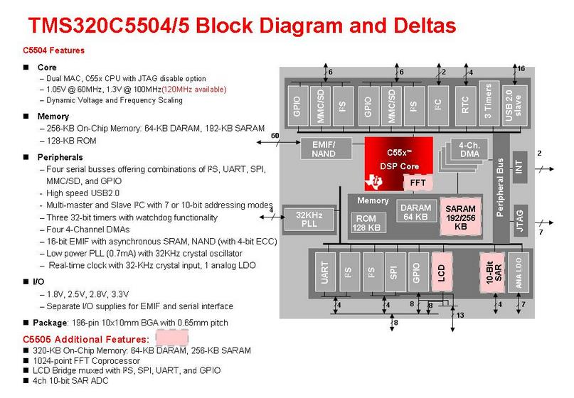
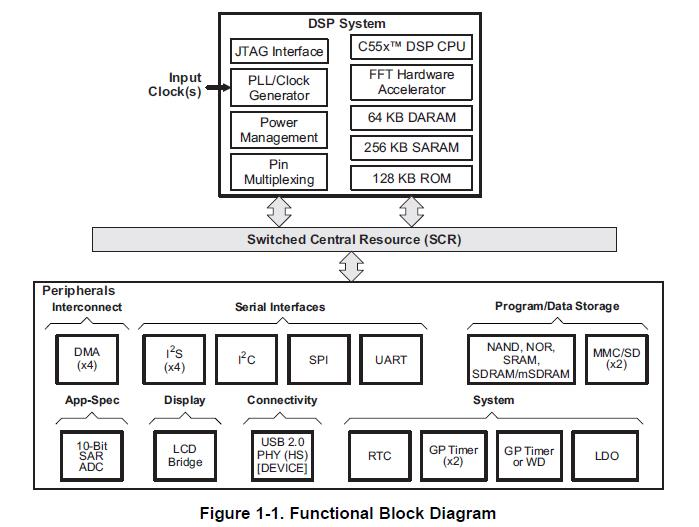

# lab07
IIR Notch Filters Using the TI TMS320C5505

## OBJECTIVES:
In this lab, we strive to implement a simple filter using a digital signal processing microprocessor and the TI Code Composer development tools. We will also compare the performance of different filter designs using inputs from a signal generator and viewing outputs on an oscilloscope. Finally, we will gain more comfort with filtering audio signals.


## BACKGROUND NOTES:
A digital signal processor is a special purpose processor with an architecture designed to efficiently implement DSP operations in real time for embedded applications. For this lab and the following labs, we will use a development board with a Texas Instruments TMS320C5505 DSP and an TLV320AIC3204 stereo audio CODEC () containing ADCs and DACs for real time signal processing. The C55x core has dual MACs, each of which can execute one multiply and accumulate per clock cycle, as well as a 1024-point FFT coprocessor. It is from the TI family of low power DSP products used in applications such as wireless audio devices, echo cancellation headphones, portable medical devices, voice applications, industrial controls, fingerprint biometrics, software defined radio. A block diagram can be seen on the following page.

The Code Composer Studio development tools allow you to create programs that can be downloaded to the board. The compiler interprets the C code instructions and creates a sequence of assembly language instructions for the processor which will accomplish the desired operations. The .asm file, which is created by the compiler, is then used by the linker to create a corresponding set of binary machine instructions. When these instructions are loaded into the DSP processor, executing them implements the original C code instructions in the hardware.

In this laboratory, we will use interrupts to respond to the analog interface ADC and DAC at 8000 samples per second. At each interrupt, a data sample is read and added to a queue. The queue, which is implemented using a shift register structure, is used to compute the filtered output for an FIR filter. An IIR filter will have one queue for the delayed input and a separate queue for the delayed output. The frequency selective behavior of the filter is determined by its coefficients. The filter will be implemented using floating point arithmetic, but its output will be converted to a short integer before it is sent to the DAC.

__References:__
- [http://www.ti.com/lsds/ti/dsp/overview.page](http://www.ti.com/lsds/ti/dsp/overview.page) 
- [http://www.ti.com/tool/tmdx5505ezdsp](http://www.ti.com/tool/tmdx5505ezdsp)






## PRELAB:
First, read the above background notes and make sure you understand the content in the first page. The figures, while informative, do not have to be completely understood.

For the, we will explore and modify a program written in C shown below. Read the code below and determine what it will do in operation. Note that the CODEC is initialized to sample at a rate of $$8\:\text{kHz}$$. Based on these files, answer the questions below.

### `main.c`
```c
// program main.c
#include <stdio.h> 
#include <math.h>
#include "stdint.h" 
#include "usbstk5505.h" 
#include "usbstk5505_i2c.h" 
#include "usbstk5505_i2s.h" 
#include "main.h"

/* Include filter information */
#include "ave5f.cof" 		//filter coefficient file

/* CODEC initialization defines */
#define GDAC 3				//DAC gain in dB {-6dB to 29dB in 1dB steps}
#define GADC 0				//ADC gain in dB {0dB to 47.5dB in 0.5dB steps}

void main(void)
{
	Int16 x[N];			//filter delay line
	Int32 yn = 0;		//output value

	/* Initialize the DSP */
	Init_USBSTK5505();

	/* Initialized AIC3204 */
	Init_AIC3204(SF_8KHz, GDAC, GADC);

	while(1)
	{
		Int8 i = 0;
		
		/* Read 16-bit right channel data */
		USBSTK5505_I2S_readRight(x);	//get new input into delay line
		
		yn = h[0]*x[0];				//calculate filter output
		
		for (i=(N-1); i>0; i--)  {
			yn += h[i]*x[i];			//calculate filter output
			x[i] = x[i-1];			//shuffle delay line contents		
		}
		
		/* Write 16-bit right channel data */
		USBSTK5505_I2S_writeRight((Int16)(yn)); 	//output to codec
	}
}
```

### `ave5.cof`
```c
//ave5.cof Coefficient file
//Implements five point moving average filter

#define N 5 			// Filter Length
Int16 h[N] = {	 		// Filter Coefficients
	1, 1, 1, 1, 1,
};
```

### QUESTION 1:
What does the main program do? Why is it set up to be in an infinite loop?

__(a)__ How does the main program have access to the values of `N` and the coefficients `h`? 

__(b)__ What is the purpose of the for loop?

### QUESTION 2:
If the first 10 data values that the CODEC reads are $$[100,\:120,\:100,\:80,\:60,\:40,\:-40,\:-100,\:20,\:100]$$, indicate the value that would be output for `yn` and the values that would be stored in the `x` array at the end of each while loop. Assume that when the program starts, the `x` array is initialized to have all values equal to 0. A table is provided on the next page.

| Cycle | `yn` | `x[0]` | `x[1]` | `x[2]` | `x[3]` | `x[4]` |
| :---: | :--: | :----: | :----: | :----: | :----: | :----: |
| 1 |   |   |   |   |   |   | 
| 2 |   |   |   |   |   |   | 
| 3 |   |   |   |   |   |   | 
| 4 |   |   |   |   |   |   | 
| 5 |   |   |   |   |   |   | 
| 6 |   |   |   |   |   |   | 
| 7 |   |   |   |   |   |   | 
| 8 |   |   |   |   |   |   | 
| 9 |   |   |   |   |   |   | 
| 10 |   |   |   |   |   |   | 

### QUESTION 3: 
Repeat __(3)__ for the case where $$h[N]=\{0,\:0,\:0,\:1,\:0\}$$ instead of the values shown in `ave5.cof`. What would this filter do?

| Cycle | `yn` | `x[0]` | `x[1]` | `x[2]` | `x[3]` | `x[4]` |
| :---: | :--: | :----: | :----: | :----: | :----: | :----: |
| 1 |   |   |   |   |   |   | 
| 2 |   |   |   |   |   |   | 
| 3 |   |   |   |   |   |   | 
| 4 |   |   |   |   |   |   | 
| 5 |   |   |   |   |   |   | 
| 6 |   |   |   |   |   |   | 
| 7 |   |   |   |   |   |   | 
| 8 |   |   |   |   |   |   | 
| 9 |   |   |   |   |   |   | 
| 10 |   |   |   |   |   |   | 

### QUESTION 4:
Modify the C code to implement a notch filter with two poles at $$\begin{matrix}z=\rho{e}^{\pm{j}\omega_0},&\text{for }\rho=0.9\end{matrix}$$ and two zeros at $$z=e^{\pm{j}\omega_0}$$ where the frequency value is selected to put the notch at $$1000\:\text{Hz}$$. Specifically indicate the changes to the coefficient file and the main program to include memory of previous outputs as well as previous inputs. Note that this is a fixed-point processor and so only integer values should be used (try to avoid floating point!). To adjust for this, simply multiply by the value obtained for the filter by 1000 and round to the nearest integer.

__Submit the answers to the questions, the two tables, and the modified C code for the pre- laboratory assignment.__

