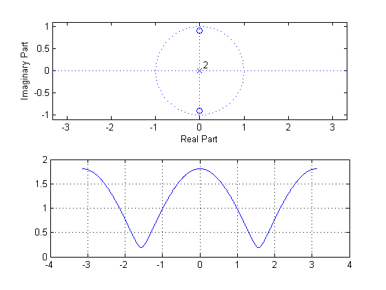
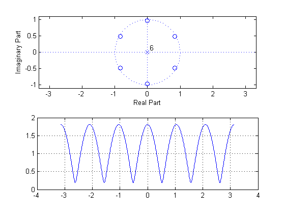
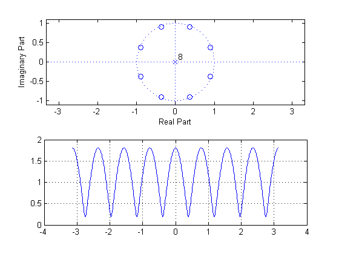
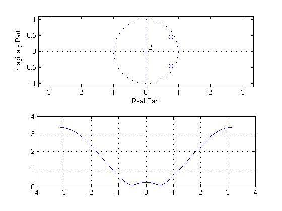
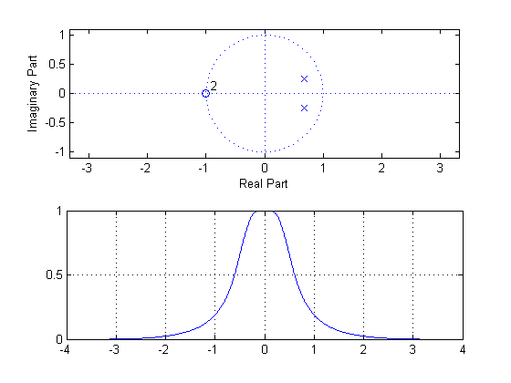
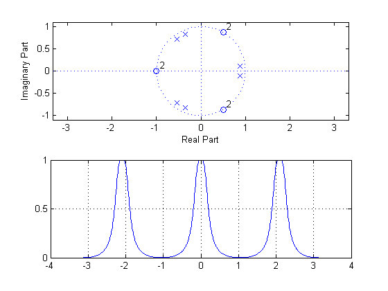

# lab08sub
Low Pass and Multiple Notch Filters Using the TI TMS320C5505


## OBJECTIVES:
- Explore the design of multiple band and multiple notch filters derived from
prototype filters.
- Compare FIR and IIR filters using sinusoidal and square wave inputs. 
- Test these filters with real time signals.


## PRELAB:
### 1.
Using the method of Step 4 of Prelab 6, get the coefficients of a notch filter at a frequency of $$2000\:\text{Hz}$$ with poles at a radius of $$0.9$$. Assume a sampling rate of $$8000\:\text{Hz}$$. Verify your design with MATLAB. Use the `freqz` function to compute the frequency response and plot the magnitude as a function of frequency. Use `zplane` to plot the poles and zeros.

### ANSWER 1.
Given,
$$
\begin{align*}
f_0&=2000\:\text{Hz}\\
f_T&=8000\:\text{Hz}\\
\omega_0&=2\pi\frac{f_0}{f_T}\\
&=2\pi\frac{(2000)}{(8000)}\\
&=\frac{\pi}{2}
\end{align*}
$$
The transfer function is
$$
\begin{align*}
H(z)&=\frac{\left(z-(0.9)e^{j\omega_0}\right)\left(z-(0.9)e^{-j\omega_0}\right)}{z^2}\\
&=\frac{z^2-2(0.9)\cos{\left(\omega_0\right)}z+(0.9)^2}{z^2}
\end{align*}
$$

Zeros can be found at
$$
\begin{align*}
z&=0.9e^{\pm{j}\omega_0}\\
&=(0.9)e^{\pm{j}\tfrac{\pi}{2}}\\
&=\pm{j}0.9;
\end{align*}
$$

#### PLOT RESULT



### 2.
Using the filter of Step 1 with a notch at $$2000\:\text{Hz}$$, find the coefficients of a 6th order filter $$H_3(z)=H_0(z^3)$$. Plot the frequency response and the pole/zero plot for this filter. At what frequencies do you have notches?

### ANSWER 2.
The new transfer function is
$$
\begin{align*}
H_3(z)&=H(z^3)\\
&=\frac{\left(z^3-(0.9)e^{j\omega_0}\right)\left(z^3-(0.9)e^{-j\omega_0}\right)}{z^6}\\
&=\frac{z^6-2(0.9)\cos{\left(\omega_0\right)}z^3+(0.9)^2}{z^6}
\end{align*}
$$

Zeros can be found at
$$
\begin{align*}
z^3&=0.9e^{\pm{j}\omega_0}\\
&=\pm{j}(0.9),\:(0.9)e^{\pm{j}\tfrac{\pi}{2}},\:(0.9)e^{\pm{j}\tfrac{5\pi}{2}}\\
z&=\pm{j}(0.9)^{\tfrac{1}{3}},\:(0.9)^{\tfrac{1}{3}}e^{\pm{j}\tfrac{\pi}{6}},\:(0.9)^{\tfrac{1}{3}}e^{\pm{j}\tfrac{5\pi}{6}}\\
\end{align*}
$$

#### PLOT RESULT 



### 3.
Repeat the previous step to create an 8th order filter $$H_4(z)=H_0(z^4)$$.

### ANSWER 3.
The new transfer function is
$$
\begin{align*}
H_4(z)&=H(z^4)=\frac{\left(z^8-(0.9)e^{j\omega_0}\right)\left(z^4-(0.9)e^{-j\omega_0}\right)}{z^8}\\
&=\frac{z^8-2(0.9)\cos{\left(\omega_0\right)}z^4+(0.9)^2}{z^8}
\end{align*}
$$

Zeros can be found at
$$
\begin{align*}
z^4&=0.9e^{\pm{j}\omega_0}\\
&=\pm{j}(0.9),\:(0.9)e^{\pm{j}\tfrac{\pi}{2}},\:(0.9)e^{\pm{j}\tfrac{5\pi}{2}},\:(0.9)e^{\pm{j}\tfrac{9\pi}{2}},\\
z&=\pm{j}(0.9)^{\tfrac{1}{4}},\:(0.9)^{\tfrac{1}{4}}e^{\pm{j}\tfrac{\pi}{8}},\:(0.9)^{\tfrac{1}{4}}e^{\pm{j}\tfrac{5\pi}{8}},\:(0.9)^{\tfrac{1}{4}}e^{\pm{j}\tfrac{9\pi}{8}}\\
\end{align*}
$$

#### PLOT RESULT 



### 4.
Repeat step 1 for a notch at a frequency of $$666.67\:\text{Hz}$$.


### ANSWER 4.
Methods to find the notch is same as the step 1.
$$
\begin{align*}
\omega_0&=2\pi\frac{f_0}{f_T}\\
&=2\pi\frac{(666.67)}{(8000)}
\end{align*}
$$

#### PLOT RESULT 



### 5.
Type "`help butter`" in MATLAB to see how to get coefficients for a Butterworth low pass filter. Using the MATLAB function `[b, a] = butter(N, w)`, compute the coefficients for a second order Butterworth filter with a cutoff frequency of $$1200\:\text{Hz}$$. (Be careful to scale the cutoff frequency correctly to get the value for w in the function call.) Verify your design with MATLAB by plotting the frequency response and the pole/zero plot for this filter.

### ANSWER 5.
The coefficients for poles (`b`) and zeros (`a`) are the output of the MATLAB function `butter(N, w)`, where `N` is the order of the filter and `w` are your normalized cutoff frequency.


#### PLOT RESULT 



### 6. 
Using the filter of Step 5, find the coefficients of a 6th order filter $$H_3(z)=H_0(z^3)$$ as you did in Step 2. Plot the frequency response and the pole/zero plot for this filter.

### ANSWER 6.
Like the exercise above, we need to observe that we have been making __comb filter__, *i.e.* in terms of coefficients, we are zero-padding to increase the order.


#### PLOT RESULT 



## QUESTIONS:
### 1.
How are the positions of the poles and zeros in the 6th order filters related to the positions of the poles and zeros of the 2nd order filters used to create the sixth order filters? How do they move for the eighth order filter?

### ANSWER to Q1.
When the order was increased from 2nd to 6th, we expect to see zeros evenly distributed along the circle.  In other words, For the 2nd order, we see 2 zeros evenly distributed along the unit circle.  Likewise, for the 6th order, we see 6 zeros evenly distributed along the unit circle. "Evenly distributed" means, the zeros have equidistance to one another (of course along the unit circle).

In 8th order, we expect to see the same effect, *i.e.* 8 zeros evenly distributed along the unit circle.


### 2. 
How does the width of the notch at $$666.67\:\text{Hz}$$ in Step 4 compare to the width of the notch at that frequency in Step 2? Why?


### ANSWER to Q2.
Width of the notch was diminisehd when the cutoff frequency decreased from $$2000\:\text{Hz}$$ to $$666.67\:\text{Hz}$$. The easy way to understand and observe what changed is to see where zeros are moved on the pole/zero diagram.


### 3.
If a notch filter were needed to remove an interfering sinusoidal signal at $$666.67\:\text{Hz}$$, would the filters from Step 2 and Step 3 give approximately similar results? How would your answer change if the interfering signal were a non-sinusoidal periodic signal with a repetition frequency of 666.67 Hz? Consider, for example, a square wave interference.

### ANSWER to Q3.
No, The creation of comb filter doesn't guarantee the removal of interfering signal at lower frequency.  Especially, we have to be very selective about which frequency component to cut off.  

If the original filter is to cut off frequency component at $$666.67\:\text{Hz}$$. The result from step 2 can do the same job, but the result from step 3 can't.  The transformation changed the notch we selectd.


### 4. 
Explain the frequency response of the 6th order filter in Step 6.


### ANSWER to Q4.
The comb filter duplicates the original frequency plot in a range of $$-\pi\leq\omega\leq\pi$$. We will see 3 identical shapes of original filter output, aligned on $$\omega$$-axis.

__Submit the answers to the questions and the plots of the frequency responses and pole/zero diagrams.__


## APPENDIX:

### `lab08pre.m`
```matlab
%% intialize
clear, clc, clf, cla, close all;
%
%% PRELAB
%
%% 1.
% 
% create filter H_0(z) @ f0=2000 Hz
%
f0=2000;
fs=8000;
w0=2*pi*f0/fs;
%
r = 0.9;
P0 = [1, -2*r*cos(w0), r^2];
Z0 = [1, 0, 0];
%
figure();
subplot(2,1,1)
zplane(P0, Z0);
%
[H0 w] = freqz(P0, Z0, 512, 'whole');
subplot(2,1,2);
plot(w-pi, fftshift(abs(H0)));
grid on;
%
%% 2.
%
% create filter H_3(z)=H0(z^3)
%
P3 = [1, 0, 0, -2*r*cos(w0), 0, 0, r^2];
Z3 = [1, 0, 0, 0, 0, 0, 0];
%
figure();
subplot(2,1,1)
zplane(P3, Z3);
%
[H3 w] = freqz(P3, Z3, 512, 'whole');
subplot(2,1,2);
plot(w-pi, fftshift(abs(H3)));
grid on;
%
%% 3.
%
% create filter H_4(z)=H0(z^4)
%
P4 = [1, 0, 0, 0, -2*r*cos(w0), 0, 0, 0, r^2];
Z4 = [1, 0, 0, 0, 0, 0, 0, 0, 0];
%
figure();
subplot(2,1,1)
zplane(P4, Z4);
%
[H4 w] = freqz(P4, Z4, 512, 'whole');
subplot(2,1,2);
plot(  w-pi, fftshift(abs(H4))  );
grid on;
%
%% 4. 
% 
% create filter H_0(z) @ f0=666.67 Hz
%
f0=666.67;
fs=8000;
w0=2*pi*f0/fs;
%
r = 0.9;
P0 = [1, -2*r*cos(w0), r^2];
Z0 = [1, 0, 0];
%
figure();
subplot(2,1,1)
zplane(P0, Z0);
%
[H0 w] = freqz(P0, Z0, 512, 'whole');
subplot(2,1,2);
plot(  w-pi, fftshift(abs(H0))  );
grid on;
%
%% 5.
%
% create a butterworth lpf @ f0=1200 Hz
%
N = 2;
wn = 1200/fs;
%
[P1 Z1] = butter(N, wn);
%
figure();
subplot(2,1,1);
zplane(P1, Z1);
%
[H1 w] = freqz(P1, Z1, 512, 'whole');
subplot(2,1,2);
plot(  w-pi, fftshift(abs(H1))  );
grid on;
%
%% 6.
%
% create H_3(z)=H_1(z^3)
%
P3 = [P1(1), zeros(1, 3-1), P1(2), zeros(1, 3-1) P1(3)];
Z3 = [Z1(1), zeros(1, 3-1), Z1(2), zeros(1, 3-1) Z1(3)];
%
figure();
subplot(2,1,1);
zplane(P3, Z3);
%
[H3 w] = freqz(P3, Z3, 512, 'whole');
subplot(2,1,2);
plot(  w-pi, fftshift(abs(H3))  );
grid on;
%
```