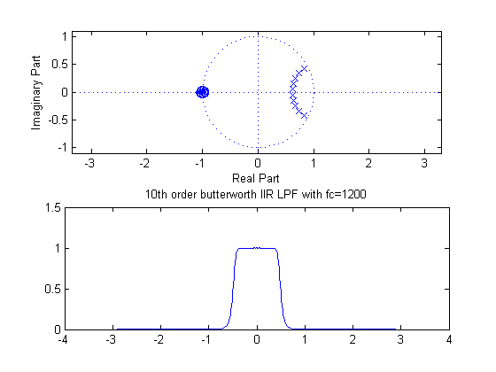
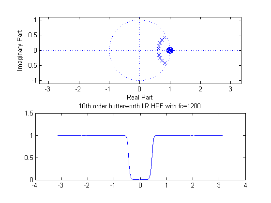
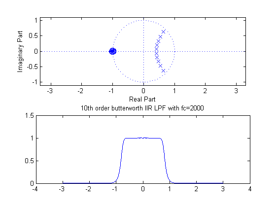
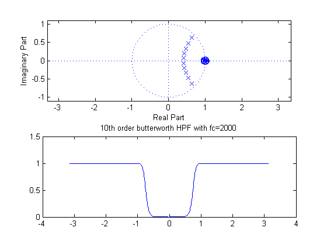
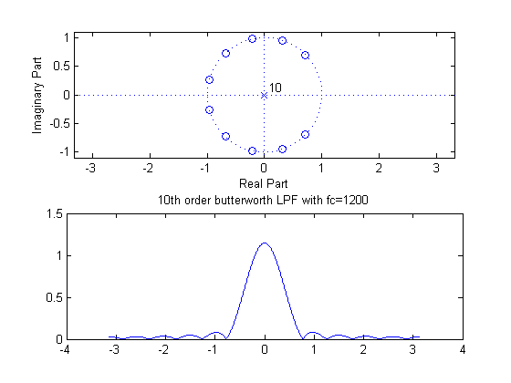
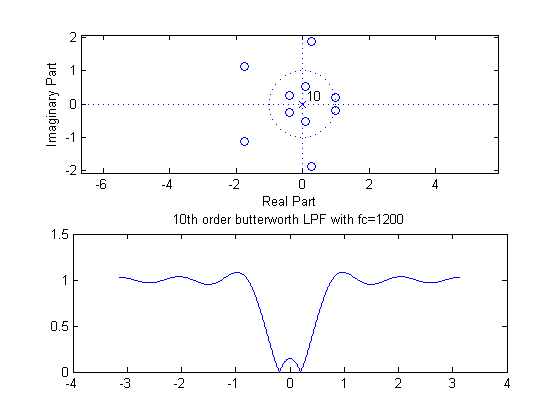
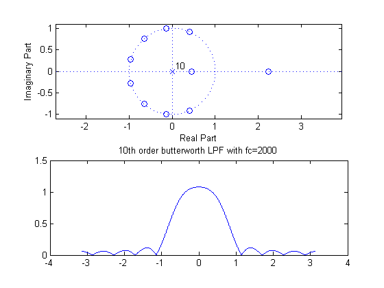
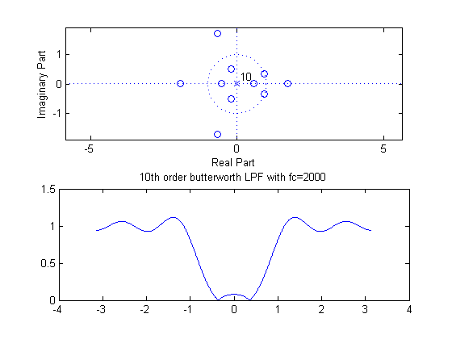

# lab08sub
Low Pass and Multiple Notch Filters Using the TI TMS320C5505


## OBJECTIVES:
- Explore the design of multiple band and multiple notch filters derived from
prototype filters.
- Compare FIR and IIR filters using sinusoidal and square wave inputs.
- Test these filters with real time signals.


## PRELAB:
### 1.
Using the method of Step 4 of Prelab 6, get the coefficients of a notch filter at a frequency of $$2000\:\text{Hz}$$ with poles at a radius of $$0.9$$. Assume a sampling rate of $$8000\:\text{Hz}$$. Verify your design with MATLAB. Use the `freqz` function to compute the frequency response and plot the magnitude as a function of frequency. Use `zplane` to plot the poles and zeros.

### ANSWER 1.
Given,
$$
\begin{align*}
f_0&=2000\:\text{Hz}\\
f_T&=8000\:\text{Hz}\\
\omega_0&=2\pi\frac{f_0}{f_T}\\
&=2\pi\frac{(2000)}{(8000)}\\
&=\frac{\pi}{2}
\end{align*}
$$
The transfer function is
$$
\begin{align*}
H(z)&=\frac{\left(z-(0.9)e^{j\omega_0}\right)\left(z-(0.9)e^{-j\omega_0}\right)}{z^2}\\
&=\frac{z^2-2(0.9)\cos{\left(\omega_0\right)}z+(0.9)^2}{z^2}
\end{align*}
$$

Zeros can be found at
$$
\begin{align*}
z&=0.9e^{\pm{j}\omega_0}\\
&=(0.9)e^{\pm{j}\tfrac{\pi}{2}}\\
&=\pm{j}0.9;
\end{align*}
$$

#### PLOT RESULT


### 2.
Using the filter of Step 1 with a notch at $$2000\:\text{Hz}$$, find the coefficients of a 6th order filter $$H_3(z)=H_0(z^3)$$. Plot the frequency response and the pole/zero plot for this filter. At what frequencies do you have notches?

### ANSWER 2.
The new transfer function is
$$
\begin{align*}
H_3(z)&=H(z^3)\\
&=\frac{\left(z^3-(0.9)e^{j\omega_0}\right)\left(z^3-(0.9)e^{-j\omega_0}\right)}{z^6}\\
&=\frac{z^6-2(0.9)\cos{\left(\omega_0\right)}z^3+(0.9)^2}{z^6}
\end{align*}
$$

Zeros can be found at
$$
\begin{align*}
z^3&=0.9e^{\pm{j}\omega_0}\\
&=\pm{j}(0.9),\:(0.9)e^{\pm{j}\tfrac{\pi}{2}},\:(0.9)e^{\pm{j}\tfrac{5\pi}{2}}\\
z&=\pm{j}(0.9)^{\tfrac{1}{3}},\:(0.9)^{\tfrac{1}{3}}e^{\pm{j}\tfrac{\pi}{6}},\:(0.9)^{\tfrac{1}{3}}e^{\pm{j}\tfrac{5\pi}{6}}\\
\end{align*}
$$

#### PLOT RESULT


### 3.
Repeat the previous step to create an 8th order filter $$H_4(z)=H_0(z^4)$$.

### ANSWER 3.
The new transfer function is
$$
\begin{align*}
H_4(z)&=H(z^4)=\frac{\left(z^8-(0.9)e^{j\omega_0}\right)\left(z^4-(0.9)e^{-j\omega_0}\right)}{z^8}\\
&=\frac{z^8-2(0.9)\cos{\left(\omega_0\right)}z^4+(0.9)^2}{z^8}
\end{align*}
$$

Zeros can be found at
$$
\begin{align*}
z^4&=0.9e^{\pm{j}\omega_0}\\
&=\pm{j}(0.9),\:(0.9)e^{\pm{j}\tfrac{\pi}{2}},\:(0.9)e^{\pm{j}\tfrac{5\pi}{2}},\:(0.9)e^{\pm{j}\tfrac{9\pi}{2}},\\
z&=\pm{j}(0.9)^{\tfrac{1}{4}},\:(0.9)^{\tfrac{1}{4}}e^{\pm{j}\tfrac{\pi}{8}},\:(0.9)^{\tfrac{1}{4}}e^{\pm{j}\tfrac{5\pi}{8}},\:(0.9)^{\tfrac{1}{4}}e^{\pm{j}\tfrac{9\pi}{8}}\\
\end{align*}
$$

#### PLOT RESULT


### 4.
Repeat step 1 for a notch at a frequency of $$666.67\:\text{Hz}$$.


### ANSWER 4.
Methods to find the notch is same as the step 1.
$$
\begin{align*}
\omega_0&=2\pi\frac{f_0}{f_T}\\
&=2\pi\frac{(666.67)}{(8000)}
\end{align*}
$$

#### PLOT RESULT


### 5.
Type "`help butter`" in MATLAB to see how to get coefficients for a Butterworth low pass filter. Using the MATLAB function `[b, a] = butter(N, w)`, compute the coefficients for a second order Butterworth filter with a cutoff frequency of $$1200\:\text{Hz}$$. (Be careful to scale the cutoff frequency correctly to get the value for w in the function call.) Verify your design with MATLAB by plotting the frequency response and the pole/zero plot for this filter.

### ANSWER 5.
The coefficients for poles (`b`) and zeros (`a`) are the output of the MATLAB function `butter(N, w)`, where `N` is the order of the filter and `w` are your normalized cutoff frequency.


#### PLOT RESULT


### 6.
Using the filter of Step 5, find the coefficients of a 6th order filter $$H_3(z)=H_0(z^3)$$ as you did in Step 2. Plot the frequency response and the pole/zero plot for this filter.

### ANSWER 6.
Like the exercise above, we need to observe that we have been making __comb filter__, *i.e.* in terms of coefficients, we are zero-padding to increase the order.


#### PLOT RESULT


## QUESTIONS:
### 1.
How are the positions of the poles and zeros in the 6th order filters related to the positions of the poles and zeros of the 2nd order filters used to create the sixth order filters? How do they move for the eighth order filter?

### ANSWER to Q1.
When the order was increased from 2nd to 6th, we expect to see zeros evenly distributed along the circle.  In other words, For the 2nd order, we see 2 zeros evenly distributed along the unit circle.  Likewise, for the 6th order, we see 6 zeros evenly distributed along the unit circle. "Evenly distributed" means, the zeros have equidistance to one another (of course along the unit circle).

In 8th order, we expect to see the same effect, *i.e.* 8 zeros evenly distributed along the unit circle.


### 2.
How does the width of the notch at $$666.67\:\text{Hz}$$ in Step 4 compare to the width of the notch at that frequency in Step 2? Why?


### ANSWER to Q2.
Width of the notch was diminisehd when the cutoff frequency decreased from $$2000\:\text{Hz}$$ to $$666.67\:\text{Hz}$$. The easy way to understand and observe what changed is to see where zeros are moved on the pole/zero diagram.


### 3.
If a notch filter were needed to remove an interfering sinusoidal signal at $$666.67\:\text{Hz}$$, would the filters from Step 2 and Step 3 give approximately similar results? How would your answer change if the interfering signal were a non-sinusoidal periodic signal with a repetition frequency of 666.67 Hz? Consider, for example, a square wave interference.

### ANSWER to Q3.
No, The creation of comb filter doesn't guarantee the removal of interfering signal at lower frequency.  Especially, we have to be very selective about which frequency component to cut off.

If the original filter is to cut off frequency component at $$666.67\:\text{Hz}$$. The result from step 2 can do the same job, but the result from step 3 can't.  The transformation changed the notch we selectd.


### 4.
Explain the frequency response of the 6th order filter in Step 6.


### ANSWER to Q4.
The comb filter duplicates the original frequency plot in a range of $$-\pi\leq\omega\leq\pi$$. We will see 3 identical shapes of original filter output, aligned on $$\omega$$-axis.

__Submit the answers to the questions and the plots of the frequency responses and pole/zero diagrams.__


## APPENDIX:

### `lab08pre.m`
```matlab
%% intialize
clear, clc, clf, cla, close all;
%
%% PRELAB
%
%% 1.
%
% create filter H_0(z) @ f0=2000 Hz
%
f0=2000;
fs=8000;
w0=2*pi*f0/fs;
%
r = 0.9;
P0 = [1, -2*r*cos(w0), r^2];
Z0 = [1, 0, 0];
%
figure();
subplot(2,1,1)
zplane(P0, Z0);
%
[H0 w] = freqz(P0, Z0, 512, 'whole');
subplot(2,1,2);
plot(w-pi, fftshift(abs(H0)));
grid on;
%
%% 2.
%
% create filter H_3(z)=H0(z^3)
%
P3 = [1, 0, 0, -2*r*cos(w0), 0, 0, r^2];
Z3 = [1, 0, 0, 0, 0, 0, 0];
%
figure();
subplot(2,1,1)
zplane(P3, Z3);
%
[H3 w] = freqz(P3, Z3, 512, 'whole');
subplot(2,1,2);
plot(w-pi, fftshift(abs(H3)));
grid on;
%
%% 3.
%
% create filter H_4(z)=H0(z^4)
%
P4 = [1, 0, 0, 0, -2*r*cos(w0), 0, 0, 0, r^2];
Z4 = [1, 0, 0, 0, 0, 0, 0, 0, 0];
%
figure();
subplot(2,1,1)
zplane(P4, Z4);
%
[H4 w] = freqz(P4, Z4, 512, 'whole');
subplot(2,1,2);
plot(  w-pi, fftshift(abs(H4))  );
grid on;
%
%% 4.
%
% create filter H_0(z) @ f0=666.67 Hz
%
f0=666.67;
fs=8000;
w0=2*pi*f0/fs;
%
r = 0.9;
P0 = [1, -2*r*cos(w0), r^2];
Z0 = [1, 0, 0];
%
figure();
subplot(2,1,1)
zplane(P0, Z0);
%
[H0 w] = freqz(P0, Z0, 512, 'whole');
subplot(2,1,2);
plot(  w-pi, fftshift(abs(H0))  );
grid on;
%
%% 5.
%
% create a butterworth lpf @ f0=1200 Hz
%
N = 2;
wn = 1200/fs;
%
[P1 Z1] = butter(N, wn);
%
figure();
subplot(2,1,1);
zplane(P1, Z1);
%
[H1 w] = freqz(P1, Z1, 512, 'whole');
subplot(2,1,2);
plot(  w-pi, fftshift(abs(H1))  );
grid on;
%
%% 6.
%
% create H_3(z)=H_1(z^3)
%
P3 = [P1(1), zeros(1, 3-1), P1(2), zeros(1, 3-1) P1(3)];
Z3 = [Z1(1), zeros(1, 3-1), Z1(2), zeros(1, 3-1) Z1(3)];
%
figure();
subplot(2,1,1);
zplane(P3, Z3);
%
[H3 w] = freqz(P3, Z3, 512, 'whole');
subplot(2,1,2);
plot(  w-pi, fftshift(abs(H3))  );
grid on;
%
```


## LAB:
### PART 2:
Create a project with Code Composer as you did in the previous laboratory.

Create two coefficient files that set the values for `a` and `b`. One filter should be the second order notch filter from your prelab with a notch at $$666.67\:\text{Hz}$$. The second filter should be the 6th order filter from your prelab that was created using coefficients from the second order notch filter with a notch at $$2000\:\text{Hz}$$. This filter should produce three notches.

Code should be flexible so that you can easily switch between these coefficient files so set N to the appropriate length in each file.

Include your new coefficient file in your `main.c`. Compile and debug your code.

#### SOLUTION
Given
$$
\begin{align*}
\omega_{0}&=2\pi\frac{f_0}{f_T}\\
\omega_{0a}&=2\pi\left(\frac{(666.67)}{8000}\right)\\
\omega_{0b}&=2\pi\left(\frac{(2000)}{8000}\right)\\
\end{align*}
$$
You can find the transfer function for each
$$
\begin{align*}
H_a(z)&=\frac{\left(z-0.9e^{j\omega_{0a}}\right)\left(z-0.9e^{-j\omega_{0a}}\right)}{z^2}\\
&=\frac{z^2-2(0.9)\cos{\left(\omega_{0a}\right)}z^{-1}+(0.9)^2}{z^2}\\
\frac{Y(z)}{X(z)}&=1-0.9(2)\cos{\left(\omega_{0a}\right)}z^{-1}+0.81z^{-2}\\
Y(z)&=X(z)\left(1-0.9(2)\cos{\left(\omega_{0a}\right)}z^{-1}+0.81z^{-2}\right)\\
Y(z)&=X(z)-0.9\sqrt{3}X(z)z^{-1}+0.81X(z)z^{-2}\\
y[n]&=x[n]-0.9\sqrt{3}x[n-1]+0.81x[n-2]\\\\
H_b(z)&=H_a(z^3)\\
&=\frac{z^6-2(0.9)\cos{\left(\omega_{0b}\right)}z^3+(0.9)^2}{z^6}\\
\frac{Y(z)}{X(z)}&=1-0.9(2)\cos{\left(\omega_{0b}\right)}z^{-3}+0.81z^{-6}\\
Y(z)&=X(z)\left(1-0.9(2)\cos{\left(\omega_{0b}\right)}z^{-3}+0.81z^{-6}\right)\\
Y(z)&=X(z)-0.9(0)X(z)z^{-3}+0.81X(z)z^{-6}\\
y[n]&=x[n]+0.81x[n-6]\\\\
\end{align*}
$$


#### `lab8_notch1.cof`
```c
// lab8_notch1.cof Coefficient file
// a 2nd order notch filter that cuts out 666.67 Hz

#define N 3		// Filter Length

float b[N] = {  // Filter Coefficients (zeros)
	1, -1.55884, 0.81
};

float a[N] = {	// Filter Coefficients (poles)
	1, 0, 0
};
```
#### `lab8_notch2.cof`
```
// lab8_notch2.cof Coefficient file
// a 2nd order notch filter that cuts out 666.67 Hz

#define N 7	// Filter Length

float b[N] = {  // Filter Coefficients (zeros)
	1, 0, 0, 0, 0, 0, 0
};

float a[N] = {	// Filter Coefficients (poles)
	1, 0, 0, 0, 0, 0, 0.81
};
```


### PART 3:
Explore the performance of the two notch filters.

#### 1-2.
Include the appropriate coefficients file to select the second order notch filter.

Set the signal generator up to output a sinusoidal signal. First, listen to the filtered output as you increase the frequency from $$100\:\text{Hz}$$ to $$4000\:\text{Hz}$$ and note frequencies at which the sound amplitude changes. Based on that, select some specific frequencies that will allow you to sketch the frequency response, and record the amplitude of the output at those frequencies. Try to accurately represent the frequency of the notch and the width of the notch.

| function generator | oscilliscope |
| :-------: | :----------: |
|  |  |
|  |  |


#### 3.
Change the signal generator to a square wave output and repeat step 2. Also observe the shape of the waveform for the frequencies from 100 to 700 Hz and note changes as the frequency increases. Describe the output waveform at 667 Hz. What frequency is the main frequency present?

Compare the results of the two filters for square wave inputs. If you wanted to filter out interference from a signal that was not a perfect sinusoidal signal, how would the additional notches of the second filter help?

| function generator | oscilliscope |
| :-------: | :----------: |
|  |  |
|  |  |

The main frequency should appear at $$666.67\:\text{Hz}$$, as shown above.


#### 4-5.
Now, include the coefficient file to use the second filter and repeat steps 2 and 3. Compare the results of the two filters for sinusoidal inputs.

##### SINUSOIDAL WAVE

| function generator | oscilliscope |
| :-------: | :----------: |
|  |  |
|  |  |

##### SQUARE WAVE

| function generator | oscilliscope |
| :-------: | :----------: |
|  |  |
|  |  |


### PART 4:
Make a new program and coefficient files for low pass and high pass filters. In the end, you should have eight coefficient files for the eight combinations of: low pass and high pass, cutoff frequency of $$1200\:\text{Hz}$$ and $$2000\:\text{Hz}$$, and FIR or IIR Butterworth.

### 1.
MATLAB RESULTS

```matlab
%% intialize
clear, clc, clf, cla, close all;
%
%% LAB08
%
%% PART 04(a)
%
fs = 8000;
N = 10;
wc1 = 1200/fs;
wc2 = 2000/fs;
%
% 10th order butterworth IIR LPF
%
[num1Li, den1Li] = butter(N, wc1)
[num1Hi, den1Hi] = butter(N, wc1, 'high')
[H1Li, w] = freqz(num1Li, den1Li, 512, 'whole');
[H1Hi, w] = freqz(num1Hi, den1Hi, 512, 'whole');
%
% 10th order butterworth IIR HPF
%
[num2Li, den2Li] = butter(N, wc2)
[num2Hi, den2Hi] = butter(N, wc2, 'high')
[H2Li, w] = freqz(num2Li, den2Li, 512, 'whole');
[H2Hi, w] = freqz(num2Hi, den2Hi, 512, 'whole');
%
% plot verification
%
figure();
subplot(2,1,1);
zplane(num1Li, den1Li);
subplot(2,1,2);
plot(w-pi, fftshift(abs(H1Li)));
title('10th order butterworth IIR LPF with fc=1200');
%
figure();
subplot(2,1,1);
zplane(num1Hi, den1Hi);
subplot(2,1,2);
plot(w-pi, fftshift(abs(H1Hi)));
title('10th order butterworth IIR HPF with fc=1200');
%
figure();
subplot(2,1,1);
zplane(num2Li, den2Li);
subplot(2,1,2);
plot(w-pi, fftshift(abs(H2Li)));
title('10th order butterworth IIR LPF with fc=2000');
%
figure();
subplot(2,1,1);
zplane(num2Hi, den2Hi);
subplot(2,1,2);
plot(w-pi, fftshift(abs(H2Hi)));
title('10th order butterworth HPF with fc=2000');
%% PART 04(b)
%
fs = 8000;
N = 10;
wc1 = 1200/fs;
wc2 = 2000/fs;
%
% 10th order butterworth FIR LPF
%
num1Lf = fir1(N, wc1, rectwin(N+1), 'noscale' )
num1Hf = fir1(N, wc1, 'high', rectwin(N+1), 'noscale' )
den1f = [1 zeros(1, N)];
[H1Lf, w] = freqz(num1Lf, den1f, 512, 'whole');
[H1Hf, w] = freqz(num1Hf, den1f, 512, 'whole');
%
% 10th order butterworth FIR HPF
%
num2Lf = fir1(N, wc2, rectwin(N+1), 'noscale' )
num2Hf = fir1(N, wc2, 'high', rectwin(N+1), 'noscale' )
den2f = [1 zeros(1, N)];
[H2Lf, w] = freqz(num2Lf, den2f, 512, 'whole');
[H2Hf, w] = freqz(num2Hf, den2f, 512, 'whole');
%
% plot verification
%
figure();
subplot(2,1,1);
zplane(num1Lf, den1f);
subplot(2,1,2);
plot(w-pi, fftshift(abs(H1Lf)));
title('10th order butterworth LPF with fc=1200');
%
figure();
subplot(2,1,1);
zplane(num1Hf, den1f);
subplot(2,1,2);
plot(w-pi, fftshift(abs(H1Hf)));
title('10th order butterworth LPF with fc=1200');
%
figure();
subplot(2,1,1);
zplane(num2Lf, den2f);
subplot(2,1,2);
plot(w-pi, fftshift(abs(H2Lf)));
title('10th order butterworth LPF with fc=2000');
%
figure();
subplot(2,1,1);
zplane(num2Hf, den2f);
subplot(2,1,2);
plot(w-pi, fftshift(abs(H2Hf)));
title('10th order butterworth LPF with fc=2000');
```

#### OUTPUT:
##### coefficients IIR
###### for `wc1 = 1200/fs`
- `num1Li`

| `num1Li` | 1 | 2 | 3 | 4 | 5 | 6 | 7 | 8 | 9 | 10 | 11 |
| :----: | - | - | - | - | - | - | - | - | - | -- | -- | 
| | 0.0014e-4 | 0.0138e-4 | 0.0623e-4 | 0.1662e-4 | 0.2908e-4 | 0.3489e-4 | 0.2908e-4 | 0.1662e-4 | 0.0623e-4 | 0.0138e-4 | 0.0014e-4 |

- `den1Li`

| `num1Li` | 1 | 2 | 3 | 4 | 5 | 6 | 7 | 8 | 9 | 10 | 11 |
| :----: | - | - | - | - | - | - | - | - | - | -- | -- | 
| | 1 | -6.9894 | 22.3231 | -42.8246 | 54.5704 | -48.2085 | 29.8728 | -12.8107 | 3.6362  | -0.6165 | 0.0474 |



- `num1Hi`

| `num1Hi` | 1 | 2 | 3 | 4 | 5 | 6 | 7 | 8 | 9 | 10 | 11 |
| :----: | - | - | - | - | - | - | - | - | - | -- | -- | 
| | 0.2177 | -2.1768 | 9.7954 | -26.1210 |  45.7118 | -54.8542 | 45.7118 | -26.1210 | 9.7954 | -2.1768 | 0.2177 |

- `den1Hi`

| `den1Hi` | 1 | 2 | 3 | 4 | 5 | 6 | 7 | 8 | 9 | 10 | 11 |
| :----: | - | - | - | - | - | - | - | - | - | -- | -- | 
| | 1 | -6.9894 | 22.3231 | -42.8246 | 54.5704 | -48.2085 | 29.8728 | -12.8107 | 3.6362 | -0.6165 | 0.0474 |



###### for `wc2 = 2000/fs`
- `num2Li`

| `num2Li` | 1 | 2 | 3 | 4 | 5 | 6 | 7 | 8 | 9 | 10 | 11 |
| :----: | - | - | - | - | - | - | - | - | - | -- | -- | 
| | 0 | 0.0001 | 0.0005 | 0.0013 | 0.0023 | 0.0028 | 0.0023 | 0.0013 | 0.0005 | 0.0001 | 0 |

- `den2Li`

| `num2Li` | 1 | 2 | 3 | 4 | 5 | 6 | 7 | 8 | 9 | 10 | 11 |
| :----: | - | - | - | - | - | - | - | - | - | -- | -- | 
| | 1 | -4.9870 | 11.9364 | -17.7424 | 17.9732 | -12.8862 |  6.5932 | -2.3691 | 0.5706 | -0.0830 | 0.0055 |




- `num2Hi`

| `num2Hi` | 1 | 2 | 3 | 4 | 5 | 6 | 7 | 8 | 9 | 10 | 11 |
| :----: | - | - | - | - | - | - | - | - | - | -- | -- | 
| | 0.0744 | -0.7436 | 3.3463 | -8.9234 | 15.6160 | -18.7392 | 15.6160 | -8.9234 | 3.3463 | -0.7436 | 0.0744 |

- `den2Hi`

| `den2Hi` | 1 | 2 | 3 | 4 | 5 | 6 | 7 | 8 | 9 | 10 | 11 |
| :----: | - | - | - | - | - | - | - | - | - | -- | -- | 
| | 1 | -4.9870 | 11.9364 | -17.7424 | 17.9732 | -12.8862 |  6.5932 | -2.3691 | 0.5706 | -0.0830 | 0.0055 |



##### coefficients FIR
###### for `wc1 = 1200/fs`
- `num1Lf`

| `num1Lf` | 1 | 2 | 3 | 4 | 5 | 6 | 7 | 8 | 9 | 10 | 11 |
| :----: | - | - | - | - | - | - | - | - | - | -- | -- | 
| | 0.0450 | 0.0757 | 0.1048 | 0.1288 | 0.1445 | 0.1500 | 0.1445 | 0.1288 | 0.1048 | 0.0757 | 0.0450 |



- `num1Hf`

| `num1Hf` | 1 | 2 | 3 | 4 | 5 | 6 | 7 | 8 | 9 | 10 | 11 |
| :----: | - | - | - | - | - | - | - | - | - | -- | -- | 
| | 1 | -0.0450 | -0.0757 | -0.1048 | -0.1288 | -0.1445 | 0.8500 | -0.1445 |  -0.1288 | -0.1048 | -0.0757 | -0.0450 |



###### for `wc2 = 2000/fs`
- `num2Lf`

| `num2Lf` | 1 | 2 | 3 | 4 | 5 | 6 | 7 | 8 | 9 | 10 | 11 |
| :----: | - | - | - | - | - | - | - | - | - | -- | -- | 
| | -0.0450 | 0 | 0.0750 | 0.1592 | 0.2251 | 0.2500 | 0.2251 | 0.1592 | 0.0750 | 0 | -0.0450 |



- `num2Hf`

| `num2Hf` | 1 | 2 | 3 | 4 | 5 | 6 | 7 | 8 | 9 | 10 | 11 |
| :----: | - | - | - | - | - | - | - | - | - | -- | -- | 
| | 0.0450 | 0 | -0.0750 | -0.1592 | -0.2251 | -0.2500 | -0.2251 | -0.1592 | -0.0750 | 0 | 0.0450 |



- `num2Hi`

| `num2Hi` | 1 | 2 | 3 | 4 | 5 | 6 | 7 | 8 | 9 | 10 | 11 |
| :----: | - | - | - | - | - | - | - | - | - | -- | -- | 
| | 0.0744 | -0.7436 | 3.3463 | -8.9234 | 15.6160 | -18.7392 | 15.6160 | -8.9234 | 3.3463 | -0.7436 | 0.0744 |

- `den2Hi`

| `den2Hi` | 1 | 2 | 3 | 4 | 5 | 6 | 7 | 8 | 9 | 10 | 11 |
| :----: | - | - | - | - | - | - | - | - | - | -- | -- | 
| | 1 | -4.9870 | 11.9364 | -17.7424 | 17.9732 | -12.8862 |  6.5932 | -2.3691 | 0.5706 | -0.0830 | 0.0055 |


### 2-3.
Make a new program based on your previous program for the notch filters to allow the code to work simply by selecting the appropriate coefficients file.

Run your new program eight times (once with each coefficients file) with signal generator input and verify that that the filters are performing correctly. Use both sinusoidal inputs and square wave inputs. What are the differences between the FIR and IIR filters in attenuating frequencies above the cutoff frequency? What are the difference between the FIR and IIR filters on the wave shape of the square wave?

## QUESTIONS:

### 1.
For the eight filters in Part 4, plot pole-zero diagrams and frequency responses using MATLAB. What is the difference between the high pass and low pass IIR filter locations of the poles and zeroes? What is the difference between the high pass and low pass FIR filter locations of the zeroes? For the FIR filter, how are the b coefficients different for the low and high pass filters?

### 2.
How would you design a notch filter to filter out all periodic signals at a fundamental frequency of 500 Hz with only odd harmonics?

__Submit the answers to the questions above and the questions in the laboratory procedure as well as the data and sketches requested in the procedure. Submit a listing of C code instructions and your coefficients for Parts 3-5.__


